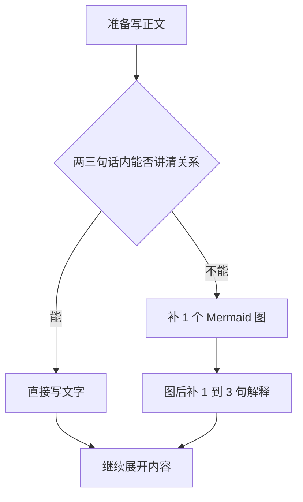

# 学习笔记写作风格

## 概述
- 在撰写或修改学习笔记、课程笔记、技术总结、阅读笔记时使用这套风格。
- 目标是形成克制、专业、层次清晰且信息密度稳定的笔记文本。

## 写作流程
1. 下笔前先判断这篇笔记的核心任务，是定义概念、解释机制、梳理流程、比较方案，还是总结章节。
2. 先搭出分层目录。普通篇幅的笔记通常保留两到四个一级标题，并让每个一级标题承担不同功能。
3. 正文优先围绕机制、条件、边界和取舍展开，不要只堆砌泛泛总结。
4. 只有在图示确实能缩短解释成本、让关系更直观时，才补 Mermaid 图。
5. 完稿前执行一次自检，确认风格和结构没有滑回模板化写法。

## 语言风格
- 写得像一个认真整理材料的人，不要写成聊天机器人、营销文案或过分轻松的说明文。
- 多用判断明确的陈述句、定义清楚的术语和语义准确的动词。
- 语气保持适度正式，但不要僵硬，不用网络化口头表达，也不要故意卖弄轻松感。
- 避免写成教学博主口吻、提问引导口吻或安慰式陪跑口吻。
- 少打比方。只有在比方确实能消除歧义、说明边界时才使用。
- 少用纯粹为了制造节奏的连接句，尤其避免反复套用 `首先 / 其次 / 最后`、`值得注意的是`、`我们可以发现` 这一类模板。
- 少用空泛拔高的表述，例如 `非常重要`、`极其关键`、`不容忽视`，除非后文确实给出了足够依据。
- 适度变化句子开头和段落长度，不要让每个小节都按同一模板展开。

## 禁用套话
- 禁止把 `不是 xxx，而是 xxx` 当成默认展开句式；只有在做严格概念辨析时才可偶尔使用。
- 禁止使用 `很多人第一次......`、`很多人会误以为......`、`很多人容易犯一个错误......` 这类先设想读者误区、再展开纠偏的模板句。
- 禁止在章节开头堆砌 `一句话概括`、`一句话总结`、`先给一个结论`、`先给一个直观理解` 这类提示牌式句子，除非用户明确要求先看摘要。
- 禁止频繁使用“先抛结论再展开”的机械结构覆盖全文；普通章节直接进入定义、机制、条件或推导。
- 禁止为了制造陪伴感而写 `你可能会觉得`、`你第一次看到这里`、`先别急`、`看到这里先记住` 这类口语化引导。
- 如果确实需要概括，应直接写成结论句本身，不要再加提示牌式前缀。

## 信息密度
- 交代清楚概念是什么、如何运作、为什么重要，以及适用边界在哪里。
- 涉及推理时，优先用简短段落展开，不要把所有内容都拆成零散要点。
- 列表要按角色、维度或阶段分组，不要形成一条平铺直叙的长清单。
- 公式、表格、伪代码只在它们比文字更能压缩信息时使用。
- 每个有分量的小节至少要包含一个具体机制、条件或取舍点。

## 工程落地
- 除非材料本身明显是原理型、学术型或以公式推导为主，否则应尽量把知识点落实到真实工程对象上。
- 优先说明这个知识点会影响哪些系统设计决策，例如算力预算、带宽压力、时延、功耗、部署方式、模块拆分、调度策略或软硬件协同。
- 适合时补充代表性的工程例子，例如芯片、平台、模块、接口或部署场景，让抽象概念落到可感知的系统语境里。
- 例子应服务于理解，不要变成产品宣传，也不要无意义地堆参数。
- 如果用户在讨论智驾 SoC、传感器、控制链路、推理部署等主题，可自然结合英伟达 Orin、地平线征程系列，或其他相关平台作为参照，但只在确有帮助时展开。
- 如果任务本身是在解读论文、梳理算法原理、证明结论或总结纯理论章节，就不要强行加入工程案例。
- 不要虚构具体项目细节。如果材料没有给出特定系统背景，就使用公开、通用、不过度细化的工程语境。

## 引号使用
- 引号只用于严格定义、直接引用、字面术语或有意做对照的表达。
- 不要为了强调而给普通概念随手加引号。
- 如果去掉引号后句意依旧清楚，就把引号删掉。

## 标题层级
- 如果内容本身包含多个主题，不要只放一个一级标题，然后在下面横向铺开一长串二级标题。
- 当内容天然可以拆成概念、机制、流程、比较、误区、实践、复盘等板块时，应拆成多个一级标题。
- 标题深度要有实际作用。如果某个标题只有一个子标题，且层级没有信息价值，就合并或重命名。
- 相邻标题不要只是换个说法重复同一件事。
- 目录的目标是分组清晰，不是格式整齐。

推荐结构：

```markdown
# 基础概念
## 定义
## 核心性质

# 运行机制
## 关键流程
## 边界条件
```

除非主题本身就是单线展开，否则避免这样写：

```markdown
# 全文
## 定义
## 特点
## 流程
## 例子
## 注意事项
```

## Mermaid 使用
- Mermaid 适合表达流程、依赖关系、决策分支、状态变化、模块关系或概念层级。
- 如果一小段文字或一个短列表已经足够清楚，就不要为了显得完整而硬加图。
- 图要克制。短笔记通常零到一张图即可，长笔记通常一到三张图即可，且每张图都应承担不同信息。
- 每张图前面先用一句话说明它要展示什么。
- 节点文字尽量短、尽量技术化，不要把节点写成一整段说明。
- 每张图后补一到三句解释，提炼图里真正值得记住的结论。
- 不要连续堆多张图而没有文字承接。
- 流程优先用 `flowchart`，交互顺序优先用 `sequenceDiagram`，状态变化优先用 `stateDiagram-v2`，概念层级可用 `mindmap` 或 `graph TD`。

图示决策规则：



## 输出习惯
- 默认使用 Markdown，除非用户明确要求其他格式。
- 解释性内容优先用段落，分类性内容再用短列表，不要让项目符号替代推理。
- 段落保持紧凑，两到四句通常是比较稳妥的默认长度。
- 如果使用表格，每一列都应承担真实的分析维度，而不是装饰性的措辞。

## 自检清单
- 检查文本是否像一个熟悉材料的人在整理笔记，而不是一个助手在套模板。
- 检查一级标题是否完成了有效分组，而不是把所有内容平铺展开。
- 检查引号是否只出现在必要位置。
- 检查是否还残留 `不是 xxx，而是 xxx` 式的模板化对照表达。
- 检查是否还残留 `很多人第一次......`、`很多人会误以为......` 这类预设读者误区的模板句。
- 检查是否还残留 `一句话概括`、`一句话总结`、`先给一个结论` 这类提示牌式前缀。
- 检查每一张 Mermaid 图是否真的值得保留。
- 检查抽象知识点是否在合适的位置落到了工程场景、系统约束或代表性实例上。
- 检查每个重要小节里是否都有实际内容，而不是只换了标题继续重复。
