# 简单介绍
AVM （Around View Monitor，环视系统）环视系统通过安装在车身前、后、左、右的四个鱼眼摄像头，通过图像处理算法拼接成一幅 360° 的鸟瞰图（Bird's Eye View, BEV）。然而，摄像头在总装过程中**必然**存在 **6 自由度的安装误差**。从数学原理、标定场搭建、算法流程及工程实践四个维度，详细剖析 AVM 的下线标定（EOL）技术。

# 为什么需要 EOL 标定？
在理想的 CAD 模型中，我们知道每个摄像头相对于车身坐标系的精确位置。但在实际生产线上，安装公差会导致以下问题：

+ **平移误差**：摄像头位置偏移。

+ **旋转误差**：摄像头拍摄角度倾斜（如 Pitch/Roll/Yaw 偏差）。

如果不进行标定，直接使用理论参数进行投影拼接，会导致地面标线断裂、重影，甚至障碍物位置判断错误。**EOL 标定的核心目标，就是求解摄像头坐标系到车身坐标系的真实变换矩阵**。

想象一下手机拍照，四个角装了四个超广角镜头，要把它们拼成一张完美的俯视图。但工人安装时，摄像头可能歪了1毫米、斜了0.5度。标定就是解决"歪了怎么办"的问题。

# 数学模型基础
# 坐标系定义
1. **世界坐标系 (World, $W$)**：通常与**车身坐标系 (Vehicle, $V$)** 重合或存在固定偏移。原点 $O_v$ 通常定义在后轴中心在地面的投影点。X轴是车头方向，Y轴是左右方向。
2. **摄像头坐标系 (Camera, $C$)**：以摄像头光心（镜头中心）为原点。
3. **图像坐标系 (Image, $I$)**：像素平面 $(u, v)$，就是最终照片上的像素点，比如 $(100,200)$ 这个位置。

## 鱼眼相机投影模型

AVM 使用鱼眼镜头，其畸变极大，不遵循针孔模型。通常使用 Scaramuzza 或 Kannala-Brandt 模型。以下以通用投影公式描述：

设空间点在摄像头坐标系下的坐标为 $P_c = [X_c, Y_c, Z_c]^T$。

1. **归一化平面投影：**
地面有个点P，在摄像头看来：
点到摄像头正下方的水平距离为 $r = \sqrt{X_c^2 + Y_c^2}$
看这个点的角度 $\theta = \arctan(r/Z_c)$
>比喻：你站在摄像头位置，低头看地面上的蚂蚁。$r$ 是蚂蚁离你脚的水平距离，$\theta$ 是你需要低头多少度才能看到它。

2. **畸变映射 (畸变函数 $f(\theta)$)：**
角度 → 畸变半径
$$r_d = f(\theta) = k_1 \theta + k_2 \theta^3 + k_3 \theta^5 + \dots$$
>鱼眼镜头就像 convex哈哈镜，越靠边缘拉伸越严重。这个公式就是在算"拉伸了多少"。

3. **像素坐标转换：**
$$\begin{bmatrix} u \\ v \end{bmatrix} = \begin{bmatrix} f_x & 0 \\ 0 & f_y \end{bmatrix} \begin{bmatrix} \frac{r_d}{r} X_c \\ \frac{r_d}{r} Y_c \end{bmatrix} + \begin{bmatrix} c_x \\ c_y \end{bmatrix}$$
其中，$K_{int} = \{f_x, f_y, c_x, c_y, k_i\}$ 为内参。在 EOL 阶段，内参通常认为已知（由模组供应商提供），我们主要关注外参。
>比喻：$f_x/f_y$ 是摄像头的"焦距"，$c_x/c_y$ 是"主点"（照片中心）。这一步把三维世界"拍扁"到二维照片。

4. 反投影（标定的关键）
已知像素 $(u,v)$，反推地面点 $(X_v,Y_v)$
>正常是"3D→2D拍照"，标定时是"2D→3D破案" —— 看到照片上的点，反推它在地面哪里。

## 外参变换 (Extrinsics)
我们的目标是求出从车身坐标系到摄像头坐标系的旋转矩阵 $R_{vc}$ 和平移向量 $T_{vc}$。
$$P_c = R_{vc} \cdot P_v + T_{vc}$$

将两者结合，从世界（车身）坐标点 $P_v$ 映射到像素点 $p_{pix}$ 的完整链路为：
$$p_{pix} = \text{Project}(K_{int}, R_{vc}, T_{vc}, P_v)$$

---
# EOL 标定间（Calibration Room）搭建
EOL 追求的是高自动化和高节拍（Tact Time）。标定间通常包含以下元素：

+ **标定布/标定板**：铺设在车辆四周地面。常见的图案包括棋盘格（Checkerboard）或圆点阵列（Circle Grid）。

    + **布局要求**：必须保证相邻摄像头的重叠区域（Overlapping Region）能同时拍摄到特定的标定特征点。

+ **定位装置**：通常使用 V-block 或轮挡来固定车辆位置，确保车辆坐标系与标定间坐标系（场地坐标系）有相对固定的初值。
>为什么要固定？
因为标定布的3D坐标是已知的，如果车动了，就等于地图错了，后面全错。

+ **光源**：均匀、无频闪的 LED 光源，避免特征点反光或过暗。

车停在中间，四块标定布像地毯一样铺在前后左右。
---

# 标定算法核心流程
EOL 标定通常属于 Target-based（基于标靶） 的自动化标定。

```mermaid
flowchart TD
    Start([车辆驶入工位]) --> Positioning{机械定位<br/>V型块/轮挡}
    Positioning -->|重复定位精度<1mm| Wait{等待车辆静止<br/>震动传感器检测}
    Wait -->|静止时间>2秒| Trigger[触发系统唤醒]
    Trigger --> Sync[同步触发四路摄像头<br/>曝光时间: 5ms]
    Sync --> QualityCheck{图像质量检查}
    
    QualityCheck --> Brightness{亮度检测<br/>均值: 128±20}
    QualityCheck --> Sharpness{清晰度检测<br/>拉普拉斯方差>100}
    QualityCheck --> FeatureCount{特征点预估<br/>数量>50个/图}
    
    Brightness -->|不合格| ReCapture1[重拍] --> Sync
    Sharpness -->|不合格| ReCapture1
    FeatureCount -->|不合格| ReCapture1
    
    Brightness -->|合格| Extract[特征点提取]
    Sharpness -->|合格| Extract
    FeatureCount -->|合格| Extract
    
    Extract --> DetectFront[前视: findChessboardCorners<br/>9×6棋盘格, 亚像素优化]
    Extract --> DetectRear[后视: 同前]
    Extract --> DetectLeft[左视: 圆点检测<br/>11×8阵列]
    Extract --> DetectRight[右视: 同左]
    
    DetectFront --> MatchFront[2D-3D匹配<br/>最近邻<10像素]
    DetectRear --> MatchRear[2D-3D匹配]
    DetectLeft --> MatchLeft[2D-3D匹配]
    DetectRight --> MatchRight[2D-3D匹配]
    
    MatchFront --> Ransac{RANSAC剔除<br/>置信度>0.98<br/>迭代次数: 1000}
    MatchRear --> Ransac
    MatchLeft --> Ransac
    MatchRight --> Ransac
    
    Ransac -->|内点率>80%| Initial[EPnP求初值<br/>时间: <5ms]
    Ransac -->|内点率≤80%| Fail1[匹配失败<br/>检查标定布脏污] --> End([人工介入])
    
    Initial --> OptimizeLM[Levenberg-Marquardt优化<br/>最大迭代: 30次]
    
    OptimizeLM --> Iter1{第i次迭代<br/>计算重投影误差}
    Iter1 --> Error{平均误差<1.0像素?}
    Error -->|否| Iter2{误差变化<0.01像素?}
    Error -->|是| Converge1[收敛]
    Iter2 -->|否| Iter1
    Iter2 -->|是| Converge1
    
    Converge1 --> JointOpt[联合优化<br/>Bundle Adjustment]
    
    JointOpt --> StitchError{拼接误差<br/>λ=0.1~1.0}
    StitchError --> Overlap[重叠区反投影差<br/>物理错位<3cm]
    Overlap --> OptimizeAll{总误差最小化<br/>4个相机同时优化}
    
    OptimizeAll --> Converge2{收敛判断<br/>平均误差<0.5像素}
    Converge2 -->|超时| Timeout[超时警告<br/>当前Tact Time>50秒] --> Simplify[简化计算<br/>减少特征点到60个]
    Converge2 -->|收敛| GenerateLUT[生成LUT表<br/>分辨率: 1024×1024]
    
    Simplify --> GenerateLUT
    
    GenerateLUT --> Validate{物理验证}
    
    Validate --> ReprojError{重投影误差<br/>均值<1.0像素<br/>最大值<3.0像素}
    Validate --> StitchGap{拼接错位<br/>十字标记反投影差<3cm}
    Validate --> ColorDiff{色彩一致性<br/>ΔY<10, ΔCbCr<5}
    
    ReprojError -->|不合格| Fail2[标定失败<br/>检查摄像头松动]
    StitchGap -->|不合格| Fail2
    ColorDiff -->|不合格| ColorCalib[色彩校正矩阵]
    
    ReprojError -->|合格| Pass1[通过]
    StitchGap -->|合格| Pass2[通过]
    ColorDiff -->|合格| Pass3[通过]
    ColorCalib --> Pass3
    
    Pass1 --> WriteECU[写入ECU EEPROM<br/>4个4×4矩阵]
    Pass2 --> WriteECU
    Pass3 --> WriteECU
    
    WriteECU --> UploadMES[上传MES系统<br/>Vin码+标定参数+时间戳]
    UploadMES --> Release[车辆放行<br/>全程Tact Time: <60秒]
    Release --> End
    
    Fail2 --> End
    
    style Start fill:#90EE90
    style End fill:#FFB6C1
    style Timeout fill:#FFA500
    style Fail1 fill:#FF0000
    style Fail2 fill:#FF0000
    style Release fill:#90EE90
```

**步骤 1：图像采集与预处理**

车辆驶入工位，触发四个摄像头同步拍照。需进行图像质量检查（亮度、清晰度校验）。

**步骤 2：特征点检测 (Feature Extraction)**

对采集的图像进行角点检测。常用的算法包括 Harris Corner, Shi-Tomasi 或针对棋盘格优化的 findChessboardCorners。输出：一组像素坐标 $\{u_i, v_i\}$。

**步骤 3：2D-3D 对应关系构建**

这是最关键的一步。
+ **已知量 (3D)**：标定板上的角点在车身坐标系下的物理坐标 $\{X_v, Y_v, Z_v\}$（通过事先测量标定间获得）。

+ **观测量 (2D)**：对应的像素坐标 $\{u, v\}$。

**步骤 4：外参求解 (Pose Estimation)**

这是一个经典的 **PnP (Perspective-n-Point) 问题**。由于我们已经有内参，我们可以通过最小化重投影误差（Reprojection Error）来求解 $R$ 和 $T$。

**目标函数：**

$$\min_{R, T} \sum_{i=1}^{N} \| p_{measured}^{(i)} - \pi(K, R, T, P_{world}^{(i)}) \|^2$$
其中：
+ $p_{measured}^{(i)}$ 是第 $i$ 个检测到的角点像素坐标。

+ $\pi(\cdot)$ 是包含畸变的投影函数。

+ $P_{world}^{(i)}$ 是对应的 3D 坐标。

**求解方法：**

1. 初值获取：利用直接线性变换（DLT）或 EPnP 算法获得初始解。

2. 非线性优化：使用 Levenberg-Marquardt (LM) 算法进行迭代优化，使重投影误差最小化。

**步骤 5：联合优化 (Joint Optimization)**

为了保证拼接缝隙完美，通常不仅单独优化每个摄像头，还会引入拼接约束。在重叠区域，同一个地面特征点被两个摄像头看到，它们反投影到地面的位置应该重合。

$$E_{total} = E_{reprojection} + \lambda \cdot E_{stitching}$$

---
# 生成 LUT 与验证
标定计算完成后，输出的是 4 个 $4 \times 4$ 的外参矩阵。但嵌入式系统通常不实时计算投影，而是使用 **Look-Up Table (LUT)**。

## 生成鸟瞰图映射表 (Map Table)

1. 定义 BEV 图像的尺寸（如 $1024 \times 1024$）和物理范围（如 $10m \times 10m$）。

2. 遍历 BEV 图像的每一个像素 $(u_{bev}, v_{bev})$。

3. 根据分辨率计算其在车身坐标系下的地面坐标 $(X_v, Y_v, 0)$。

4. 利用求得的外参 $R, T$ 和内参 $K$，将地面坐标反向投影回四个摄像头的原始图像坐标。

5. 将映射关系 $(u_{bev}, v_{bev}) \to (u_{raw}, v_{raw}, \text{camera_index}, \text{weight})$ 存入 LUT。

## 验证标准

+ 重投影误差：通常要求平均误差 $< 1.0$ 像素。

+ 拼接错位：在标定板接缝处，物理错位应小于 $3\text{cm}$（具体视主机厂标准而定）。

+ 色彩一致性：检查融合区域的亮度过渡是否自然。