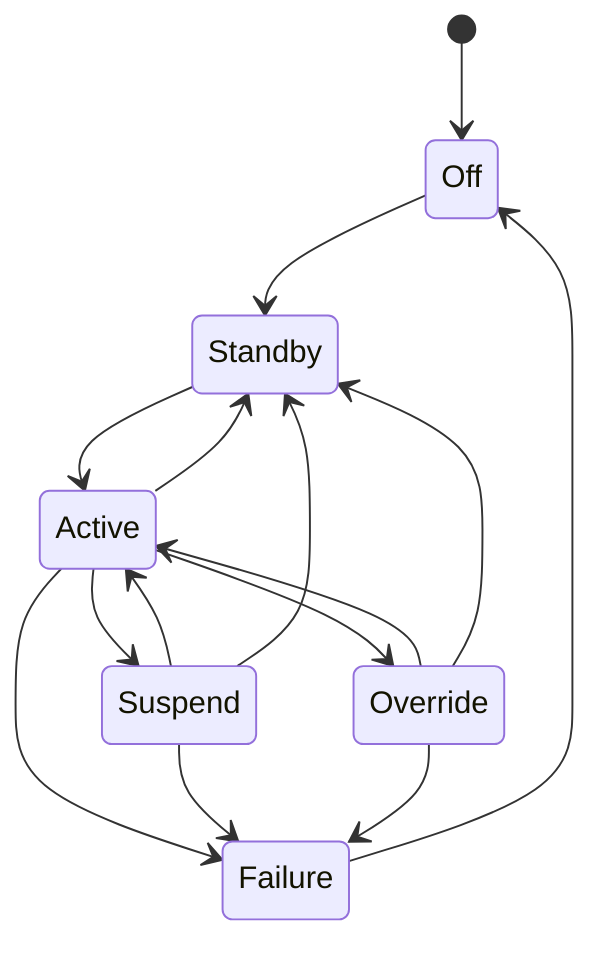
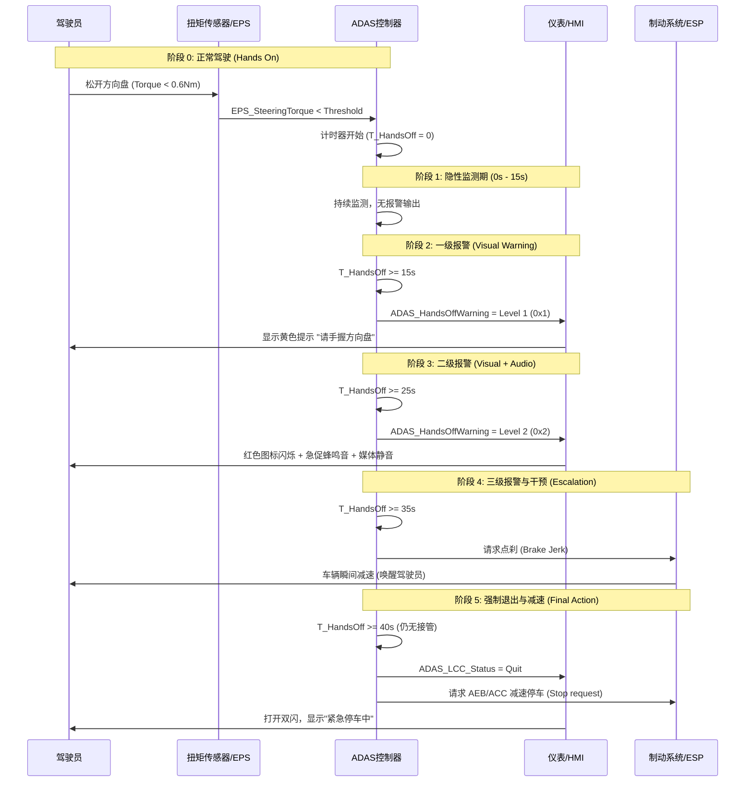

# 引言
LCC，Lane Cruise Control，车道巡航辅助，也有叫车道车道居中控制的，是一种横向辅助功能。在车辆行驶过程中，系统利用摄像头探测车道线，计算车辆在车道内的位置，并通过控制 EPS 施加转向力矩，使车辆持续保持在当前车道的中心位置行驶。

>**有些LCC会跟随驾驶员打转向灯自动变道，但是这里不讨论，单纯的车道居中并不具备ALC功能。**

参考资料
1. [岚图ADS LCC使用手册](https://m.dsmp.voyah.com.cn/userguide/h97e/SF-05006001_f8200.html)
2. [理想汽车全场景辅助驾驶（LCC）](https://www.lixiang.com/autoinfo/user-manual-app/l8prohelp2023-app/topic-2022-EFA9B416-007.html)
3. [小鹏汽车车道居中辅助（LCC）快速上手指南](https://bbs.xiaopeng.com/article/1439341)
4. [享界 S9 增程版使用说明书](https://hima.auto/dam/hima-site/cn/xiangjie/service/pdf/s9-evr-product-manual-20250821.pdf)

> **注意**：与 ACC 不同，ACC 控制油门/刹车，LCC 控制方向盘。LCC 必须在 ACC 激活的前提下才能工作（除部分低速排队辅助场景外）。

相比于ACC更加高级，却低于NOA。
| 功能      | 全称     | 核心作用           | 控制维度         | 技术复杂度 |
| ------- | ------ | -------------- | ------------ | ----- |
| **ACC** | 自适应巡航  | 自动跟车，保持安全车距    | 仅纵向（速度/距离）   | 基础    |
| **LCC** | 车道居中控制 | 保持车辆在车道中央行驶    | 纵向+横向（方向盘微调） | 中等    |
| **NOA** | 导航辅助驾驶 | 按导航路径自动变道、进出匝道 | 纵向+横向+路径决策   | 高阶    |

+ **ACC**：仅控制车速和车距，实现"跟车走"，**不干预方向盘**
+ **LCC**：在ACC基础上增加车道保持，**通过摄像头监测车道线，主动微调方向盘**使车辆居中行驶。可细分为TJA（低速拥堵辅助）和ICA（高速巡航辅助）
+ **NOA**：在LCC基础上融合高精度地图与导航，能**主动决策**自动变道、超车、进出匝道等复杂操作。（可以简单理解为LCC+Navigation）

## 工作原理
ADAS 控制器融合摄像头数据，计算出最优行驶路径（Reference Path）。

+ 当车辆偏离车道中心时，系统计算横向偏差（Lateral Error）和航向偏差（Heading Error）。

+ 控制器输出目标方向盘转角给 EPS。

+ 先进点：LCC 具备“曲率预瞄”功能，在进入弯道前根据车道线曲率提前规划转向，避免入弯过急。
> 所以听上去只是一个简单的路径跟踪。

> 三者能否共存于一套智驾方案？
可以，目前主流方案就是分层共存。

---

# 系统结构和原理

## ADAS 系统输入输出
LCC 功能高度依赖前视摄像头对车道线的识别以及 EPS 的执行能力。
+ **感知**：
    + **前视摄像头**：提供车道线类型（实/虚）、车道宽度、车辆相对于车道中心的横向偏差、航向角偏差、车道曲率 。
    + **前向毫米波雷达**：辅助判断前方路况及护栏等静止物，保障横向控制安全。
+ **执行**：
    + **EPS (Electric Power Steering)**：接收 ADAS 发送的目标转角或目标扭矩请求，执行转向操作。
    + **HMI**：显示方向盘图标（灰色/蓝色）、脱手报警提示、接管提示。

## 信号交互需求
相较于 ACC，LCC 新增了对转向系统和驾驶员手力矩的信号需求：
|信号名称 |信号描述 |来源 |用途 |
|--|--|--|--|
|`EPS_SteeringAngle`|方向盘转角|EPS|控制闭环反馈|
|`EPS_SteeringTorque`|驾驶员手力矩|EPS|判断驾驶员是否接管/脱手|
|`EPS_LCC_Available`|EPS LCC功能可用性|EPS|故障诊断|
|`ADAS_LCC_SteeringReq`|目标转向角/扭矩请求|ADAS|横向控制指令|
|`TCM_TurnSwitchStatus`|转向灯状态|BCM|变道抑制判断|

# 状态机及进入退出条件

LCC 的状态机逻辑比 ACC 更关注驾驶员的手部动作和车道线质量。

+ **Off (关闭)**：功能未开启。

+ **Standby (待命)**：ACC 已激活，车道线识别清晰，但驾驶员未触发 LCC 激活。

+ **Active (激活)**：LCC 正在控制方向盘。

+ **Override (接管)**：驾驶员转动方向盘超过阈值，LCC 暂时挂起（不退出，仅暂停力矩输出）。

+ **Suspend (抑制)**：因打转向灯或车道线暂时丢失（<2s）导致的暂时抑制。

+ **Failure (故障)**：系统故障。

## 几个重要的转移条件

### Standby -> Active, ALL
1. ACC 处于 Active 状态 。

2. 车道线识别清晰：双侧车道线置信度高于阈值。

3. 车速条件：仪表车速在 0 ~ 130 km/h 范围内（支持全速域车道保持）。

4. 驾驶员操作：

    + 方式一：在 ACC/LKA 均 Standby 状态下，向内连续拨动巡航控制杆两下 。

    + 方式二：在 ACC Active 状态下，若车道线满足条件，仪表显示灰色方向盘图标，此时再次向内拨动拨杆两下。

5. 无手力矩干预：驾驶员手力矩小于 1.5 Nm。

6. 转向灯未开启：TCM_TurnSwitchStatus = OFF 。

### Override逻辑
ACC 的接管是踩油门，LCC 的接管是转方向盘。

+ 当检测到 `EPS_SteeringTorque` > 3.0 Nm（可标定）时，LCC 进入 Override 状态。

>在 Override 状态下，LCC 不会立即退出，而是进入“共驾模式”或“静默待机”。
>+ 若驾驶员松手且车辆仍在车道内，LCC 自动恢复 Active（无需重新拨杆）。
>+ 若驾驶员长时间（>5s）接管或主动变道跨越车道线，LCC 退出至 Standby。

### 转向灯抑制逻辑 (Turn Signal Suppression)
+ 当驾驶员拨动转向灯（左/右）时，LCC 自动进入 Suspend 状态，释放方向盘力矩，允许驾驶员轻松变道。

+ 当转向灯回正，且车辆重新在新的车道居中稳定行驶后，LCC 自动恢复 Active。

---

# 功能需求

## 开启与激活
LCC 开启必须伴随声音提示（如“叮”一声）及仪表盘图标变化，这个图标可以是方向盘图标，表明LCC的核心功能是对方向盘的微调。
+ 灰色：表示Standby
+ 蓝色：表示Active
+ 红色+闪烁：表示LCC正在退出或请求Override
+ ……

## 脱手检测 (Hands-Off Detection - HOD)
LCC 要求驾驶员双手必须时刻在方向盘上。系统通过**力矩传感器**或**电容感应**监测驾驶员状态。报警策略分为三级：

1. **一级报警 (15s 未检测到手)：**
+ 仪表显示文字提示“请手握方向盘”，伴随黄色图标闪烁。
+ `ADAS_LKAorALCTouchWarning = ShortLeave`

2. **二级报警 (25s 未检测到手)：**
+ 仪表红色图标闪烁，伴随急促蜂鸣音。
+ 音频系统静音（降低媒体音量）

3. **三级报警/退出 (35s 未检测到手)：**
+ LCC 强制退出。
+ 触发“点刹” (Jerk) 提醒驾驶员。
+ 若仍无接管，车辆可能触发减速停车逻辑（参考 ACC Stop&Go 逻辑）并打开双闪。

## 弯道速度控制 (Linkage with ACC)
LCC 需向 ACC 发送减速请求。
+ 当 LCC 检测到前方道路曲率半径 R < 250m 时，计算最大过弯安全速度。
+ 若当前车速 > 安全速度，LCC 请求 ACC 降低车速，以保证车辆能稳定通过弯道而不冲出车道 。

---

# 一些问题

## 弯道suspend

> 问题：假如我误操作打了方向灯，车辆在弯道会不会冲出去？
答：**不会**

1. **弯道工况禁止Suspend**
系统会实时计算前方道路曲率，当检测到弯道半径小于阈值（如<500m）时，**自动屏蔽转向灯触发的Suspend指令**。仪表盘提示"弯道中无法暂停辅助"，LCC持续施加转向力矩。

2. **即使误触发Suspend，也有软着陆机制**

| 保护层级   | 具体动作    | 触发条件     |
| ----------- | -------------- | ------------ |
| **缓释力矩**    | 0.5-1秒内逐步卸力，而非瞬间释放   | 任何Suspend触发时 |
| **横向加速度监控** |若车辆横向加速度>0.3g（异常外抛趋势），立即恢复力矩 | 车辆偏离预期轨迹  |
| **ESC联动** |触发电子稳定系统，主动制动内侧轮，产生纠正横摆力矩| 横向偏移速率超限 |
| **强制告警**| 红色闪烁+急促蜂鸣，强制驾驶员接管 | 与Suspend同步触发 |

---

## 长时间等待变道
>问题：如果我打转向灯后想变道，但旁边车道有车不让，我长时间压着虚线平行行驶，LCC会怎么处理？
答：LCC 不会抢夺方向盘，也不会强制把车拉回原车道或推入新车道。系统会完全尊重驾驶员的意图，保持“静默”状态，直到变道完成或取消。

1. **初始阶段，触发suspend**
开启转向灯，方向盘助力力矩释放，会感觉到方向盘变轻（恢复到普通 EPS 助力手感），LCC 不再输出横向控制指令。
2. **中间阶段，压线行驶与力矩接管 (Override & Straddling)**
长时间控制方向盘压在虚线上等待时机，由于需要用力保持车辆压线（对抗路面回正力矩），`EPS_DriverTorque` 很可能超过接管阈值，这个满足了Override的逻辑。
并且车辆位于两条车道线之间（`Lateral Error` 横向偏差极大），且同时跨越了当前车道线。此时系统无法计算有效的车道中心，因此无法激活 LCC。
3. **盲区报警 (BSD Interaction)**
虽然 LCC 暂停了，但 ADAS 的安全底座（**BSD 盲区监测**）仍在工作，后视镜上的 BSD 警示灯会狂闪。
如果试图强行打方向变道，可能会触发 **LCA (并线辅助)** 的蜂鸣报警，甚至触发 **LDP (车道偏离抑制)** 的反向纠偏力矩（视具体车型安全策略优先级而定，通常 LCC 规范会定义：在驾驶员主动打灯且施加明显变道力矩时，LDP 也会被抑制，以防与驾驶员博弈）。
4. **恢复**
无论是放弃变道还是最终变道成功，都会回到active状态。

---

## 转向灯Full Lock和Light Tap
>问题：Full Lock和Light Tap有没有区别？
答：一般是有区别的。

|拨杆操作|操作描述|BCM/TCM 输出信号|触发意图|
|--|--|--|--|
|轻打转向灯 (Light Tap)|拨杆只拨到第一级，松手后自动回位（通常闪烁 3 次或 5 次）。|`TCM_TurnSwitchStatus` 输出闪烁（Flash）模式。|变道意图提醒 / 提示后车|
|深打转向灯 (Full Lock)|拨杆拨至第二级，保持常亮状态。|`TCM_TurnSwitchStatus` 输出常亮（Steady）模式。|正式变道行为 / 准备执行操作。

Full Lock没什么好说的，肯定要变道的。

**对于Light Tap，LCC可保持或延迟抑制。** 轻打转向灯仅被视为一个**提醒动作**或**微小调整意图**，不应干扰 LCC 的正常居中工作。

主流的解决方案是保持Active不变，也有部分车型会延迟进入 Suspend 状态，例如，在转向灯开始闪烁 1 秒后才进入 Suspend，或在检测到驾驶员同时施加了**超过轻微力矩（>1.5 Nm）** 后才进入 Suspend。

## LCC 和 ACC 的关系
>LCC是否重写了纵向控制逻辑？还是直接调用了 ACC 模块？

LCC 和 NOA 都不是重写纵向控制功能，而是**复用并扩展了 ACC 模块**，形成了分层架构。

参考[小鹏 M03](https://bbs.xiaopeng.com/article/2864077) 的帖子，设置了`LCC_Avaliable = True`时，屏幕会有灰色方向盘标志：

需要满足以下条件才可进入 Active：
+ 道路视野清晰
+ 车道线清晰
+ 未踩下制动踏板
+ 不存在安全风险
+ 车速满足要求如下，当前方无车辆时，车速在15\~130km/h；或者前方有车辆且与前车距离至少为2m时，车速在0\~130km/h

激活 LCC 后，方向盘图标会变成蓝色，仪表盘上的车道线也会变成绿色，同时伴有功能进入提示音。此时，LCC 会辅助驾驶员控制方向盘，**车速由ACC控制**。

因此 LCC 的底层逻辑是 ACC 负责跟车，LCC 算法在此基础上叠加车道居中算法。

---
## 是否剧烈纠偏

>问题：车道线因大雨/积水反光丢失2秒，LCC进入Suspend，但第2.1秒时我刚好压线了，系统恢复时会不会剧烈纠偏把我甩出去？
答：不会。

LCC 有“防甩”的机制，如果Lateral Error和Heading Error相差较大，是不满足LCC快速恢复条件的，同时也会检查驾驶员力矩，尊重驾驶员当前的控制意图。

LCC会输出**渐进增加的纠偏力矩**，这个力矩会比正常的居中力矩小，目的是柔和地引导，而不是强制拉回。算法层面也有严格的横向加速度限制，比如$\text{MaxLatAccel}$参数限制**Jerk**。

---
## Lane Offset

>问题：我想在车道内稍微靠左一点避开大货车，但LCC非得把我拉回正中央，我跟它‘较劲’时算不算Override？有没有微调偏移量的设置？是否支持偏置行驶（Lane Offset）？
答：属于典型的Override行为。至于Lane Offset，**不是LCC的标配功能**，目前主流LCC系统默认强制居中，横向偏移设置并未普遍开放。

---
## Suspend和Override的本质区别
>试想一个case：LCC active下，驾驶员打了转向灯，进入了suspend，但是猛打方向盘变道，是否进入override？

通常**不建议也不必要**直接把 LCC 系统的 suspend 状态无条件跳到 override。
（但也许在满足一系列安全与就绪条件下，可以实现“直接切换”——前提是做好接管/退让的安全与 HMI 处理。）

+ suspend 一般表示系统临时停止控制输出（例如因低置信度感知、低速、临时限制等），此时系统主动放弃控制权；
override 通常表示驾驶员通过明确输入（例如大幅方向盘力矩、踩刹车或按下接管按钮）覆盖系统输出并接管车辆控制。二者语义不一致，直接跳转会模糊责任和交互流程。

+ 并且驾驶员需要明确知道谁在控制。直接切换可能导致 HMI 不一致／驾驶员混淆，影响安全。

回到上面说的那个case，感觉没有标准答案，有说应该进入override的，有说直接退出LCC的，有说依然保留suspend的……

---