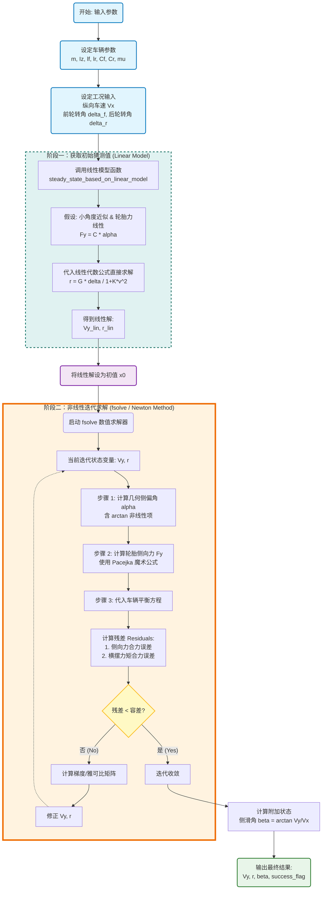

# 四轮转向车模型
假设车辆是一个“自行车”结构（左右轮合并），只考虑侧向运动 $V_y$ 和 横摆运动 $r$。

1. **侧向力平衡**
$$
m a_y = \sum F_y
$$
其中车辆的侧向绝对加速度 $a_y$ 由侧向加速度 $\dot{V}_y$ 和向心加速度 $r V_x$ 组成：
$$m (\dot{V}_y + r V_x) = F_{yf} \cos\delta_f + F_{yr} \cos\delta_r$$

2. **横摆力矩平衡**
$$
I_z \dot{r} = \sum M_z 
$$

$$
I_z \dot{r} = l_f F_{yf} \cos \delta_f - l_r F_{yr} \cos \delta_r
$$

**稳态 (Steady State)** 的定义是车辆进入稳定转向状态，此时状态变量不再变化：
$$\dot{V}_y = 0, \quad \dot{r} = 0$$

所以：需要求解的**平衡点方程**就是：
$$\begin{cases}
m r V_x = F_{yf} \cos \delta_f + F_{yr} \cos \delta_r \\
0 = l_f F_{yf} \cos \delta_f - l_r F_{yr} \cos \delta_r
\end{cases}$$

## 线性模型
线性之所以是线性，就是大量使用了**小角度近似**
$$
\tan \theta \approx \theta
$$

所以：
$$
\alpha_f \approx \delta_f - \dfrac{V_y + l_f r}{V_x}
$$

$$
\alpha_r \approx \delta_r - \dfrac{V_y - l_r r}{V_x}
$$

另外假设轮胎处于线性区，侧向力与侧偏角成正比。
$$F_{yf} = C_f \alpha_f$$

$$F_{yr} = C_r \alpha_r$$

还假设了转角较小，也就是：
$$
\cos \delta_f \approx 1
$$

$$
\sin \delta_f \approx 0
$$

将以上这些线性轮胎力和近似后的侧偏角代入平衡方程：

1. **力矩平衡** $I_z \dot{r} = 0$
$$
l_f C_f \alpha_f - l_r C_r \alpha_r = 0
$$

2. **侧向力平衡** $m \dot{V_y} = 0$
$$m r V_x = C_f \alpha_f + C_r \alpha_r$$

通过联立这两个方程，消去 $V_y$，可以推导出横摆角速度 $r$ 的解析解。

定义稳定性因数 $K_s$ (Stability Factor)：
$$K_s = \frac{m}{L^2} (\frac{l_f}{C_r} - \frac{l_r}{C_f})$$
其中 $L = l_f + l_r$。

最终得到的**稳态横摆角速度增益**公式为：
$$r = \frac{V_x / L}{1 + K_s V_x^2} (\delta_f - \delta_r)$$

## 非线性模型
非线性模型之所以被称为“非线性”，是因为轮胎侧向力 $F_y$ 与侧偏角 $\alpha$ 的关系是非线性的。

首先是轮胎侧偏角，是轮胎速度矢量与轮胎朝向之间的夹角。
$$
\alpha_f = \delta_f - \theta_{vf} = \delta_f - \arctan(\frac{V_y + l_f r}{V_x})
$$

$$
\alpha_r = \delta_r - \theta_{vr} = \delta_r - \arctan(\frac{V_y - l_r r}{V_x})
$$

其次是轮胎力模型，采用了简化的魔术公式 Pacejka：
$$F_y = D \sin(C \arctan(B \alpha))$$
这是一个饱和函数：当 $\alpha$ 较小时，力线性增加；当 $\alpha$ 很大时，力会达到峰值 $D = \mu F_z$ 并饱和。

**由于 $F_y(\alpha)$ 是非线性的，上面的平衡方程组变成了一个超越方程组，无法直接写出 $V_y$ 和 $r$ 的解析解（公式解）。**

# 非线性模型的求解
为了求解出非线性模型的解，有一个大致的思路：


## 参数对齐
> Pacejka模型的小角度刚度与线性模型参数需要匹配，不然会导致求解困难且失去对比意义。

Pacejka模型的初始侧偏刚度（ $\alpha=0$ 处的导数）为：
$$
k_\alpha = \left. \frac{dF_y}{d\alpha} \right|_{\alpha=0} = B \cdot C \cdot D
$$
其中：
+ $D = \mu \cdot F_z$ （峰值因子）
+ $C$ （形状因子）
+ $B$ （刚度因子）

根据这个关系：
$$
C_\alpha = B \cdot C \cdot D
$$
+ 假设我们已经知道侧偏刚度$C_\alpha$，然后$D = \mu \cdot F_z$，只需要知道$B$和$C$其中任意一个就行；
+ 或者我们已经拟合了魔术公式的参数，直接相乘得到$C_\alpha$就行。

# 结果分析


# 代码
```python

```


