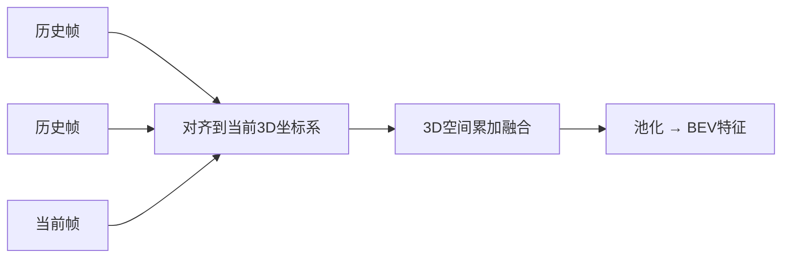
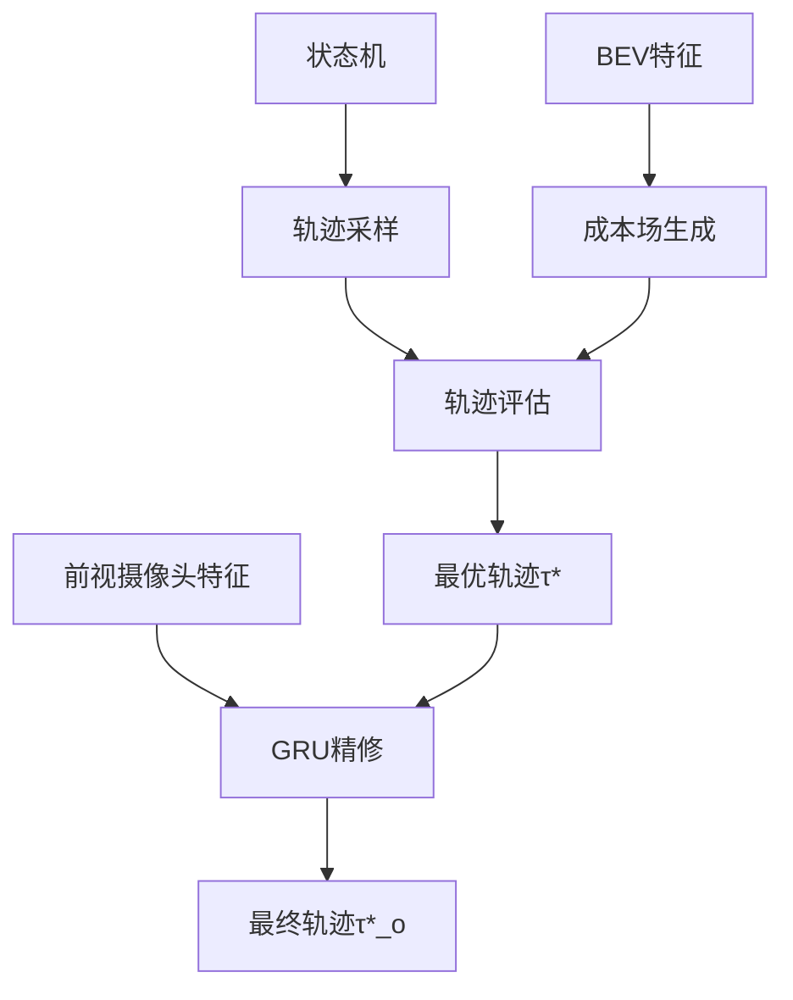

# 引言
> Hu S, Chen L, Wu P, et al. St-p3: End-to-end vision-based autonomous driving via spatial-temporal feature learning[C]//European Conference on Computer Vision. Cham: Springer Nature Switzerland, 2022: 533-549.

## 为什么做这个研究？
作者想解决现有自动驾驶系统的一个痛点：传统方法把感知、预测、规划拆成独立模块串行处理，像流水线一样，前一个模块出错后一个就跟着错。而端到端方法虽然能联合优化，但现有研究要么依赖昂贵的激光雷达，要么就是"黑箱"模型不够透明。

## 核心问题是什么？
纯视觉方案如何把2D图像转换成3D的BEV？

这个转换需要深度信息，而**深度估计本身就很难**。更重要的是，随着时间推移，车辆移动会导致**特征对齐问题**——过去的画面和当前画面对不上，几何信息容易丢失。

### 为什么深度估计很难？
1. **几何本质的歧义**
单张2D图像对应着无限多个可能的3D场景。想象一下：一张照片中一个5米高的路灯和远处一个50米高的塔楼，如果只看像素尺寸和纹理，它们可能看起来完全一样。这是因为**相机无法区分"大尺寸物体"和"近距离的小物体"**。

2. **监督信号稀缺**
比如即使去用激光雷达，稀疏点云的覆盖度也不高，还容易受到遮挡。

3. **自动驾驶场景本身对深度要求高**

4. **泛化能力受到很多因素的影响**

### 什么是特征对齐问题？
想象你的车有6个摄像头（前后左右+两个斜角），每0.5秒拍一张照片。你的任务是把这6张照片拼成一个俯视图（BEV），看清楚周围50米内所有车和人的位置。

**特征对齐问题就是：如何把不同相机、不同时间拍的"碎片"拼到同一张正确的地图上？**

所以首先遇到的问题就是**空间对齐**，如果直接把6个画面塞进神经网络，模型会疯掉：这个到底是同一辆车，还是6辆不同的车？

所以一般操作是把所有相机的像素先"反投影"到3D空间（每个像素变成一条射线），再统一到当前时刻的ego坐标系（以车中心为原点的3D世界）。

第二个问题又来了：车本身是要运动的，感知对象也可能在运动，怎么去进行**时序对齐**呢？

传统的做法是每个 frame 都先变换到当前 bev，再做拼接，再做 3D 卷积。但是**先转成BEV再拼接，高度信息已经丢了（从3D压成2D），动态物体没对齐。**

> 本文的ST-P3的解决方案：先对齐，再BEV。

在3D空间里，把过去所有帧的特征搬到现在车的坐标系下，像积木一样堆起来，最后再"压扁"成BEV图。

## 提出了什么解决方案？
提出的ST-P3方案有三个创新点：
1. 感知模块：在转换到BEV之前，先把所有历史帧的3D特征对齐到当前车辆坐标系下累加，保留完整的几何信息
2. 预测模块：设计双路径结构，一条路径处理未来不确定性（像人脑想象多种可能），另一条学习历史运动规律，两者互补
3. 规划模块：用GRU网络"精修"轨迹，专门处理红绿灯等视觉细节，不靠高清地图

# 啊啊啊啊啊
> 感知和预测直接忽略，不想看

# 规划
ST-P3的规划模块最大的亮点是：**在显式采样框架下，用学习成本+GRU精修实现了无HD地图的鲁棒规划**。

## 输入
+ 在无图的情况下，来自状态机的 high level 命令只是直行、左转、右转这样子，所以只是一个粗粒度命令告诉规划器"大概往哪儿走"
+ BEV预测结果：车辆/行人占位图、可行驶区域、车道线
+ 自车状态：速度、位姿
+ 前视摄像头特征：用于红绿灯识别

## 轨迹采样
给定自车状态$(v,\delta_0)$，采样器基于自行车模型在速度-曲率空间做网格搜索：
$$
\tau = \text{BicycleModel} \left( v+\Delta v, \delta_0 + \Delta \delta, T \right)
$$

一般会采样2000条候选轨迹的样子，然后再过成本评估，选一条成本最小的轨迹。

## 创新点 1：混合成本函数
成本函数由三部分组成，不搞纯黑盒：
$$
f(\tau, o, m; w) = f_0(\tau, o, m; w_0) + f_v(\tau; w_v) + f_{\tau}(\tau; w_{\tau})
$$

+ $f_0$：安全规则成本（手工设计，可解释），相当于先验知识。
+ $f_v$：学习成本场（数据驱动，泛化性强），因为预测head会输出一个Cost Volume：每个位置一个代价值，所以相当于让网络自己学"哪些区域危险但规则写不出来"。
+ $f_r$：舒适性成本

## 创新点 2：GRU精修单元
以前的工作里，初始轨迹只依赖BEV，但BEV对远距离/小目标的红绿灯识别不准。因为BEV投影后红绿灯像素就几个点，容易漏检或误检。

>不关心，略过略过

## 创新点 3：无HD地图的采样策略
就是上面说的，既然没有HD地图的路由线，就用离散命令粗粒度引导：

+ 直行：采样器生成前向轨迹簇（曲率小）
+ 左转：采样器生成左曲率轨迹簇（初始$\delta$为负）
+ 右转：采样器生成右曲率轨迹簇（初始$\delta$为正）

(但实际操作可能不会这么严格的正负，只是如果左转，那转角的右边界就会小很多，左边界会被拓宽)

另外的就是让感知模块在线生成"伪地图"，然后采样器把这些语义分割结果当作约束。也不讨论。

# 总结
感知看不懂，实时性没提，感觉不适合高速和高阶智驾，无图方案在舒适性上仍落后HD地图方案，对乘用车体验是硬伤。

也没那么端到端，看半天发现重点在 bev 的感知，妈的。