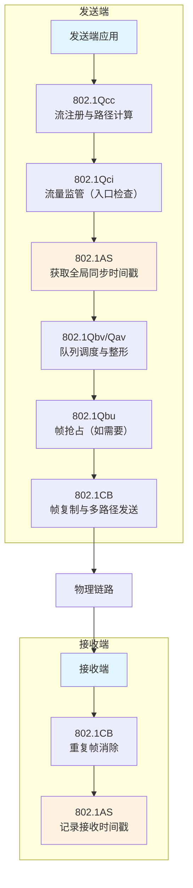
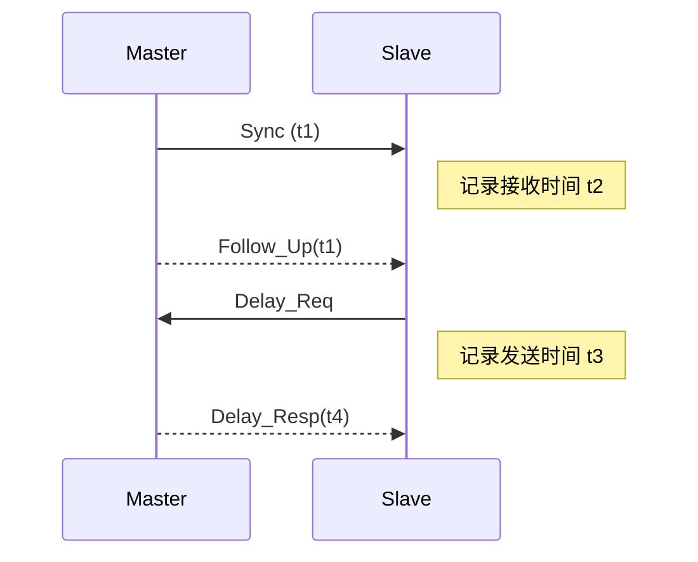

# TSN时间敏感网络
TSN（Time-Sensitive Networking） 是由IEEE 802.1工作组制定的一系列标准协议集合，**专注于解决二层网络确定性传输问题**。与传统以太网的"**尽力而为**"不同，TSN通过VLAN标签中的PCP（Priority Code Point）和VID（VLAN ID）字段定义流量优先级，实现零拥塞丢包、有界延迟和低抖动的数据传输。
## 四大技术

分别是：
+ 时钟同步：IEEE 802.1AS (gPTP) 
+ 流量调度：802.1Qbv、802.1Qav、802.1Qbu
+ 可靠性保障：IEEE 802.1CB (FRER)
+ 资源管理：802.1Qcc、802.1Qci

# 时间同步
> 在TSN之外，其他办法是如何实现时间同步的？
1. 最常用的是**NTP，网络时间协议**。手机上的时钟就是这个协议，也就是网络服务器中有一个标准时间源，client向server发送同步时间请求，server回复，client收到，然后估算通信延迟，然后再同步时间。所以说NTP的误差通常比较大，适合日常需求，对时间精度要求很低的场景。
2. **卫星授时**，字面意思，受限于信号，因为在室内可能收不到，所以常用于基站、电力系统。（信号速度是光速级）
3. **硬件同步**，把两个设备用线连起来。硬件同步方法有很多，比如PTP（IEEE1588，精确时间协议），同步脉冲就像设备上有个“时钟输出口”，定期发出一个电信号（比如每秒一次），其他设备收到信号就“对一下表”，适合简单场景。
4. **无线电授时**，容易受天气和地形影响。

TSN主要是通过IEEE802.1AS协议来实现时间同步的，这个协议也叫**广义精确时间协议（gPTP）**。它是在PTP（IEEE1588协议）基础上扩展而来的，就好像是在原来协议的基础上进行了升级优化，让时间同步更精准、更适合TSN网络。

## gPTP的实现流程
1. **选择主时钟节点**

网络中的每个设备在系统上电时，都会先接收来自其他设备的时钟信息。然后，通过一种叫做 **最佳主时钟算法 (BMCA, Best Master Clock Algorithm)** 的规则，天家来比一比谁的时钟更准、更适合作为主时钟。就像一群人比谁的表更准，最准的那个人就成为"时间老大"，这个老大叫做**grandmaster**，其他人都是它的奴隶，**slave**。比完之后，时钟最优的那个设备就会被选为主时钟节点，slavenode则作为从时钟节点。主时钟节点会周期性地发送一种announce消息，告诉其他从时钟节点自己是"时间老大"，以及自己的时间信息。

2. 计算时间偏差和传输延时

主时钟节点确定后，就开始准备让大家的时间都和它一样。
a. 主端口发送Sync报文，报文离开主端口MAC层时，触发主端口记录此时的时间戳**T1**。
b. 从端口接收Sync报文，报文到达从端口MAC层时，触发从端口记录此时的时间戳**T2**。
c．之后主端口再发送 **FolloW_UP** 报文 ，把T1的值告诉从端口。
d．通过这几个时间戳，从端口就能算出自己和主时钟之间的时间偏差。同时，从端口还会发送**Pdelay_Req**报文，主端口接收后记录时间戳并回复，通过这一系列操作，从端口可以计算出数据在网络传输中的延时。

3. 校正从时钟节点时间

从时钟节点知道了自己和主时钟的时间偏差以及传输延时后，就可以根据这些信息来调整自己的时钟了。它会按照计算出来的结果，把自己的时钟往前调或者往后调，让自己的时间和主时钟尽量保持一致。通过这样不断地测量、计算和调整，整个网络中的设备时钟就能够逐步同步起来，最终达到纳秒级的时钟同步精度。

