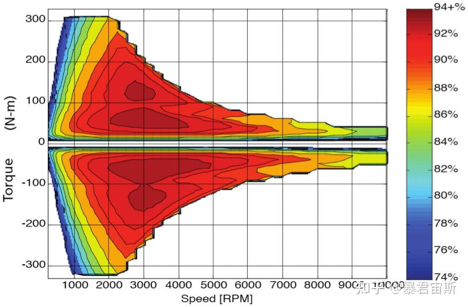

# 动力性
动力性油指汽车在良好路面上直线行驶时由受到的纵向外力决定的、所能达到的平均行驶速度。（也就是不考虑转向的横向受力情况）

动力性是汽车最基本的性能。

# 汽车的动力性指标
主要是 3 方面的指标：
1. 最高车速$u_{amax}$：在水平良好路面（混凝土或沥青）上直线行驶能达到的的最高行驶稳定速度
2. 加速时间$t$：常用原地起步加速时间（0-400m 或 0-100km/h 加速时间）和超车加速时间（由 30/40km/h 加速到某一高速时间，没有一致规定）
3. 最大爬坡度$i_{max}$：用满载（或某一载质量）时汽车在良好路面上的最大爬坡度

影响$u_{amax}$的因素有哪些？
  1. 排量
  2. 配置手动挡 MT>自动挡 AT（还有无级变速 CVT/涡轮增压 T 等）
  3. 车重
  4. 效率$\eta_T$
  5. suv<轿车（因为 suv 的风阻系数比较高）

**注意，这个最大爬坡度不是角度，而是角度的正切值！！！**

轿车通常在良好路况行驶，因此一般不强调它的最大爬坡度）
货车必须具备足够的爬坡能力，一般$i_{max}$为 30%或 16.7 度
越野车的爬坡能力非常重要，一般要求有 60%或 31 度左右

**! ! ! ! 注意，纯电汽车的评价指标可能会有所不同：**
1. 30min 最高车速
2. 0-50 和 50-80 km/h 加速时间
3. 爬坡性能：爬坡速度和车辆最大爬坡度

# 驱动力与行驶阻力
## 驱动力
汽车发动机产生的转矩，经过传动系传至驱动轮上。此时作用于驱动轮上的转矩$T_t$产生一个对地面的圆周力$$F_0$$，地面对驱动轮的反作用力$F_t$即驱动汽车的外力，称为驱动力。
$$F_t = \dfrac{T_t}{r}$$
那么作用于单个驱动轮上的转矩$T_t$是多少呢？
$$T_t = T_{tq}
\cdot
i_g
\cdot
i_0
\cdot
\eta_T$$
其中，$T_{tq}$是发动机转矩；$i_g$是变速器传动比；$i_0$是主减速器传动比（主传动比）；$\eta_T$是传动系的机械效率。

### 发动机的转速特性
功率$P$、转矩$T_{tq}$、燃油消耗率$b$、发动机曲轴转速$n$之间的函数关系用曲线表示，这条曲线称为发动机特性曲线。节气门全开的时候称为外特性曲线，节气门部分开启称为部分负荷特性曲线。

! ! ! 注意，最大转矩对应的转速$n_{tq}$和最大功率对应的转速$n_p$是两码事。

常用公式：
$$P_e = 
\dfrac{T_{tq}n}{9550}$$
为了方便计算，常常采用多项式来描述台架测得的、接近于抛物线的发动机转矩曲线。
$$T_{tq} = a_0 + a_1 n+ a_2 n^2 + 
\cdots+a_k n^k$$
一般最多五次多项式就够了。系数根据最小二乘法拟合得到。

### 传动系的机械效率
输入传动系的功率$P_{in}$在传动过程中为了克服摩擦，损耗了一部分功率$P_T$，机械效率的定义为：
$$\eta_T = 
\dfrac{P_{in}-P_T}
{P_in}$$
这个损失又分为机械损失和液力损失两大类。

### 车轮的半径
+ 无载时的半径称为自由半径。（把汽车吊起来）
+ 汽车静止时的半径称为静力半径$r_s$。

滚动半径由实验测得，或近似估算。
+ 对汽车进行动力学分析的时候，应该用静力半径$r_s$；
+ 进行运动学分析的时候，应该用滚动半径$r_r$。

但一般不计较它们的差别，统称为$r$

### 驱动力图

之前讲的那些特性曲线、参数都知道之后，就可以求出各个档位的$F_t$值，再根据发动机转速和汽车行驶速度之间的转换关系求出$u_a$
$$u_a=0.377\dfrac{rn}{i_g i_0}$$

## 行驶阻力
行驶阻力的构成：滚动阻力$F_f$、空气阻力$F_w$、坡度阻力$F_i$、加速阻力$F_j$。
$$\Sigma F=F_f + F_w + F_i + F_j$$

### 滚动阻力
简单来说，这个滚动阻力是由于轮胎变形和支撑路面变形所产生的相互作用力，如果汽车行驶在硬路面上，轮胎的变形是主要的。

什么是**加载和卸载**？

看图：车轮向左滚动，左边的$d$是加载区域，右边的$d^\prime$是卸载区域。
上图的曲线不能完全重合，实际上就是因为加载和卸载过程中有一部分能量被损耗了。（轮胎内部摩擦产生的弹性迟滞损失，使轮胎变形时对它做的功不能全部回收）

**这意味着车辆在运动时，加载区域的载荷$F_{zd}$>卸载区域的载荷$F_{zd^\prime}$，导致这两个载荷力合力$F_z$的作用点在$n-n^\prime$的左侧，这个偏移的距离用$a$表示。**

假设车辆行驶在水平路面上，意味着垂向上受力平衡，也就是$W=F_z$。

又由于$a$的存在，因此这两个力形成了一对力偶。称为阻力偶。

引入阻力偶矩$T_f$，阻碍汽车轮胎的滚动。因此要使从动轮在硬路面上等速滚动，必须在车轮中心施加一个推力$F_{p1}$，来克服滚动阻力偶矩。
$$F_{p1}r = T_f$$
$$F_{p1} = \dfrac{T_f}{r} = 
F_z \dfrac{a}{r}$$

令$f = \dfrac{a}{r}$，则$f = \dfrac{F_{p1}}{W}$，这个$f$就称为滚动阻力系数。
对于驱动轮，因为有驱动力矩$T_t$，所以有地面给车轮的切向反作用力$F_{X2}$：
$$F_{X2}r = T_t - T_f$$
$$F_{X2} = F_t - F_f$$
现在可以看出，真正作用在驱动轮上驱动汽车行驶的力为地面切向反作用力$F_{X2}$，它的数值等于驱动力-滚动阻力。

> 问：滚动阻力系数$f$和哪些因素有关？
> 答：路面种类、行驶车速、轮胎构造、材料、气压。由实验测得。

>行驶车速对滚动阻力系数有很大影响。
>比如，轿车轮胎在车速为 100km/h 以下时，滚动阻力逐渐增加但变化不大；
>在某一车速（如 140km/h）以上时增加较快。
>车速达到某一临界车速（例如 200km/h）左右时，滚动阻力迅速增加，此时轮胎发生驻波现象，轮胎周缘不再是圆形而呈明显的波浪状。出现驻波后，不但滚动阻力显著增加，轮胎的温度也很快增加到 100℃以上，胎面与轮胎帘布层脱落，几分钟内就会出现爆破现象，这对高速行驶的车辆是很危险的。

### 空气阻力
空气阻力分为压力阻力和摩擦阻力两部分。（想一下高速行驶时，打开天窗和打开侧窗的区别）

压力阻力又分为：形状阻力、干扰阻力、内循环蓄力、诱导阻力。（形状阻力>>干扰阻力>内循环蓄力>诱导阻力）
- 形状阻力：顾名思义，占空气阻力的大部分，和车身形状有关。
- 干扰阻力：和车身表面凸起物有关
- 内循环阻力：发动机、车内通风需要吸气排气形成的阻力
- 诱导阻力：空气升力在水平方向的投影
$$F_w = \dfrac{1}{2}
C_D
\rho
A
u_r^2$$
式中，$C_D$是风阻系数，$\rho$是空气密度（一般为 1.2258 kg/m3），$A$为迎风面积，$u_r$为相对速度（速度是 km/h）。
可以写成：
$$F_w = \dfrac
{C_D A u_a^2}
{21.15}$$
（只讨论无风情况）

### 坡度阻力
$$F_i  =
G \sin \alpha$$
当坡度比较小的时候，有近似：
$$\sin \alpha \approx
\tan \alpha =
i$$
由于坡度阻力$F_i$和滚动阻力$F_f$均与道路有关，且和汽车重力成正比，所以可以把这两种阻力合并到一起，称为道路阻力$F_\Psi$：
$$F_\Psi = F_f + F_i = Gf\cos\alpha + G\sin \alpha
\approx Gf+Gi=G(f+i) =G\Psi$$
$\Psi$称为道路阻力系数。

### 加速阻力
汽车加速行驶时，需要克服其质量加速运动时的惯性力，就是加速阻力$F_j$。汽车质量分为平移质量和旋转质量。
$$F_j = 
\delta m 
\dfrac{\text{d}u}{\text{d}t}$$
$\delta$是汽车旋转质量换算系数。$\delta > 1$

# 汽车行驶平衡
$$F_t = F_f + F_w + F_i + F_j
$$
$$\dfrac{T_{tq}i_gi_0\eta_T}
{r}=Gf\cos\alpha + 
\dfrac{C_D A}{21.15}u_a^2 + 
G\sin\alpha+\dfrac{\text{d}u}{\text{d}t}$$
其实根据这个方程式，就可以求出动力性的三个评价指标。
但是为了清晰而形象地表明汽车行驶时的受力情况及其平衡关系，一般是将汽车行驶方程式用图解法来进行分析的。

## 汽车驱动力 - 行驶阻力平衡图
就是在汽车驱动力图上把汽车行驶中经常遇到的滚动阻力和空气阻力$F_f + F_w$也算出来并画上，作出汽车驱动力 - 行驶阻力平衡图，并以此来确定汽车的动力性。

可以看到有一个交叉点临界车速，低于这个临界车速，驱动力大于行驶阻力，意味着汽车可以用剩余的驱动力加速或爬坡；
在这个临界车速点，意味着无论怎么踩油门，汽车都不会加速了。

要分析加速时间，将这个式子写成$\dfrac{\text{d}u}{\text{d}t}=
\dfrac{1}{\delta m}[F_t - (F_f + F_w)]$
就会把上面这个图转化为加速度曲线图$a-u_a$，积分就行了。

最大爬坡度也是根据方程来的，设加速度为 0，
$$\alpha = 
\arcsin
\dfrac{F_t - (F_f+F_w)}{G}$$
$$i = \tan \alpha$$

## 动力特性图
也有用动力特性图来分析汽车动力性的。
将行驶方程两边除汽车重力$G$并整理：
$$\dfrac{F_t-F_w}{G}=\Psi + 
\dfrac{\delta}{g}
\dfrac{\text{d}u}{\text{d}t}$$
令$\dfrac{F_t-F_w}{G} = D$，为汽车的动力因数。
$$D = \Psi + 
\dfrac{\delta}{g}
\dfrac{\text{d}u}{\text{d}t}$$
$D$与车速的关系曲线称为动力特性图
如果要求最大爬坡度，令$\dfrac{\text{d}u}{\text{d}t}=0$：
$$D_{max} = f\cos\alpha_{max}+\sin\alpha_{max}$$
从而得到：
$$\alpha_{max} = 
\arcsin
\dfrac{D_{max}-f\sqrt{1-D_{max}^2+f^2}}
{1+f^2}$$
要求加速时间，就令$i=0$。
$$\dfrac{\text{d}u}{\text{d}t}=\dfrac{g}{\delta}(D-f)$$
然后积分。

## 总结
如何得到三个评价指标？
- 最高车速就是两条线的交点，这个最容易得到。
- 加速时间和最大爬坡度其实和图关系没那么大，还是根据方程推导来的。

# 汽车行驶的附着条件和汽车的附着率
从上面的分析可知，动力装置（指发动机与传动系）确定的驱动力是决定动力性的主要因素，驱动力大则加速、爬坡能力好，但这一结论仅在轮胎 - 路面附着力足够（如干燥水泥路面上的良好轮胎）时成立；

若路面附着性差（如潮湿沥青路），大驱动力可能致车轮滑转，地面切向反作用力不大，动力性难提升。可见，汽车动力性既受驱动力制约，也受轮胎与地面附着条件限制 。

地面对轮胎切向反作用力的极限值称为附着力$F_\varphi$。

$$F_{Xmax} =F_\varphi=F_Z \varphi$$
$\varphi$就是传说中的附着系数。

（实际上还受到 y 轴方向上的轮胎力的耦合影响，不过这里只讨论纵向）

$\dfrac{F_x}{F_z}$就称为附着率，附着率$C_\varphi$不能大于$\varphi$，这个参数只对驱动轮有意义，对从动轮是没有意义的。

## 加速、上坡时的附着率
对于后轮驱动汽车，后驱动轮的附着率为
$$C_{\varphi 2} = 
\dfrac{F_{X2}}{F_{Z2}} = 
\dfrac{F_{f1} + F_{w} + F_{i} + F'_{j}}{F_{Zs2} - F_{Zw2} + \dfrac{G}{g} \dfrac{h_{g}}{L} \dfrac{\text{d}u}{\text{d}t}}$$
简化掉空气阻力和滚动阻力，得到：
$$C_{\varphi 2} = \dfrac{F_{\text{i}} + F'_{\text{j}}}{F_{\text{zs2}} + \dfrac{G}{g} \dfrac{h_{\text{g}}}{L} \dfrac{\text{d}u}{\text{d}t}} =
 \dfrac{i + \dfrac{1}{\cos\alpha} \dfrac{1}{g} \dfrac{\text{d}u}{\text{d}t}}{\dfrac{a}{L} + \dfrac{h_{\text{g}}}{L} \Bigl(i + \dfrac{1}{\cos\alpha} \dfrac{1}{g} \dfrac{\text{d}u}{\text{d}t}\Bigr)}$$

 $i+\dfrac{1}{\cos\alpha}
\dfrac{1}{g}
\dfrac{\text{d}u}{\text{d}t}$可以理解成包含加速阻力在内的等效坡度，用$q$表示。

$$C_{\varphi 2} = 
\dfrac{q}{\dfrac{a}{L}+\dfrac{h_g}{L}q}$$
把$q$拿出来，单独求最大等效坡度$q_{max}$：
$$q_{max} = 
\dfrac{\dfrac{a}{L}}
{\dfrac{1}{\varphi}-\dfrac{h_g}{L}}$$
代表基于实际附着系数的最大等效坡度。
前驱车同理。

但是对于四驱车，前后驱动扭矩的分配是根据中央差速器的结构决定的，有一个分配系数$\Psi$。这个系数一般在 0.6 左右，后轴多分配一些。
同理，附着率为：
$$C_{\varphi 1} = 
\dfrac{(1-\Psi)q}
{\dfrac{b}{L}-\dfrac{h_g}{L}q}$$
$$C_{\varphi 2} = 
\dfrac{\Psi q}
{\dfrac{a}{L}+\dfrac{h_g}{L}q}$$
前、后驱动轮的附着率常不相等。如前驱动轮附着率较大，即一定等效坡度$q$条件下，前驱动轮要求更大的地面附着系数，则在一定$\varphi$值路面上行驶时，前驱动轮的驱动力将先达地面附着力而滑转。前驱动轮滑转后，前驱动力不再增加，故后驱动轮动力也保持其在刚刚开始滑转时的数值而不再增加。

# 汽车的功率平衡
汽车行驶时，不仅力是平衡的，功率和阻力功率也是平衡的。

牢记$P=Fv$

后面懒得写了，一堆发动机。这年代到底谁还在干发动机和变速箱？

# 电车补充
在讲其他的东西之前，需要明确一下现在电动汽车所使用的电机种类：
1. 永磁同步电机，PMSM：绝对的主流，90%以上车用；
2. 交流异步电机：早期主流，现在已经慢慢被淘汰了；
3. 开关磁阻电机：老头乐上喜欢用，不讨论。
所以我们的研究对象可以说只有 PMSM 一个。

## 电机效率 map 图
效率 map 图是电机的效率在扭矩-速度平面上的等高线图，广泛用于描述电动机和驱动系统在给定扭矩/速度工况点的性能。其外特性显示了电机给定转速下的最大输出扭矩能力。

参考：https://zhuanlan.zhihu.com/p/667273756，永磁同步电机的损耗由铜耗、铁耗、永磁涡流损耗和机械损耗组成，其中铜耗 copper loss 和铁耗 iron loss 占主要部分。

为简化分析，忽略电机的铁心的饱和、温度影响等因素。

要得到 map，除了通过实验获得，还可以通过解析获得。

铜耗计算公式：
$$P_{cu} = 3k_{ac}I^2 R_{dc} = 3k_{ac}J^2 V_{cu}$$
可以看出铜耗与电流的平方成正比，而扭矩又与电流成正比，因此铜耗与转矩成正比。
铁浩计算公式：
$$ P_{fe} = k_h f^\alpha B^2 + k_e f^2 B^2 + k_{ex} f^{1.5} B^{1.5} $$
可以发现，铁耗近似与频率的 2 次方成正比，而频率与转速成正比，所以铁耗和转速的平方成正比。
也即重载区铜耗占主，高速区铁耗占主。因此从总损耗图可以看出，等功率线两端损耗较大，中间损耗较小，电机高效区在等功率线中间。

PS：这个map也通常用作于做四轮扭矩的最优分配：
$$\text{min} \ J = W_1J_f + W_2J_e + \cdots$$
$J_f$是轮胎利用率，$J_e$是电机效率。（也许$W_2$需是一个负权重）

## 电机的弱磁控制
车用PMSM是通过逆变器驱动，电机接受的最大电流和电压受到逆变器最大电流和电压的双重约束，当转速需要进一步提高，逆变器则不能提供更大的电流或电压。弱磁控制可以在不改变电机结构和逆变器容量的前提下提升永磁同步电机调速范围。该方法以降低转矩为代价，使电机转速超过其额定转速。

可以看出，在恒转矩区，使用磁场定向控制 (FOC) 来调节电机。
然而，当转速继续上升时，施加的电压达到最大值，反电动势电压超过施加的电压，从而阻止电机转速增加。

然后就要使用弱磁模式了。

通过注入负直轴电流（id<0）削弱转子磁场，减少反电动势，从而突破基速限制。了解就行，这是电机控制算法开发工程师该学的知识。

But，我们需要知道高速区的弱磁控制，会对电机效率map产生什么影响？

关注三个机制：
- 铜损增加：弱磁时需注入较大负直轴电流（id），导致定子绕组铜损$I^2R$显著上升。例如，在恒功率区，id 的增加可能使铜损占总损耗的比例从 30% 升至 50% 以上。
- 铁损波动：高速运行时，铁损（磁滞和涡流损耗）随频率升高而增加，但弱磁导致的磁密下降可能部分抵消这一效应，最终铁损变化取决于两者的动态平衡。
- 机械损耗：转速升高会加剧轴承摩擦和风阻损耗，尤其在超高速区域（如超过基速 2 倍时），机械损耗可能成为主导因素。
表现在电机效率map图上，则是：
- 效率峰值迁移：基速以下，效率峰值出现在 MTPA 控制的最优工作点；进入弱磁区后，效率峰值向高速低负载区域偏移，且幅值下降 5%-15%。
- 高效区收缩：弱磁区域的高效运行窗口（效率 > 85%）通常比恒转矩区窄 30%-50%，尤其在轻载高速时，效率可能降至 70% 以下。
- 负载敏感性增强：在弱磁区，效率对负载变化更为敏感。例如，当负载从额定值的 80% 降至 20% 时，效率可能下降 10%-15%，而恒转矩区仅下降 5%-8%。

## 减速器设计
问：为什么电动汽车也需要减速器？
答：其实还是尺寸和重量需求限制，我要输出大扭矩，不可能一直堆料吧？要么我别爬坡了，要么我永远不走高速。所以成本这是一个方面，另一方面是成熟度：如果电机直驱，不仅需要复杂的算法匹配转弯半径和轮速差，更困难的是动态保持轮子实际转速和理论一样（两个轮子，同时按照理论设计）否则不能避免轮子打滑，造成不必要的风险。

问：所以和燃油车的变速箱有什么区别？
答：减速器只是减速，而变速箱是多个减速器放到一起，负责调速。然而电动车电机本身就具备调速功能。总结：发动机是巨婴，变速箱是保姆。

