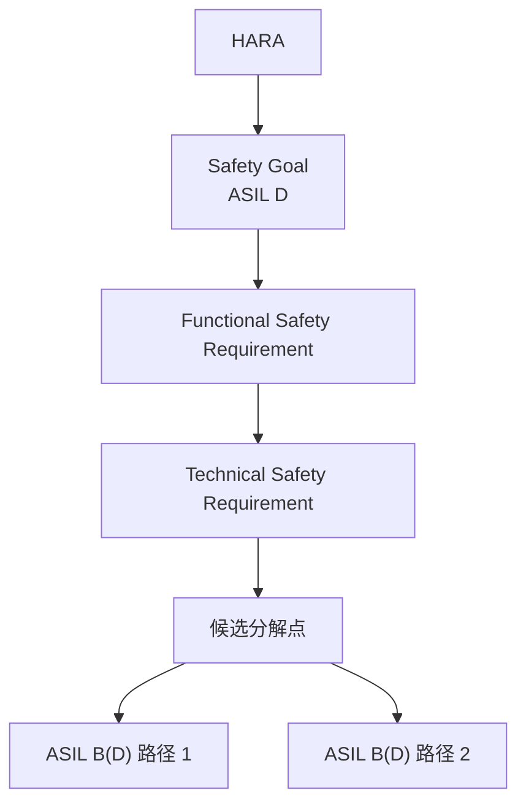
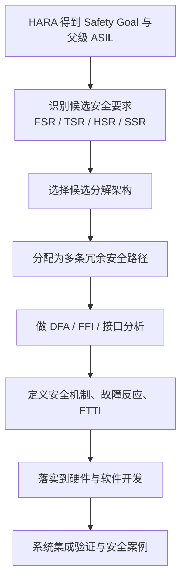
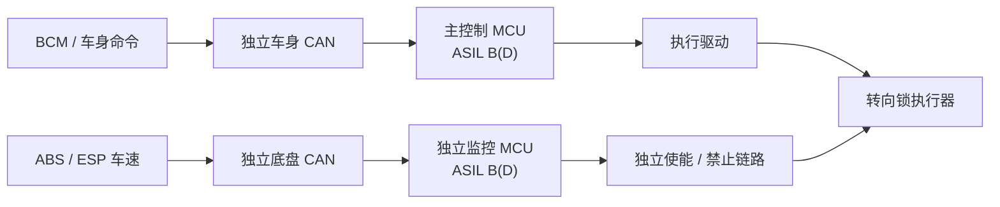

`ASIL Decomposition` 是 ISO 26262 里一个非常容易被说简单、但真正落地时很容易做错的概念。很多人口头上会把它理解成把一个 `ASIL D` 的功能拆成两个 `ASIL B`，这样成本就降下来了。这种说法只抓住了结果的一部分，真正关键的前提却被省掉了：**被分解的是安全要求，不是安全目标；分解后的要求必须带冗余，而且要分配到足够独立的元素上；最终功能安全论证仍然围绕原始 ASIL 展开**。

如果把这个点看透，ASIL 分解就不再只是一个降等级技巧，而是一种架构方法。它服务的是高等级安全目标的实现问题：当单一路径太贵、太复杂、性能不合适，或者很难把单一元素直接做到目标 ASIL 时，可以把同一条高等级安全要求，用两条或多条相互独立的安全路径来承担。这样做的意义，不只是节省器件成本，更重要的是**避免单点故障直接击穿整个安全目标**。

在自动驾驶、线控制动、线控转向、电驱和高压电控这些场景里，ASIL 分解经常和冗余架构、安全监控器、安全岛、外部 watchdog、双通道传感、双总线通信一起出现。真正的工程难点通常不在于把表格背下来，而在于证明这几条路径真的足够独立，以及它们失效时能否把系统带回一致的安全状态。

# 先把对象分清
ASIL 分解首先不是对 `Safety Goal` 本身做降级。[Infineon 对 ASIL decomposition 的说明](https://community.infineon.com/t5/Knowledge-Base-Articles/ASIL-decomposition-ISO-26262/ta-p/852405)明确强调，**可以被分解的是功能安全要求、技术安全要求、硬件安全要求或软件安全要求，安全目标本身不分解**。这意味着，经过 `HARA` 得到的原始安全目标及其父级 `ASIL` 仍然保留，只是在架构分配阶段，把后续的安全要求按允许的模式拆给多个元素去实现。

这个逻辑可以先用一条链路记住：

这里的 `ASIL B(D)` 不是一个新的独立安全等级，它表示：**这条要求本身按 `ASIL B` 的开发 rigor 去实现，但它服务的是一个原始父级为 `ASIL D` 的安全目标**。括号里的 `D` 不能省，因为它告诉你这条要求来自哪里，也提醒你后面的系统级论证、集成验证和硬件指标目标不能简单按孤立的 `ASIL B` 去理解。

这也是为什么工程里常说，ASIL 分解能降低局部元素的开发等级，但**不会把整个 item 的功能安全责任一起降掉**。如果原始安全目标是 `ASIL D`，最终安全案例仍然要说明这个 item 如何满足 `ASIL D` 的目标风险水平，而不是只说明每个局部模块各自满足了一个低等级要求。

# 允许的分解组合
[Infineon 对 ISO 26262-9 的总结](https://community.infineon.com/t5/Knowledge-Base-Articles/ASIL-decomposition-ISO-26262/ta-p/852405)给出了比较清楚的允许组合。工程上最常查的就是下面这张表：

| 分解前 | 允许的分解后组合 |
|:--|:--|
| `ASIL D` | `ASIL D(D) + QM(D)` |
| `ASIL D` | `ASIL C(D) + ASIL A(D)` |
| `ASIL D` | `ASIL B(D) + ASIL B(D)` |
| `ASIL C` | `ASIL C(C) + QM(C)` |
| `ASIL C` | `ASIL B(C) + ASIL A(C)` |
| `ASIL B` | `ASIL B(B) + QM(B)` |
| `ASIL B` | `ASIL A(B) + ASIL A(B)` |
| `ASIL A` | `ASIL A(A) + QM(A)` |

这张表有三个常被忽略的含义。

第一，分解不是随便凑。`ASIL D` 可以拆成 `B(D) + B(D)`，但不能随手写成 `A(D) + A(D)`。标准允许的组合，本质上约束了风险削减能力如何在冗余路径之间重新分配。

第二，`QM` 并不等于可以不管。例如 `ASIL D(D) + QM(D)` 这种模式里，`QM(D)` 这条路径仍然属于安全概念的一部分，只是它本身不承担同等级的开发 rigor。它是否真的可以作为分解路径的一部分，要看整体架构、独立性、失效反应和安全论证是否成立。

第三，ASIL 分解可以服务于功能、技术、硬件、软件多层要求，理解时不要只盯着硬件框图。很多项目里，真正的切入点是某条 `TSR` 或某个监控功能在架构上的分配方式。

# 分解成立的前提
ASIL 分解成立，核心不在表格，而在三个前提：**冗余、独立、可证明**。

## 冗余
分解后的几条安全要求，必须共同覆盖同一条初始安全要求，不能拆成互不相干的子功能。换句话说，它们服务的是同一个安全目标，且各自都在为防止同一类危险失效负责。

举一个更具体的例子。假设 `HARA` 得到的安全目标是：*车辆行驶过程中不得出现非预期的转向执行*。继续往下分配时，某条技术安全要求可以写成：**一旦检测到异常转向请求、控制器失步或关键报文超时，系统必须在 `FTTI` 内阻止 `EPS` 继续输出危险转向力矩**。

如果这条要求要做分解，分解后的两条路径都必须直接参与阻止危险转向，而不是一条真正在控风险，另一条只做信息提示。一个成立的写法可以是：
- 路径 1：主控制通道负责生成合法的转向请求，只有在驾驶输入、车速、模式状态和自检结果都满足条件时，才允许向 `EPS` 输出目标转角或目标转矩。
- 路径 2：独立监控通道负责监督主控制通道输出，一旦发现目标转角越界、转矩斜率异常、报文超时或主控失步，就独立撤销执行使能，或者直接向 `EPS` 下发禁止扭矩请求。

这两条路径都在做同一件事：**约束执行器不要产生危险转向**。因此它们有资格被拿来做 ASIL 分解。

反过来看，如果你写成：
- 路径 1：主控制通道负责方向盘扭矩估算。
- 路径 2：中控界面弹窗提醒驾驶员注意。

这就不构成合格的分解。原因不是中控提示完全没价值，而是它没有直接对执行器形成安全约束，也无法保证在 `FTTI` 内把危险转向压住。它更像辅助告警或 `HMI` 支持，而不是承担同一条安全要求的独立安全路径。

## 独立
独立是 ASIL 分解最难的部分。[Infineon 对 ASIL decomposition 的说明](https://community.infineon.com/t5/Knowledge-Base-Articles/ASIL-decomposition-ISO-26262/ta-p/852405)和 [Infineon 对 FFI 的说明](https://community.infineon.com/t5/Knowledge-Base-Articles/Functional-safety-freedom-from-interference-FFI/ta-p/799699)都在强调这一点：**要通过 `Dependent Failure Analysis` 证明这些元素之间不存在会共同击穿初始安全要求的依赖失效，或者已经有合适的安全措施把这些依赖失效控制住**。

这里要先分清两类依赖失效。

| 类型 | 含义 | 典型例子 |
|:--|:--|:--|
| `Common Cause Failure` | 一个共同原因让两条路径同时失效 | 两个 MCU 共用同一电源，电源跌落后同时失效 |
| `Cascading Failure` | 一条路径的故障继续传染到另一条路径 | 主控制器输出错误速度信息，监控 MCU 也基于错误数据做出错误判断 |

这两类都属于 `Dependent Failure`。只要它们可能导致原始安全要求被违反，分解就站不住。工程上常见的独立性检查对象包括：
- 电源是否独立，欠压、过压、掉电时是否会双通道同时失效。
- 时钟是否独立，是否存在共同时钟停振导致双路径同时冻结。
- 复位链路是否独立，一个复位信号是否会同时拉死两条通道。
- 通信链路是否独立，两条通道是否共享同一条 CAN、同一个交换芯片、同一份经主控转发的数据。
- 软件是否真正独立，是否共用同一算法、同一代码生成链、同一编译器缺陷路径。
- 存储和内存保护是否独立，一条路径的内存越界是否可能破坏另一条路径状态。
- 执行链路是否独立，两条判断最终是否还是被同一个故障点单点阻断。
- 时序是否独立，是否存在同一个超时或调度拥塞让两条安全路径一起来不及反应。

[TI 的白皮书](https://www.ti.com/lit/pdf/sway028)和 [Infineon 对 FFI 的说明](https://community.infineon.com/t5/Knowledge-Base-Articles/Functional-safety-freedom-from-interference-FFI/ta-p/799699)都在提醒：**同构冗余通常不足以自动证明独立性**。简单地复制一颗相同 MCU、复制一份相同软件、跑在相同电源和相同时钟下，通常不够。多样性有帮助，但多样性本身也不自动等于独立，最终还是要回到 `DFA` 证据。

## 可证明
ASIL 分解不是画出双通道框图就完成了，后面还要有完整证据链。至少要能回答下面这些问题：
- 为什么这几条路径足以覆盖同一安全要求。
- 为什么单点故障不会直接让整条安全功能完全失守。
- 为什么共同原因故障和级联故障已经被排查或受控。
- 为什么系统进入的安全状态一致，且满足 `FTTI` 约束。
- 为什么硬件指标、软件开发流程、验证活动和集成测试仍然与原始父级 ASIL 对齐。

# 典型流程
把 ASIL 分解放进项目流程里，会比单独背概念清楚得多。一个比较稳妥的落地顺序通常长这样：

下面把每一步展开。

## 第一步：先有原始安全目标
ASIL 分解不会替代 `HARA`。项目必须先完成危害分析，得到明确的 `Safety Goal` 及其父级 `ASIL`。如果前面连危险事件、场景、严重度、暴露率、可控度都没有收敛，后面讨论分解通常会失焦，因为你根本不知道自己在保护什么。

## 第二步：找分解对象
真正进入架构设计时，需要识别哪一条要求是候选分解对象。通常有几类典型触发条件：
- 单一元素很难直接满足目标 ASIL。
- 主控制路径很复杂，想把高复杂度功能和安全监督功能拆开。
- 需要保留高性能控制器，同时再加一条较简单但独立的安全监控路径。
- 想提高对单点硬件故障或系统性故障的鲁棒性。

不是每条要求都适合分解。那些天然只有一个执行链路、很难形成真实独立性的要求，强行做分解往往只会把论证复杂度抬高。

## 第三步：选分解模式
这一步才轮到查上面的允许组合表。例如某个 `ASIL D` 的技术安全要求，架构上可能考虑：
- `ASIL B(D) + ASIL B(D)`：两条能力较均衡的独立路径。
- `ASIL C(D) + ASIL A(D)`：一条主路径更强，另一条做相对简单但独立的安全监督。
- `ASIL D(D) + QM(D)`：保留一条完整高等级路径，另一条补充冗余或可用性支持。

哪种模式更合适，不只取决于标准允许，还取决于系统物理结构、器件能力、执行链路、诊断机制和成本边界。

## 第四步：把要求分到元素上
分配时要尽量写成**可验证的要求**。例如：
- 主控制通道：在收到合法驾驶命令且车辆满足解锁条件时，输出转向执行请求。
- 安全监控通道：仅当独立速度源确认车辆静止时，才允许执行器使能；否则强制禁止锁止执行。

这样的要求写法比笼统地说主 MCU、备 MCU 各负责一半更好，因为后者没有把安全语义写出来，也不利于后续 `DFA` 和测试用例设计。

## 第五步：做 DFA 和 FFI
很多架构图死在这里。表面上看是双通道，实际上却共用了关键依赖点。`DFA` 往往要具体到信号、时钟、电源、内存区、总线、执行器使能、监控触发链路。`FFI` 则更偏向保证一个元素不会通过错误访问、时间侵占、通信干扰等方式破坏另一个元素。

在软件和 SoC 场景里，这一步尤其关键。两个任务如果跑在同一颗高性能 SoC 上，想靠逻辑分区就完成 ASIL 分解，通常要非常认真地证明：
- 内存隔离成立。
- 调度隔离成立。
- 通信接口有端到端保护。
- 权限和资源访问受控。
- 一条路径的软件异常不会把另一条路径拖进未定义行为。

## 第六步：回到原始 ASIL 看硬件与验证
这是另一个常见误区。[Infineon 对 ASIL decomposition 的说明](https://community.infineon.com/t5/Knowledge-Base-Articles/ASIL-decomposition-ISO-26262/ta-p/852405)明确指出，**item 的功能安全评估仍由原始 ASIL 定义，硬件指标目标也仍按原始 ASIL 看**。这意味着即使你已经把某条 `ASIL D` 要求分成了两个 `ASIL B(D)`，也不能简单得出整机硬件指标只需按 `ASIL B` 看。

工程上更稳妥的理解是：分解改变的是要求分配和局部实现 rigor，不是把整机的目标风险水平整体降级。

## 第七步：验证系统级结论
最后必须通过系统测试、故障注入、接口测试、时序验证和安全分析证明：任一路径失效时，另一条路径仍能把系统保持在可接受风险范围内；如果出现共同原因故障，已有措施能及时把系统拉回安全状态；如果故障持续存在，系统是否进入 fail-safe，还是具备有限的 fail-operational / limp-home 能力，也都要有明确设计和证据。

# 工程示例
## 示例一：电子转向锁
[TI 的 An introduction to ASIL decomposition and SIL synthesis 白皮书](https://www.ti.com/lit/pdf/sway028)给了一个很典型的例子，适合用来理解**错误的分解为什么不成立**。

先设定安全目标：**车辆行驶中，转向锁不得被非预期锁止**。这个目标的后果可能非常严重，因此常被当作高等级安全目标来讲解。

如果只用单个 MCU 接收车身控制模块命令，再驱动执行器，这就是单通道架构。它的问题很直接：只要主控、通信或执行链路出现关键故障，就可能直接违反安全目标。

很多人第一次做分解时，会画出下面这种看起来像双通道、其实不独立的结构：
- 主 MCU 负责控制执行器。
- 次 MCU 负责判断车速是否为零。
- 但次 MCU 获取车速的路径仍然通过主 MCU 转发。

这个问题的本质在于：**次 MCU 并没有独立事实来源**。如果主 MCU 因通信错误、软件故障或数据篡改把错误速度送给次 MCU，那么两条路径会因为同一个原因一起做错判断。这就是典型的 `Cascading Failure` 或 `Common Cause` 风险。

更合理的做法是让两条路径在关键事实上保持独立，例如：

这个架构里，主控制通道和安全监控通道至少在关键输入来源和使能逻辑上更独立。主通道想锁止执行器，必须同时满足监控通道独立确认的允许条件。这样做的价值，不只是满足 `ASIL B(D) + ASIL B(D)` 这种形式，更重要的是把单点错误速度信息直接导致误锁止的概率压下去。

## 示例二：高性能控制器加安全监控器
另一个很常见的模式出现在电驱、转向、制动和高算力控制系统里。主控制器负责复杂控制算法，安全监控器负责监督、比较、超时检测和安全下电。

这种模式之所以常见，是因为高性能控制器未必最适合承担全部高等级安全机制。项目往往会选择：
- 一颗擅长复杂控制、性能更强的主控，承担正常控制功能。
- 一颗结构更简单、诊断手段更强，或者 `safety manual`、`FMEDA`、诊断覆盖说明等交付物更完整的监控器，承担安全监督和失效处置。

典型安全职责分工可以是：
- 主控输出扭矩、制动或转向请求。
- 监控器独立采集关键反馈量，检查范围、斜率、时序和相容性。
- 一旦发现越界、失步、超时或自检失败，监控器独立拉断使能或触发安全状态。

这种架构经常被误解成性能 MCU 做业务、ASIL MCU 做个 watchdog 就行。真正成立的关键仍然是独立性。**监控器如果只读取主控转发过来的数据，或者两者共享同一电源、时钟、复位、通信仲裁点和执行使能点，那么看上去有两条路径，实质上仍可能被一个共同原因一起击穿**。

# 为什么简单双 MCU 往往不够
最常见的错误，就是把两颗 MCU 画在图上，就觉得已经完成 ASIL 分解。实际上，下面这些情况都很危险：

| 表面结构 | 实际问题 |
|:--|:--|
| 两颗相同 MCU，共用同一电源和时钟 | 一个供电或时钟故障就可能让两条路径一起失效 |
| 两条软件路径跑同一套算法、同一编译链 | 系统性缺陷可能同时影响两条路径 |
| 监控通道只看主通道转发的数据 | 主通道错误会级联污染监控判断 |
| 两条路径最终都依赖同一个执行使能点 | 执行器侧单点故障仍可能击穿安全目标 |
| 双通道只做结果比较，没有独立安全动作 | 检测到故障但不能把系统带回安全状态 |

所以，评估一个分解方案时，真正要追问的是这些模块之间是否形成了真实有效的双路径防护：
- 两条路径看到的关键事实是否独立。
- 两条路径的故障模式是否足够不同。
- 两条路径是否都能在 `FTTI` 内采取有效安全动作。
- 一条路径坏掉后，另一条路径是否还真的有能力兜底。

# 和几个常见概念的关系
## 和 ASIL 定级的关系
ASIL 定级来自 `HARA`，回答的是某个危险事件需要多高风险降低能力。ASIL 分解发生在后续架构设计阶段，回答的是：**怎样把这个高等级要求以更可实现的方式分配给多个元素**。前者是风险分类，后者是实现策略，层次完全不同。

## 和安全岛的关系
安全岛并不自动等于 ASIL 分解，但它经常是 ASIL 分解的好载体。原因很简单：安全岛通常在实时性、权限隔离、监控接口、独立复位和安全机制上更容易形成一条相对独立的安全路径。如果主应用域负责复杂感知或控制，而安全岛负责监督和安全处置，这就很容易形成可论证的双路径架构。

## 和 fail-safe、fail-operational 的关系
ASIL 分解既可以服务于 fail-safe，也可以服务于一定程度的 fail-operational，但两者不是同义词。
- 如果分解后的冗余路径只用于在故障时快速切断输出、拉回安全状态，它更偏向 fail-safe。
- 如果故障后仍保留部分可控功能，例如降级转向助力、受限扭矩输出、低性能 limp-home，它才接近 fail-operational。

要做到后者，要求往往更高，因为你不仅要证明能安全停下来，还要证明降级运行期间仍满足残余风险约束。

# 常见误区
## 误区一：Safety Goal 也能分解
不对。能分解的是后续安全要求，原始安全目标及其父级 ASIL 仍保留。

## 误区二：`ASIL D = 两个 ASIL B`
这只是允许组合之一，而且只有在冗余和独立性都被证明成立时才有效。两个 `ASIL B` 路径如果彼此高度耦合，最后仍然可能要按原始 `ASIL D` 看待。

## 误区三：双通道天然更安全
双通道只是在架构上提供了潜力，不代表论证自然成立。大量失败案例都出在共同电源、共同总线、共同软件缺陷和执行器单点依赖上。

## 误区四：用了分解，验证工作就会轻很多
局部模块的开发 rigor 可能下降，但系统级分析、集成验证、故障注入、`DFA`、接口分析和安全案例往往会更复杂。尤其在高集成 SoC、跨域控制器和复杂软件平台里，证明独立性本身就是大工作量。

## 误区五：同构冗余就够了
通常不够。复制相同器件和相同软件，常常只能提高随机硬件故障覆盖，却未必能很好地应对系统性故障和依赖失效。要不要引入多样性、引入独立监控链路、引入外部安全机制，要看具体安全概念。

## 误区六：某颗芯片本身就是 `ASIL D`
更准确的说法通常是：某颗器件按某种流程开发，能够支持系统达到某个目标 ASIL，或者它提供了满足相应应用所需的安全机制，以及 `safety manual`、`FMEDA`、诊断覆盖说明等交付物。`ASIL` 最终是围绕 item / safety requirement / safety case 来谈的，不是给单颗器件贴一个脱离上下文就绝对成立的万能标签。

# 什么时候值得做
ASIL 分解通常在下面几类情况下最有价值：
- 主功能复杂度高，不想让整套复杂软件都按最高等级开发。
- 需要把控制性能和安全监督能力拆给不同器件。
- 单颗器件难以同时满足性能、成本和安全要求。
- 系统需要更好的单点失效容忍度。
- 项目希望在 fail-safe 之外，进一步探索有限降级运行能力。

但它并不总是划算。对于结构简单、执行链路单一、很难形成真实独立性的功能，强行做分解很可能只会把架构、验证和安全案例复杂度推高，最终收益并不明显。

# 资料参考
- [Infineon: ASIL decomposition: ISO 26262](https://community.infineon.com/t5/Knowledge-Base-Articles/ASIL-decomposition-ISO-26262/ta-p/852405)
- [Infineon: Functional safety: freedom from interference](https://community.infineon.com/t5/Knowledge-Base-Articles/Functional-safety-freedom-from-interference-FFI/ta-p/799699)
- [TI: An introduction to ASIL decomposition and SIL synthesis](https://www.ti.com/lit/pdf/sway028)
- [TI: TIDM-02009 reference design overview](https://www.ti.com/tool/TIDM-02009)
- [TÜV SÜD: ISO 26262 – Functional Safety for Automotive](https://www.tuvsud.com/en-us/services/functional-safety/iso-26262-automotive)
