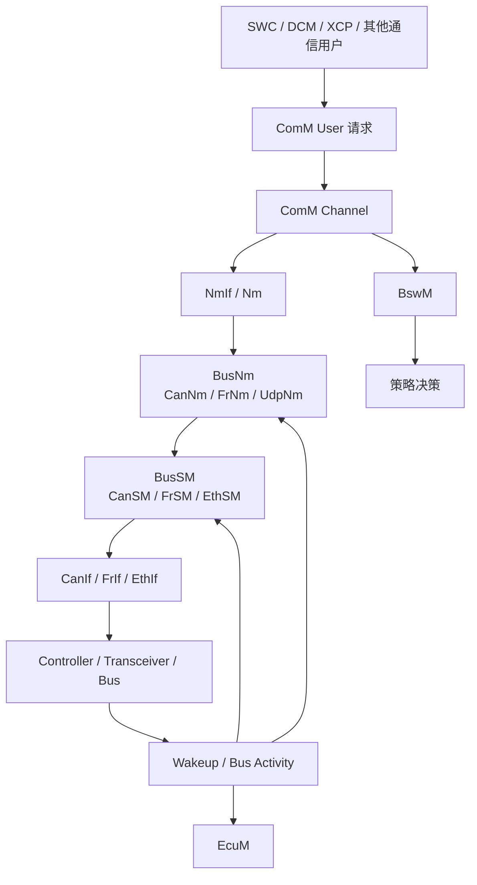
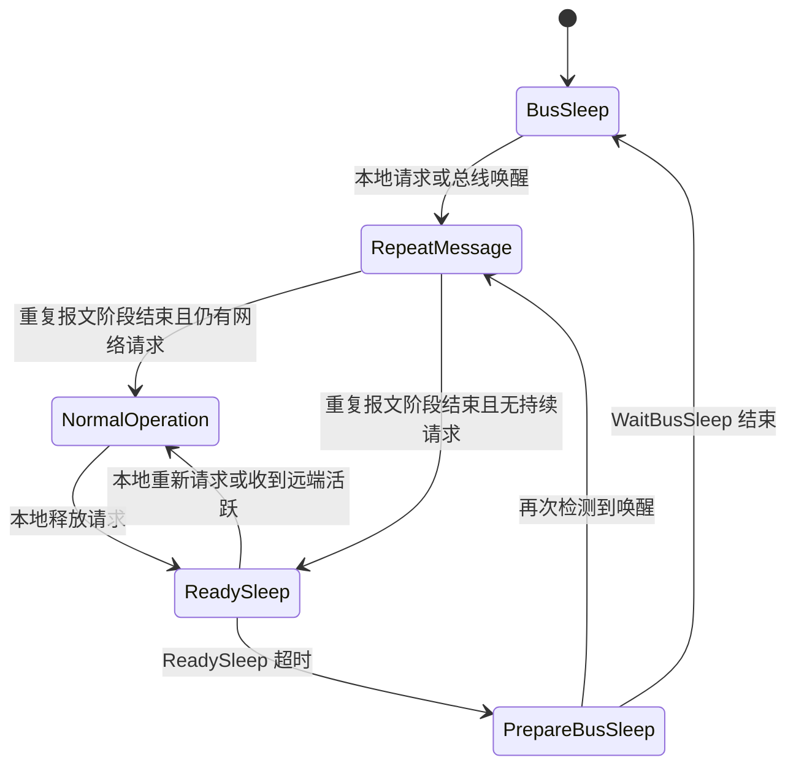

AUTOSAR 的网络管理，核心任务是让一个通信簇中的节点在合适的时候一起保持通信能力、一起进入休眠，并在网络再次需要时有序唤醒。它处理的是整车电子网络中的协同问题：哪些 ECU 还需要总线、谁来维持网络活跃、何时可以安全地关闭控制器和收发器、局部功能请求如何上升为网络级状态。

在 Classic Platform 中，网络管理通常围绕 `ComM`、`Nm`、`NmIf`、`BusNm` 和状态管理模块展开。工程上最常见的是 `CanNm`，但同一套抽象也覆盖 `FrNm`、`UdpNm` 等总线类型。

理解这套机制，重点是看清两个状态机的配合关系：应用和基础软件通过 `ComM` 提出通信需求，网络层通过 `Nm` 族模块把这种需求传播成簇级共识，再由总线状态管理和底层驱动完成控制器、收发器与报文调度的切换。

# 设计目标与系统边界
AUTOSAR 网络管理要满足四类目标。
1. 控制功耗。整车静态电流通常受休眠策略强约束，通信簇不能长期维持唤醒状态。
2. 保证协同。一个 ECU 不能只根据本地应用是否暂时不发报文就立刻睡眠，否则会破坏仍在通信的节点。
3. 提供统一抽象。上层不需要分别面向 CAN、FlexRay、以太网编写不同的睡眠控制逻辑。
4. 支持扩展策略。典型扩展包括网络唤醒校验、被动节点、网关节点和 Partial Networking。

网络管理不直接承担业务通信的语义。`PduR`、`Com`、`Dcm`、`Xcp` 或自定义 SWC 负责各类 PDU、信号和诊断会话；NM 只关心网络是否应保持可通信。因此它归属于整车状态治理范畴，与报文路由职责分开。

从系统边界看，网络管理与以下对象强耦合：
- `EcuM`：处理 ECU 启动、休眠、唤醒源验证，以及从系统维度决定何时允许进入休眠流程。
- `BswM`：把多个基础软件模块的状态和请求组合成策略动作，例如切换通信允许条件、通知应用模式变化。
- `ComM`：把上层用户请求汇总为通道级通信模式，是最直接的网络管理入口。
- `Nm` / `NmIf` / `BusNm`：完成 NM 抽象、路由与总线相关协议动作。
- `CanSM` / `FrSM` / `EthSM`：让通信控制器和收发器真正进入相应硬件状态。

这几层关系可以概括为一套需求汇聚、网络广播和状态收敛的组合机制。单看 `CanNm` 报文，容易把它理解成周期心跳；网络是否继续活跃，取决于整条链路上的联合状态。

## 为什么一个 ECU 不能只根据本地应用决定是否立刻睡眠？

某个 ECU 当前没有业务报文，并不等于整个网络已经具备休眠条件。其他节点可能还在维持诊断会话、网关转发、周期控制报文或某个功能链路；这些节点依赖网络仍然可用，不依赖某个单节点此刻是否恰好在发应用报文。如果一个节点只看本地应用流量就关闭控制器或收发器，会直接打断簇内的状态收敛。

更具体地说，AUTOSAR 网络管理依赖 NM PDU、超时计数和等待窗口来形成全网都可以休眠的共识。一个节点过早睡眠，会带来几类连锁影响：
1. 它停止发送或接收 NM PDU，其他节点对该节点活跃状态的判断会变得不连续，网络收敛过程被打断。
2. 如果它本身承担网关、协调或功能链路中的一环，远端节点虽然仍在通信，但报文路径已经断开，表现出来会像网络仍处于唤醒状态而功能已经失效。
3. 如果它提前关闭收发器，后续总线活动、网络请求释放或再次唤醒都可能不能按预期被感知，造成局部节点与整簇状态不同步。
4. 对诊断、刷写或控制闭环这类场景，单节点过早掉线会直接引起超时、会话中断或控制数据缺失。

因此，AUTOSAR 不把本地暂时没有业务报文当成休眠条件，而是要求节点先通过 `ComM`、`Nm`、`BusNm` 和状态管理模块参与完整的释放流程，等网络级条件成立后再进入休眠。这样做的目的，是把休眠从单点动作变成簇级收敛动作。

# 分层结构与职责划分
Classic Platform 中，网络管理的常见结构可以概括为下图。

## ComM 的位置
`ComM` 是通信需求的收口点。它面向用户，也就是通信请求的发起方，接口组织方式围绕请求主体展开，不按总线节点展开。这里的用户可能是诊断管理、网络服务、应用组件，或某个需要临时打开总线通信的基础软件模块。用户通过 `ComM_RequestComMode()` 之类的接口表达自己需要的通信级别，`ComM` 再把多个用户在一个通道上的请求合并，形成该通道的目标模式。

`ComM` 的三个主模式是：
- `COMM_NO_COMMUNICATION`：不允许正常通信。
- `COMM_SILENT_COMMUNICATION`：只允许接收，不允许应用发起正常发送。
- `COMM_FULL_COMMUNICATION`：允许完整通信。

工程中最重要的是 `No Communication` 与 `Full Communication` 之间的切换；`Silent Communication` 更多出现在状态过渡、总线关闭前缓冲、或部分栈策略场景。

## Nm 与 NmIf 的位置
`Nm` 提供总线无关抽象，`NmIf` 负责把通道和具体 `BusNm` 实现连接起来。上层不需要知道当前通道到底使用 `CanNm` 还是 `UdpNm`，它只关心网络是否已请求、是否已释放、是否检测到远端节点活跃。

这个抽象层解决了两类问题：
1. 让 `ComM` 只面对统一的 NM 接口。
2. 让多总线平台在架构上保持一致，减少策略层差异。

## BusNm 的位置
`BusNm` 是总线相关协议实现，典型是 `CanNm`。它真正处理的对象包括：
- NM PDU 的周期发送与接收。
- 节点活跃监视和超时判定。
- Ready Sleep、Repeat Message 等网络状态转换。
- 可选的协调字段、节点检测、Partial Networking 位向量。

从分工上看，`ComM` 负责是否需要通信的需求汇聚，`BusNm` 负责如何在这个总线上传播该需求的执行动作。

## BusSM 与底层驱动
`CanSM`、`FrSM`、`EthSM` 决定硬件状态切换，包括控制器模式、收发器模式、总线离线恢复、唤醒标志处理等。很多项目把问题都归到 NM，但实际上大量网络不睡眠或睡眠后无法唤醒的问题，根因出在状态管理模块与收发器配置没有对齐。

# 两个关键状态机
理解 AUTOSAR 网络管理，不能只看一个模块的状态机。至少要同时看 `ComM` 的通道模式机和 `BusNm` 的网络模式机。前者代表本地需求收敛，后者代表簇级共识传播。

## ComM 通道模式机
`ComM` 对每个 Channel 维护一个通信模式。简化后可以理解为：
- `No Communication`：本地没有用户请求，且系统允许该通道休眠。
- `Full Communication`：至少有一个用户要求通信，或网络当前仍需维持活跃。
- `Silent Communication`：过渡或受限阶段，允许接收但限制主动发送。

在 `Full Communication` 内部，很多实现还会细分网络已请求和准备睡眠等子状态，用于与 `Nm` 交互。工程上可以把它看成两条主线：
1. 本地是否还有用户请求。
2. 网络是否已经具备进入休眠的条件。

一个常见误区是把 `ComM` 视为单纯的 API 转发层。实际上它承担了用户仲裁和通道聚合。如果一个通道映射了多个用户，只要其中一个用户还保持 `FULL_COMMUNICATION` 请求，整个通道就不能释放。

## BusNm 网络模式机
以 `CanNm` 为例，网络状态通常分为三大类：
- `Bus-Sleep Mode`
- `Prepare Bus-Sleep Mode`
- `Network Mode`

其中 `Network Mode` 通常再细分为：
- `Repeat Message State`
- `Normal Operation State`
- `Ready Sleep State`

这几个状态的意义如下。

### Bus-Sleep Mode
节点认为网络已休眠，不再维持 NM 周期报文，通信控制器和收发器通常会进入低功耗相关模式。这个状态下如果检测到本地唤醒或总线唤醒，则进入网络恢复流程。

### Repeat Message State
这是网络刚被唤醒或刚进入活动阶段后的快速传播状态。节点会较密集地发送 NM PDU，目的是让整个簇尽快感知网络已恢复活跃。如果配置了 Immediate NM Transmissions，这一阶段的报文发送更密。

### Normal Operation State
网络已经稳定活跃，至少有本地或远端节点明确请求继续通信。此时节点按正常周期发送 NM PDU，并维持超时监测。

### Ready Sleep State
本地已经释放网络请求，且从当前视角看网络具备向休眠过渡的可能，但还不能立刻睡眠。节点会继续观察是否有新的 NM 活动、远端请求或本地新请求。一旦再次出现网络需求，就回到 `Normal Operation` 或 `Repeat Message`。

### Prepare Bus-Sleep Mode
这是面向总线关闭和硬件切换的过渡阶段。它的作用是给底层状态切换和等待计时留出窗口，避免节点刚停止发 NM 就立即关闭硬件，导致不同 ECU 的收敛过程失步。

## 唤醒到休眠的完整过程
一个典型的 `CanNm` 通道从唤醒到休眠，常见路径如下：

这个流程里最关键的判断点有三个：
1. 谁触发了网络唤醒。本地请求、远端 NM 活动、收发器唤醒都可能成为入口。
2. 当前是否还有任何节点需要网络。这个条件通过 NM PDU 周期活动和超时机制传播。
3. 是否已经满足底层硬件安全切换的等待条件。这个条件体现在 `Ready Sleep` 和 `Prepare Bus-Sleep` 的计时窗口中。

## 计时参数的工程意义
网络管理的可观测行为，很大程度上由定时器决定。常见参数包括：
- `Repeat Message Time`：重复报文阶段持续时间，影响网络恢复速度和唤醒初期总线负载。
- `NM Timeout Time`：对端 NM 活动超时阈值，影响节点何时判断网络可能已不再被请求。
- `Wait Bus-Sleep Time`：进入总线睡眠前的最终等待窗口，影响休眠收敛一致性。
- `Message Cycle Time`：NM PDU 正常周期，影响网络维持开销与超时敏感性。
- `Immediate Nm Cycle Time` 与 `Immediate Nm Transmissions`：影响唤醒初期报文密度。

这些参数没有脱离系统目标的统一最优值。如果平台强调快速下电，就会倾向更短的等待时间；如果平台更担心误休眠或跨域网关同步问题，就会拉长超时窗口。

# 从本地请求到簇级共识
AUTOSAR 网络管理的重要作用，在于它把某个模块的通信请求扩展为整个通信簇的临时共识。这个过程可以拆成四步。

## 第一步：用户请求进入 ComM
诊断会话、应用功能、网络服务等通过 `ComM` 请求 `FULL_COMMUNICATION`。`ComM` 会先把用户的通信需求记录为通道目标，再与后续的网络状态收敛过程配合。

## 第二步：ComM 请求网络保持活跃
`ComM` 与 `Nm` 交互后，网络被标记为已请求。对于主动节点，`BusNm` 会开始或继续发送 NM PDU；对于被动节点，则可能只监听网络活动而不主动维持 NM。

## 第三步：BusNm 通过 NM PDU 扩散状态
以 CAN 为例，`CanNm` 报文中的控制位、节点标识、可选的用户数据和 PNC 位向量，会把当前节点对网络状态的认知传播到其他节点。对端节点据此刷新超时计数、维持活跃，或更新 Partial Networking 信息。

## 第四步：网络释放与收敛
当本地用户撤销请求后，`ComM` 不再坚持 `FULL_COMMUNICATION` 目标，但通道不会立刻掉回 `No Communication`。只有当 `Nm` 判断整个网络也进入可睡眠状态，`ComM` 和 `BusSM` 才会协同推动通道进入休眠。

这也说明 AUTOSAR 网络管理不能简化为有报文就醒、没报文就睡。实际系统里，睡眠判定依赖显式状态传播和超时收敛，不能只看业务流量瞬时是否为零。

# Partial Networking 的作用
整车平台规模变大之后，让整个 CAN 簇因为一个局部功能而全部保持唤醒，功耗代价会迅速上升。Partial Networking 的目的，是让网络只唤醒真正参与该功能的节点集合。

在 AUTOSAR 里，Partial Networking 常通过 `PNC`（Partial Network Cluster）实现。`PNC` 是一个逻辑分组，用来描述部分网络范围内的协同关系。一个 ECU 可以属于多个 PNC，一个物理通道上也可以承载多个 PNC 的状态传播。

## 核心对象
理解 PNC 时，通常会遇到以下术语：
- `PNC`：逻辑部分网络簇，用于描述某个功能域所需的节点集合。
- `PNI`：NM 报文中指示 Partial Networking 信息有效的标志。
- `PNC Bit Vector`：在 NM PDU 中承载各个 PNC 请求状态的位图。
- `ERA`：External Request Array，表示从网络其他节点接收到的 PNC 请求。
- `EIRA`：External and Internal Request Array，综合本地和外部请求后的有效 PNC 请求视图。

不同实现还会引入本地内部请求数组，用于在网关或本地应用请求参与前先做聚合。工程重点是理解这套位图机制如何让一个节点区分整条总线被请求和只有某些逻辑网络被请求这两类情况。

## PNC 的工作过程
以带网关的车身网络为例，流程通常如下：
1. 某个功能请求激活一个或多个 PNC。
2. 对应 ECU 在 NM PDU 中设置 `PNI` 和相关位向量。
3. 其他节点接收到 NM PDU 后更新外部请求数组。
4. 属于该 PNC 的节点维持通信，不属于该 PNC 的节点可继续朝休眠方向收敛。
5. 网关节点根据配置，把 PNC 请求映射到其他通道或其他 PNC。

PNC 的收益很直接：降低无关节点的唤醒比例，减少待机功耗，特别适合门控、无钥匙进入、远程控制等局部功能长期存在的场景。

## PNC 的代价
Partial Networking 不是一个打开就省电的简单选项，它会显著增加配置和验证复杂度。
- 位向量映射一旦配置错误，最常见的结果是误唤醒或功能节点漏唤醒。
- 网关路径需要验证双向传播与释放条件，测试规模比普通 NM 明显更大。
- 抓包时不能只看节点是否发 NM，还要看位向量是否正确收敛。

对于平台型项目，PNC 的设计通常必须与功能架构、门控策略、低功耗目标和诊断策略一起评审，而不能只由通信配置工程师独立完成。

# 与 EcuM、BswM、BusSM 的协同
只看 `ComM + CanNm`，很多项目问题解释不通。车辆休眠和唤醒需要把 `EcuM`、`BswM` 和 `BusSM` 放进同一个时序里一起分析。

## 与 EcuM 的关系
`EcuM` 管理 ECU 的全局生命周期。网络唤醒可能来自总线活动、点火、门把手、定时器或其他外部源。对于一个已经进入低功耗的 ECU，唤醒源先由 `EcuM` 和底层驱动识别，再逐步恢复通信栈。系统状态满足条件后，`ComM` 和 `Nm` 才能把通道推回活跃通信。

因此，网络管理更像是已运行通信栈中的簇级协调，`EcuM` 负责系统是否已经进入或退出低功耗运行域。

## 与 BswM 的关系
`BswM` 负责策略联动。例如：
- 诊断会话激活时，是否强制保持若干通道在 `Full Communication`。
- 休眠准备阶段，是否先通知某些应用保存状态。
- 某个通道进入 `No Communication` 后，是否切换应用模式或关闭服务。

很多量产项目里，平台策略差异更多体现在 `BswM` 如何响应 `ComM` 和 `Nm` 的状态变化；`CanNm` 的基础行为本身相对稳定。

## 与 BusSM 的关系
`BusSM` 是从协议状态走到硬件状态的桥梁。`CanNm` 可能已经进入 `Prepare Bus-Sleep`，但如果 `CanSM` 还未完成控制器模式切换或收发器未进入 Standby，硬件层面就还没有真正睡下去。反过来，如果硬件提前关闭，也可能造成 NM 收敛不完整、远端节点误判超时，甚至触发诊断故障。

# 配置时最容易出错的地方
AUTOSAR 网络管理的难点通常不在代码逻辑，而在配置边界。下面几类问题最常见。

## 用户到通道的映射错误
一个功能模块到底挂在哪个 `ComM User` 上，这个定义直接决定它能否正确维持网络。如果诊断、网关转发或后台服务被错误地复用到普通应用用户上，就容易出现功能还在运行但网络提前释放的现象。

## 主动节点与被动节点角色不清
并非所有节点都必须主动发 NM。被动节点只监听网络活动，不负责维持 NM 周期。这个选择影响总线负载、功耗以及故障后的恢复行为。如果把本应主动维持网络的核心节点配置成被动节点，簇级活跃时间可能会异常缩短。

## 定时参数只看单节点，不看整簇
NM 参数需要整簇协调。一个 ECU 把 `Repeat Message Time` 配得特别短，另一个 ECU 还在使用较长的超时窗口，最终效果可能是网络收敛慢、抓包表现异常，甚至出现局部节点反复进出活跃状态。

## 网关节点的 PNC 映射不闭环
带网关的项目最容易出问题。请求传播、释放传播、跨通道路由以及本地保持条件必须同时正确。很多某功能偶发失效的问题，最后都追到网关节点对 PNC 位向量的聚合和转发条件。

## 诊断与刷写场景没有单独评审
刷写、扩展诊断会话、售后测试常常需要长时间保持网络活跃。如果只按普通用户行为配置 `ComM`，刷写流程中就可能出现网络意外睡眠，导致会话中断或下载失败。

# 调试与抓包时应该看什么
排查网络管理问题时，更有效的方法是把链路拆开看，直接追到节点未进入休眠或未成功唤醒背后的状态传递和硬件动作。

## 先看 ComM
确认是否仍有用户在请求 `FULL_COMMUNICATION`。很多表面上的 NM 问题，其实是某个用户没有释放请求，或者 `BswM` 策略持续把通道锁在活跃模式。

## 再看 NM PDU
重点观察：
- NM 报文是否按预期周期发送。
- 唤醒初期是否存在 Immediate NM 或 Repeat Message 阶段。
- 控制位和 PNC 位向量是否符合预期。
- 对端节点是否在 `NM Timeout` 窗口内持续有活动。

如果本地不发 NM，也收不到远端 NM，那么问题多半已经不在 `ComM`，而在 `CanIf`、`CanSM`、控制器或收发器路径上。

## 然后看 BusSM 和硬件状态
如果软件状态显示要睡眠，但总线仍有活动，通常要检查：
- 控制器是否真正切到停止或睡眠模式。
- 收发器是否进入 Standby。
- 是否存在外部唤醒引脚抖动或总线噪声。
- 是否有其他节点持续发业务报文或 NM 报文。

## 最后看整车场景
网络管理经常是跨域联动问题。门锁、PEPS、网关、诊断仪、远程服务、整车控制器都可能间接影响一个通道的通信模式。单 ECU 抓包不能解释的问题，要回到整车时序。

# 典型工程判断
围绕 AUTOSAR 网络管理，可以形成几条比较稳定的工程判断。
1. `ComM` 决定的是本地通道目标，`BusNm` 决定的是网络级状态传播，二者必须分开看。
2. 网络睡眠不是瞬时事件，它是一个带等待窗口的收敛过程。
3. `CanNm` 的核心作用，是通过状态机和超时机制把局部请求变成簇级共识。
4. Partial Networking 能显著降低功耗，但会把配置、网关和验证复杂度同时抬高。
5. 量产问题通常发生在模块边界上，尤其是 `ComM`、`BswM`、`BusSM`、收发器配置和整车策略的交界处。

对于做整车通信、平台集成或功能开发的人，理解 AUTOSAR 网络管理时，适合把每一次网络唤醒和网络休眠都还原成一条可追踪的链路：谁提出请求，谁维持网络，谁传播状态，谁执行硬件切换，谁最终决定可以睡下去。只要这条链路清楚，大多数网络管理问题都能定位到具体边界。

# 参考资料
- AUTOSAR Classic Platform 官方发布页：<https://www.autosar.org/standards/classic-platform/>
- AUTOSAR `Specification of Communication Manager`：<https://www.autosar.org/fileadmin/standards/R21-11/CP/AUTOSAR_SWS_COMManager.pdf>
- AUTOSAR `Specification of CAN Network Management`：<https://www.autosar.org/fileadmin/standards/R21-11/CP/AUTOSAR_SWS_CANNetworkManagement.pdf>
- ETAS 对 AUTOSAR 通信管理与 Partial Networking 的公开说明：<https://rtahotline.etas.com/confluence/display/RH/CanNm%2Band%2BPartial%2BNetworking>
