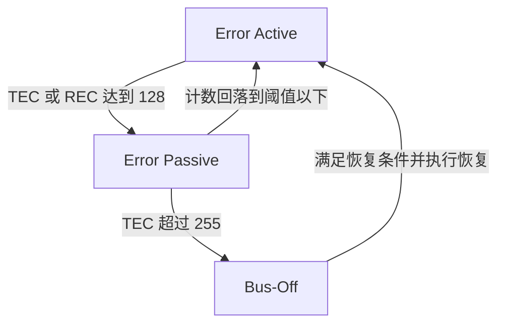

Bus-Off 是 CAN 控制器进入的一种严重错误隔离状态，属于 CAN 协议容错机制的一部分。它由控制器协议状态机判定，反映节点在发送方向已经连续失败到需要隔离的程度。进入 Bus-Off 后，节点会停止继续主导总线发送，目的是把已经持续发送失败的节点隔离出去，避免它反复破坏总线通信。

理解 Bus-Off，需要沿着错误计数器往前追。Bus-Off 的上游是错误计数器，错误计数器的上游是发送和接收过程中的具体失败。分析时要同时看三个对象：CAN 控制器、错误计数器 `TEC` 与 `REC`、错误状态机。

# 前置基础
## TEC 和 REC 是什么？
`TEC` 是 Transmit Error Counter，也就是发送错误计数器。`REC` 是 Receive Error Counter，也就是接收错误计数器。它们都属于 **CAN 控制器内部的协议状态量**。

这层关系分成四点：
1. 它们位于 CAN 控制器协议层。
2. 上层软件不会按自己的规则维护这两个计数。
3. 它们通常由 CAN 控制器硬件里的协议引擎按标准规则自动更新。
4. 驱动软件通常只能读取、记录或在初始化时清零相关状态，增减逻辑由控制器内部完成。

从工程对象上看，`TEC` 和 `REC` 的主语是 **控制器硬件协议单元**，软件只是观察者和管理者。某些芯片手册会把它们暴露成寄存器字段，驱动读取当前值，并根据它们判断节点已经处于 Error Active、Error Passive 还是 Bus-Off。

## TEC 和 REC 分别记录什么？
它们的职责分工如下：
1. `TEC` 反映发送方向的错误严重程度。
2. `REC` 反映接收方向的错误严重程度。

发送方向和接收方向，指的是控制器在 CAN 协议层进行发送或接收时是否检测到了错误，和应用软件是否调用发送接口处在不同层次。比如发送报文时没有得到 ACK、发送过程中检测到位错误，这类问题会影响 `TEC`。接收报文时检测到格式错误、CRC 错误、填充错误，这类问题通常会影响 `REC`。

## 它们的功能逻辑是什么？
`TEC` 和 `REC` 的主要作用是驱动错误状态机，让控制器根据错误持续程度调整自己的行为，日志记录只是软件侧利用这些状态的方式之一。逻辑分三层：
1. 统计错误。控制器在发送和接收过程中，根据错误类型更新 `TEC` 和 `REC`。
2. 切换状态。当计数超过某些阈值，控制器从 Error Active 进入 Error Passive，严重时再进入 Bus-Off。
3. 改变行为。状态改变后，控制器在总线上的动作会变化，例如错误标志形式变化、是否继续允许正常发送、是否需要进入隔离和恢复流程。

`TEC` 和 `REC` 是 **状态机的输入量**，Bus-Off 是状态机的结果之一。

## 为什么要区分发送错误和接收错误？
因为发送失败和接收失败的系统风险不一样。

接收侧节点在接收时频繁出错，常见表现是自身接收质量差，对整条总线的主动破坏能力有限。发送侧节点如果持续发送失败，会不断触发重发、错误帧、仲裁干扰和总线占用，对整个网络的破坏性更大。因此 CAN 把 Bus-Off 直接绑定到 `TEC`，触发判断不看 `REC` 是否超限。

# 错误状态机
CAN 控制器的错误状态通常分为 Error Active、Error Passive 和 Bus-Off 三个层级。理解 Bus-Off 时，前面两个状态也要放进同一条状态链里。

## Error Active
Error Active 是正常通信状态。控制器在该状态下可以正常收发 CAN 帧，也可以在检测到错误时主动发出错误标志，要求总线放弃当前报文并重传。只要错误还处在可控范围内，节点就保持该状态。

工程上，该状态表示节点仍被认为是一个健康参与者，它既能通信，也有资格积极参与总线级错误处理。

## Error Passive
当 `TEC >= 128` 或 `REC >= 128` 时，控制器进入 Error Passive。该状态属于降级运行，节点仍未彻底离线。节点通常还能继续收发报文，但它对总线的主动干预能力已经被削弱。

该设计的含义是：控制器已经观察到持续错误，但还没有严重到必须彻底隔离。它会收敛自己的行为，减少对其他节点的影响。

## Bus-Off
当 `TEC` 超过 255 时，控制器进入 Bus-Off。Bus-Off 的触发条件来自发送错误计数器严重超限，接收错误计数器高不会直接触发 Bus-Off。

进入 Bus-Off 后，控制器会停止继续以正常方式参与总线发送。驱动和上层软件通常会看到控制器状态异常、发送中止、总线关闭中断或错误标志上报。此时应优先判断为什么 `TEC` 会被推到这么高，直接重发往往会把节点重新推回同一个故障循环。

# TEC 和 REC 怎样变化？
## 错误计数规则
CAN 协议对不同错误场景规定了不同的计数规则。错误计数并非遇错一律加 1，发送和接收两边也存在差异。计数触发点发生在 CAN 控制器协议引擎检测到错误的时刻，应用软件不会逐帧决定加几。不同控制器手册在说明时会给出更细的更新表，工程上保留这层逻辑：
1. 发送失败通常比接收失败更容易推动系统进入严重状态。
2. 成功发送或成功接收后，计数通常会回落。
3. 瞬时干扰会造成计数波动。
4. 持续性故障会让计数上升速度长期大于回落速度，最终跨过状态阈值。

Bus-Off 通常来自一段时间内持续失败的累计，单次偶发错误通常推不到 Bus-Off。

## TEC 的触发规则
`TEC` 面向发送方向。只要当前节点正在作为发送方主导一帧报文，而控制器发现这次发送没有被总线正确接受，发送错误计数就会被更新。常见触发点如下。

| 触发场景 | 具体例子 | TEC 变化 | 工程含义 |
| --- | --- | --- | --- |
| 发送方发出 Error Flag | ECU A 发送车速报文时发现 CRC 校验过程异常，于是主动发送 Error Flag，让整网丢弃这一帧 | 通常 `TEC +8` | 当前节点作为发送方发现这一帧失败，并主动通知总线丢弃当前帧 |
| 发送方检测到 ACK Error | 台架上只有 ECU A 一个节点，ECU A 发完报文后 ACK 槽一直保持隐性，没有任何节点确认 | Error Active 阶段通常伴随 `TEC +8` | 报文发完后没有任何其他节点在 ACK 槽给出确认 |
| 发送方检测到 Bit Error | ECU A 想发送隐性位，但线束短路把总线拉成显性位，控制器读回的电平和自己发出的电平不一致 | 通常导致错误处理，进而增加 `TEC` | 常指向总线电平干扰、短路、冲突或位时序配置异常 |
| 发送方在错误标志或过载标志期间检测到位错误 | ECU A 正在发送 Active Error Flag，但总线电平变化不符合错误标志应有的位序列 | `TEC +8` | 连错误处理阶段都不能稳定表达，说明总线状态已经比较差 |
| 错误标志之后检测到过长连续显性位 | 某个收发器损坏，把 CAN_L / CAN_H 持续拉成显性状态，错误标志结束后总线仍长时间不回到隐性 | 按规则每段继续 `TEC +8` | 总线可能被某个节点或线束故障长时间拉成显性电平 |
| 一帧成功发送完成 | ECU A 发出发动机转速报文，至少一个接收节点 ACK，直到 EOF 结束都没有错误 | `TEC -1`，最低保持 0 | 稳定成功发送会慢慢抵消过去的错误累计 |

发送错误的惩罚比成功发送的恢复快得多：失败一次可能加 8，成功一次通常只减 1。这种比例让控制器对持续发送失败更敏感。比如一个节点连续 16 次发送都失败，`TEC` 理论上就可能从 0 上升到 128 附近，节点进入 Error Passive；继续失败时，再往上就会接近 Bus-Off 门槛。

Bit Error 还有两个重要例外。仲裁字段里，节点发送隐性位却读回显性位，表示它输掉仲裁，后续转为接收方，这属于 CAN 的正常仲裁机制。ACK 槽里，发送方发送隐性位却读回显性位，表示至少有一个接收节点给出了 ACK，这也是正常情况。这两类读回差异不会按普通 Bit Error 处理。

## REC 的触发规则
`REC` 面向接收方向。接收方没有主导当前帧，但它在解析总线电平、帧格式和校验结果时也能发现错误。常见触发点如下。

| 触发场景 | 具体例子 | REC 变化 | 工程含义 |
| --- | --- | --- | --- |
| 接收方检测到普通帧错误 | ECU B 接收 ECU A 的报文时，算出的 CRC 和帧里的 CRC 不一致 | 通常 `REC +1` | 接收过程中发现 CRC、格式、填充或位流异常 |
| 接收方发出 Error Flag 后，第一个后续位仍为显性 | ECU B 发现格式错误并发出 Error Flag，但错误标志之后的下一位仍然被总线拉成显性 | `REC +8` | 错误通知之后总线仍被拉住，说明故障强度较高 |
| 接收方在 Active Error Flag 期间检测到位错误 | ECU B 正在发送 Active Error Flag，但读回的总线电平不符合错误标志应有的显性位序列 | `REC +8` | 接收节点参与错误处理时仍看到异常电平 |
| 错误标志之后检测到过长连续显性位 | 线束对地短路导致总线持续显性，ECU B 作为接收方在错误处理之后仍看不到隐性恢复 | 按规则每段继续 `REC +8` | 总线电平存在持续支配，常见于短路、节点卡死或严重干扰 |
| 一帧成功接收完成 | ECU B 正确收到 ECU A 的门状态报文，并在 ACK 槽给出确认 | `REC` 按规则回落 | 稳定接收说明节点看到的总线质量恢复正常 |

接收错误多数情况下加得慢，`REC` 描述的是该节点看到的总线质量。`REC` 很高会让节点进入 Error Passive，削弱它参与错误处理的能力；Bus-Off 的直接门槛仍由 `TEC` 触发。

`REC` 的回落也有边界。`REC` 在 1 到 127 之间时，一次成功接收通常让它减 1；如果 `REC` 已经超过 127，成功接收后会被拉回到 119 到 127 之间的某个值，单帧成功接收不会直接清零。这种设计可以避免一个已经处于严重接收异常的节点因为偶然收到一帧正确报文就立刻恢复成健康状态。

## 为什么是 +8？
`+8` 来自 CAN 协议的故障隔离规则。协议把发送失败看得更重，因为发送方正在主动占用总线；如果它持续失败，就会不断触发重发、错误标志和总线占用，影响所有节点。`+8` 让严重错误计数上升得比成功通信回落快得多，控制器可以在短时间内把明显不健康的节点推到 Error Passive，进一步严重时推到 Bus-Off。

`+8` 和状态阈值是配套设计。Error Passive 的门槛是 128，Bus-Off 的门槛是 `TEC > 255`。一次严重发送错误加 8 时，连续 16 次典型发送失败就能把 `TEC` 从 0 推到 128 附近，节点进入 Error Passive；继续失败后，再逐步接近 Bus-Off。如果改成 `+4`，同样的故障需要约 32 次才到 Error Passive；如果改成 `+6`，阈值对应的失败次数又会变成另一组不整齐的边界。协议选择 `+8`，是在恢复速度、故障隔离速度、计数器宽度和状态阈值之间做出的统一规则。

主机厂不能把 `+8` 当作普通标定项改成 `+4` 或 `+6`。只要使用符合 Classical CAN / CAN FD 协议的控制器，`TEC`、`REC` 的增减规则由控制器协议引擎实现，节点之间需要遵守同一套故障隔离行为。主机厂、Tier1 或平台软件可以配置的是另一层策略：
1. Bus-Off 后自动恢复还是软件手动恢复。
2. 恢复前延时多久。
3. 是否限次恢复或锁存故障。
4. DTC 什么时候置位、什么时候老化。
5. 网络管理是否允许节点重新上线。

不同芯片厂商的寄存器名称、状态位、中断上报方式和恢复控制方式可能不同，但标准 CAN 控制器不会让某个主机厂单独修改协议内部的 `TEC +8`、`REC +1`、成功发送 `TEC -1` 这些计数规则。否则同一条 CAN 总线上的节点故障隔离行为就会不一致，协议的容错边界也会失去意义。

## ACK 问题的风险
ACK 异常在现场出现频率高，在 Error Active 阶段也会快速推高 `TEC`。原因在 ACK 机制本身。

CAN 发送方把一帧报文送上总线之后，需要至少有一个其他节点在 ACK 槽确认自己正确收到了这帧数据。如果 ACK 确认始终不存在，发送方会把这次发送视为失败，并继续重发。在 Error Active 阶段，这类失败通常会让发送方每次按较大的步长增加 `TEC`。

ACK 失败往往说明问题已经超出一两位噪声造成的偶发错误，发送链路整体没有建立起来。常见情形包括：
1. 网络里实际上只有一个节点，没有其他节点可应答。
2. 波特率或采样点配置不一致，其他节点根本没法正确解码。
3. 收发器、终端、电源或线束异常，其他节点收不到有效信号。
4. 其他节点虽然上电，但处于 Standby、休眠、Bus-Off 或初始化未完成状态。

单节点台架还有一个边界：如果台架上只有一个 CAN 节点，它发出的报文一定没有其他节点 ACK。它会因为连续 ACK Error 进入 Error Passive，但标准规则对 Error Passive 节点的 ACK Error 有例外处理；当它没有检测到显性 ACK，同时发送 Passive Error Flag 期间也没有检测到显性位时，`TEC` 不再按普通发送错误继续增加。因此，单节点无 ACK 场景可能停在 Error Passive，未必继续走到 Bus-Off。

量产网络里的 ACK 异常仍然危险，因为它经常伴随更复杂的故障：其他节点存在但解码失败、收发器未使能、总线电平异常、终端错误或位时序不一致。这些问题会让 ACK Error、Bit Error、Stuff Error 混在一起出现，`TEC` 就可能继续上升到 Bus-Off。

## 成功通信为什么能把计数拉回来？
CAN 的错误状态机会根据成功通信向健康方向回退。只要节点重新出现稳定的成功发送或成功接收，计数器就会按规则回落。协议设计需要区分瞬时扰动和持续故障，避免把每次错误都放大成严重故障。

该机制带来三个结果：
1. 偶发干扰只会让计数暂时波动。
2. 稳定通信会把计数拉回去。
3. 只有持续失败才会把节点推向 Bus-Off。

工程分析时要同时看有没有报过错、错误是否持续、计数是否单向上升、恢复后是否马上再次恶化。

# Bus-Off 是怎样形成的？
典型的 Bus-Off 形成路径如下：
1. 节点开始发送报文。
2. 发送过程中持续发生错误，常见是 ACK 失败，也可能是位时序或物理层问题。
3. `TEC` 连续上升，节点先进入 Error Passive。
4. 错误仍未消失，发送继续失败，`TEC` 继续上升。
5. `TEC` 超过 255，控制器进入 Bus-Off。

该过程说明，Bus-Off 通常对应根因长期存在后的保护动作，本身不等于根因。排查重点应回到前面那几步为什么一直失败。

# 恢复机制
## 恢复条件是什么？
Bus-Off 可以恢复，但恢复也有明确前提。常见 CAN 控制器和 ISO 11898 相关规则要求节点先观察到 **128 次总线空闲序列**，每次序列至少包含 11 个连续隐性位，之后才具备恢复资格。

该条件的意义在于，总线必须先表现出稳定、可识别、没有持续冲突的电平状态，控制器才允许自己重新加入。否则节点刚出来又立刻发报，再次失败，再次 Bus-Off，系统就会进入无效抖动。

## 总线空闲指什么？
总线空闲，指的是 CAN 控制器在物理总线上连续采样到隐性电平，并且连续时间达到 11 个 bit time。它描述的是总线电平状态，和整车网络是否还有 ECU 发报文属于两个问题。

CAN 总线有两种逻辑电平：
1. 显性位。任意节点把总线驱动成显性，总线结果就是显性，通常用于 SOF、仲裁中的 dominant bit、ACK 槽确认、错误标志等。
2. 隐性位。没有节点主动驱动显性时，总线回到隐性状态，通常用于总线空闲、帧结束、间隔位等。

因此，恢复条件里的 11 个连续隐性位，表示控制器看到总线已经连续保持一小段干净的释放状态。它关心的是这段时间里没有节点把总线拉成显性，也没有错误帧、短路或卡死节点持续占住总线。

## 整车一直发报文，怎么还能空闲？
车辆上电后，多个 ECU 会周期性发送报文，但 **CAN 帧和 CAN 帧之间仍然有协议规定的隐性位**。一个正常 CAN 帧结束时，ACK Delimiter 是 1 个隐性位，EOF 是 7 个隐性位，Intermission 是 3 个隐性位，合起来正好是 11 个连续隐性位。

因此，即使总线上持续有周期报文，只要通信是健康的，每个正常帧结束附近都可能给 Bus-Off 节点提供一次可计数的空闲序列。Bus-Off 节点此时不主动发送，它只是在旁边观察总线，累计看到 128 次这样的 11 位隐性序列后，控制器才具备恢复资格。

以 500 kbit/s 的 CAN 总线为例，1 个 bit time 是 2 微秒，11 个连续隐性位约等于 22 微秒。128 次这样的序列，对应的纯位时间下限约为 2.816 毫秒。实际恢复时间通常更长，因为控制器要等待这些序列自然出现在帧尾、报文间隔或总线释放段里，软件还可能额外加恢复延时、限次和诊断记录。

整车网络上电后一直有报文，并不妨碍 Bus-Off 恢复。只要总线没有被持续拉成显性，也没有一直处在错误帧风暴里，正常帧之间的隐性间隔通常足够让控制器完成恢复前的观察。

## 什么情况下等不到空闲？
恢复不了的场景，通常是总线电平或错误状态一直不稳定。典型情况包括：
1. CAN_H / CAN_L 短路，导致总线长期保持显性或波形畸变。
2. 某个收发器损坏，持续把总线拉住。
3. 位时序严重不匹配，节点之间反复产生错误帧。
4. 终端或线束问题导致帧尾隐性位无法稳定保持。
5. 软件恢复太激进，节点刚恢复就立刻大量发送，又把自己推回 Bus-Off。

位时序严重不匹配，指的是节点对同一串 CAN 位流的时间划分不一致。比如标定用的 VCI 配成 500 kbit/s，但实际接入的是 250 kbit/s 的 CAN 网络；或者波特率名义上一样，但采样点、同步跳转宽度、时钟误差差得太多。（*VCI 是 Vehicle Communication Interface，也就是车辆通信接口设备，作用是把电脑上的 INCA、CANoe、诊断软件等工具连接到车上的 CAN、CAN FD、LIN 或以太网网络。*）发送方按自己的 bit time 发出 SOF、仲裁场、控制场和数据场，接收方却在错误的位置采样，就可能把本来正常的位流解析成 CRC Error、Stuff Error、Form Error 或 Bit Error。

这类错误会反复打断正常帧。一个节点刚开始发送，另一个节点在接收过程中判定帧格式不对，于是发出 Error Flag；发送方看到总线被错误标志打断，也会把这次发送算作失败。随后发送方重发，接收方仍按错误的节奏采样，又再次发出 Error Flag。总线上就会出现一帧还没正常结束就被错误帧破坏的循环，稳定的 11 个连续隐性位也可能被不断打断。

在标定现场，该问题常见于接错 CAN 网段或 VCI 通道参数配错。INCA 里表现为 ECU 初始化失败，底层实际可能是 VCI 和车上节点根本不在同一个位节奏上；此时反复点击初始化，会让 VCI 继续发送错误节奏的报文，把错误帧和 `TEC` 累计推得更高。

需要分清两个概念：车辆通信繁忙不一定阻止恢复；总线缺少稳定的连续隐性位才会阻止恢复。正常报文密集时，帧尾仍然能提供隐性序列。物理层故障、错误帧连续出现或节点卡死时，控制器才可能长期等不到满足条件的空闲序列。

## 自动恢复和手动恢复
工程实现里通常有两类恢复策略：
1. 自动恢复。控制器在满足恢复前提后自行退出 Bus-Off。
2. 手动恢复。软件检测到 Bus-Off 后，经过延时、诊断记录和状态检查，再重新初始化控制器或重新上线。

自动恢复实现简单，但反复 Bus-Off 风险更高。手动恢复更适合量产系统，因为软件在恢复前先确认物理层、网络状态和错误次数，并同步处理 DTC、限次、故障锁存。

## 不知道恢复策略时怎么判断？
如果现场只有 CANoe，不要靠长时间等待判断。**协议层的 128 次空闲序列本身属于很短的总线观察条件，在健康总线上通常很快就能满足**。

一个实用判断是：在 CANoe Trace 里已经**能看到正常报文、错误帧停止、CANoe 侧主动发送也已暂停**之后，**如果几十秒内硬件通道仍保持 Bus-Off，且没有任何重新上线迹象，就不要按自动恢复继续等几个小时**。此时应按三类问题处理：恢复被软件策略关闭、Bus-Off 被故障锁存、或者 CANoe 硬件通道需要手动重新初始化。

外部人员主要通过 CANoe 现象做快速判断，结论还要看项目配置、MCU CAN 控制器手册、驱动代码或研发日志。现场排查先服务于下一步动作判断：继续观察、CANoe 通道重启、硬件复位，或者回到根因排查。

# 常见根因
## 物理层故障
物理层问题高频出现，通常包括：
1. CAN_H 或 CAN_L 断线。
2. CAN_H 或 CAN_L 对地、对电源或互相短路。
3. 终端电阻缺失、阻值异常或布置位置错误。
4. 接插件接触不良、屏蔽接地异常。
5. 收发器供电、使能脚、待机脚状态错误。

这类问题的共同点是，发送方看到的是连续失败，接收方看到的是波形异常、帧错误或根本收不到有效报文。

## 位时序不匹配
即使线束完全正常，节点也可能因为时序配置问题进入 Bus-Off。典型情形包括：
1. 波特率设置不一致。
2. 仲裁段和数据段参数不匹配。
3. 采样点过于靠前或靠后。
4. 时钟源误差过大。

这类问题常出现在台架正常、整车异常，或者低负载正常、高负载异常的场景里。根因是控制器还在收发，但它和网络的位节奏已经对不齐了。

## 网络拓扑和负载问题
CAN 对支路长度、节点数量、终端位置和通信速率都有边界。网络在小规模台架上看起来能跑，只能说明当前条件下暂时可通信，无法证明量产拓扑下也稳定。支路过长、节点过多、速率过高、线束反射明显，都会压缩采样裕度，最终把问题表现成随机报错、计数累加和 Bus-Off。

## 软件与系统时序问题
软件逻辑本身也会制造 Bus-Off，典型场景包括：
1. 控制器已经启动，但收发器还在 Standby。
2. 节点刚唤醒就开始高速发送，而网络其他节点尚未准备好。
3. 模式切换过程中，网络管理和控制器状态没有对齐。
4. 恢复策略过于激进，控制器一恢复就马上再次大流量发送。

这类问题在 AUTOSAR 平台里尤其常见，因为故障不一定落在单个寄存器上，而可能落在 `CanIf`、`CanSM`、`ComM`、网络管理和唤醒休眠时序的边界处。

# 工程判断
Bus-Off 排查中，以下几条判断常用。
1. `TEC` 和 `REC` 是 CAN 控制器内部的协议状态量，由控制器协议引擎按规则维护。
2. `TEC` 决定发送方向的严重程度，Bus-Off 由 `TEC` 超限触发。
3. `REC` 很高会把节点推向 Error Passive，但通常不会直接触发 Bus-Off。
4. ACK 失败是典型诱因之一，在 Error Active 阶段会快速推高 `TEC`；单节点无 ACK 场景可能只进入 Error Passive。
5. Bus-Off 是保护动作，根因通常在物理层、位时序、拓扑或系统时序。
6. 恢复成功只能说明节点重新上线过，不能说明问题已经消失。

分析 Bus-Off 时沿着一条因果链走：控制器在发送或接收中持续出错，错误计数器上升，错误状态机切换，发送方向长期失败把 `TEC` 推过阈值，控制器最终进入隔离状态。因果链清楚后，Bus-Off 问题就能顺着链路拆解到具体对象上。

# 标定现场例子
常见场景是：工程师做标定时，把 VCI 的 OBD 接口插到了错误位置，或者转接线把 CAN_H / CAN_L 接到了错误网段。随后在 INCA 里点击 ECU 初始化，INCA 会让 VCI 打开对应 CAN 通道，并向目标 ECU 发送初始化所需的通信报文。该动作可能是 XCP on CAN 的连接请求，也可能是诊断会话、Seed & Key 或项目配置里定义的初始化报文，具体取决于项目通信方案。

从 CAN 控制器角度看，关键不在 INCA 界面上点了什么按钮，而在 VCI 这一侧开始主动发送 CAN 帧。后续现象通常分成三类。

第一类是 VCI 实际接到了一条没有其他节点的 CAN 线上。VCI 发送初始化报文后，ACK 槽没有任何节点拉成显性位。VCI 的 CAN 控制器会把这次发送判为 ACK Error，在 Error Active 阶段通常按发送错误处理，`TEC` 以较大步长上升。INCA 里常见表现是 ECU 初始化失败、No response from ECU、硬件通道报 CAN error，严重时 VCI 通道进入 Error Passive 或 Bus-Off。目标 ECU 没收到这些报文，它本身不会因为这次操作进入 Bus-Off；进入异常状态的是正在发送的 VCI 通道。

第二类是 VCI 接到了另一条有节点在线的 CAN 网段，而且波特率和采样点刚好匹配。此时 VCI 发送的帧能被错误网段上的节点正确解码，这些节点即便不识别该应用层报文，也会在 CAN 协议层给 ACK。因此，VCI 的 `TEC` 未必因为 ACK Error 快速上升。INCA 仍然会初始化失败，因为目标 ECU 不在这条总线上，期望的响应报文不会回来。该场景会造成误判：底层 CAN 看起来有 ACK，上层 ECU 初始化仍然超时。

第三类是 VCI 接到了错误网段，但**波特率、采样点或物理层条件不匹配**。VCI 发出的位流会被其他节点看成错误帧，或者 VCI 自己读回的总线电平和预期不一致。VCI 侧可能出现 Bit Error、Stuff Error 或 ACK Error，`TEC` 上升；错误网段上的其他 ECU 作为接收方也可能检测到 CRC、格式或填充错误，`REC` 上升。此时影响已经不局限于 INCA 连接失败，错误网段上的正常通信也可能被错误帧打断，严重时会看到整网报错、通信抖动或多个节点错误计数升高。

按时间顺序拆开，过程如下。
1. OBD 或转接线接错，VCI 的 CAN 通道没有连到目标 ECU 所在的 CAN 网络。
2. INCA 点击 ECU 初始化，VCI 开始发送初始化报文。
3. 总线上没有正确的目标 ECU 响应，INCA 等不到期望的 XCP、CCP 或诊断响应。
4. 如果没有任何节点 ACK，VCI 侧先出现 ACK Error，`TEC` 上升。
5. 如果接到了错误网段且位时序不匹配，VCI 和错误网段上的节点可能互相制造错误帧。
6. VCI 继续重试初始化，发送错误持续累计，VCI 通道可能进入 Error Passive 或 Bus-Off。
7. 工程师看到的是 INCA 初始化失败、硬件接口报错、CAN 通道 Bus-Off 或 ECU 无响应。

该例子的排查重点有三件事：确认 VCI 通道号和项目里配置的 CAN 通道一致；确认 OBD 或转接线的 CAN_H / CAN_L 接到了目标 ECU 所在网段；用总线分析仪或示波器看初始化报文有没有 ACK、有没有目标 ECU 响应、有没有错误帧。只在 INCA 里反复点 ECU 初始化，通常只会让 VCI 继续发送同一类失败报文，`TEC` 继续累积，问题不会自动消失。

# 参考资料
- Bosch CAN 2.0 Specification: [CAN Specification Version 2.0](https://www.bosch-semiconductors.com/media/ip_modules/pdf_2/canliterature/can2spec.pdf)
- Microchip CAN Controller Module Documentation: [CAN Error States](https://onlinedocs.microchip.com/oxy/GUID-7112B2B7-9230-4367-BBFB-942C5B51D8BF-en-US-15/GUID-40F464D1-C6A3-49D8-B32B-6B57C33A6305.html)
- Microchip CAN Error Counter Register: [CAN Error Counter Register](https://onlinedocs.microchip.com/oxy/GUID-B822915F-C375-4172-91BD-AB6F326EB783-en-US-1/GUID-92EF898E-482E-4A30-9958-06ECCF3B751B.html)
- Microchip CAN FD Protocol Module Documentation: [Bus Off Recovery](https://onlinedocs.microchip.com/oxy/GUID-E48B4A26-F201-4F0A-BCBA-16461582816A-en-US-2/GUID-155CE676-0DE6-40B0-971E-3D49FBFF13DC.html)
- NI CAN Bus-Off Explanation: [Why Is My CAN in the Bus Off State?](https://knowledge.ni.com/KnowledgeArticleDetails?id=kA00Z000000kGnGSAU&l=zh-CN)
- NXP FlexCAN Support Discussion on Bus-Off Recovery Behavior: [Bus Off Recovery in FlexCAN](https://community.nxp.com/t5/MPC5xxx/Bus-off-recovery-in-MPC5744/td-p/1578785)
