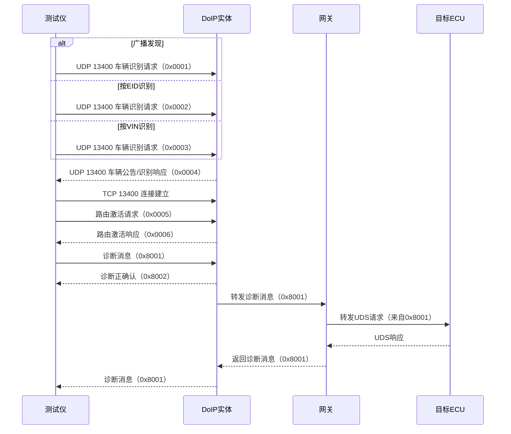

DoIP 全称 `Diagnostic Communication over Internet Protocol`。它处理的是诊断报文如何通过 `IP` 网络进入整车、完成发现、连接、路由和传输；诊断语义本身仍由 `UDS` 定义。放在车载以太网场景里看，`UDS` 和 `DoIP` 是一条完整诊断链路里的两层。

# DoIP 解决什么问题
## 标准位置
`ISO 13400` 系列把 DoIP 的工程边界划得很清楚。
- `ISO 13400-2` 规定 `TCP`、`UDP`、车辆发现、连接建立与维护、路由、错误处理，以及可选的实体状态监控、`TLS` 和防火墙能力。
- `ISO 13400-3` 规定基于 `IEEE 802.3 100BASE-TX` 的车载有线接口，以及接口的发现、识别和激活/停用。
- `ISO 13400-4` 规定以太网诊断连接器的最低要求，包含车端连接器和外部测试设备连接器。

`IANA` 还登记了 `doip-data` 和 `doip-disc`，二者都映射到 `13400` 端口，前者走 `TCP`，后者走 `UDP`。这也是 DoIP 在工程里最直观的入口形态。

## 为什么有 DoIP
传统 `CAN/ISO-TP` 诊断在功能上已经够用，但一旦面对集中式架构、较大镜像、远程诊断和多 ECU 路由，车载网络就会开始暴露出带宽和拓扑上的限制。DoIP 的价值就在这里：它把诊断搬到以太网上，让诊断仪、产线设备和研发电脑可以通过标准 IP 接入整车网络。

更直接的变化在于，诊断链路从点对点总线进入了可路由、可分层、可集中管理的网络环境。对于网关、域控和多 ECU 平台，这已经不是单纯的带宽升级，而是诊断接入方式的变化。

典型使用场景有三类：
- 研发联调时，工程师需要在电脑上直接访问域控、摄像头、雷达或网关。
- 产线下线和售后服务时，诊断设备需要稳定、快速地完成读码、刷写和标定。
- 集中式架构里，网关需要把诊断请求路由到车内多个子系统，而不是让外部设备逐个碰每个节点。

# 分层结构
DoIP 不是一个独立的底层帧格式，它是在标准以太网上承载的诊断应用。阅读这一层时，统一按插图里的顺序理解：`Ethernet Header`、`IP Header`、`TCP / UDP Header`、`DoIP Header`、`DoIP Payload`。


```text
未带 802.1Q VLAN Tag 时:
Byte 0-6: Preamble
Byte 7: SFD
Byte 8-13: Destination MAC
Byte 14-19: Source MAC
Byte 20-21: EtherType = 0x0800
Byte 22-...: IP Header
Byte ...: TCP / UDP Header
Byte ...: DoIP Header
Byte ...: DoIP Payload
Last 4 Bytes: FCS

带 802.1Q VLAN Tag 时:
Byte 0-6: Preamble
Byte 7: SFD
Byte 8-13: Destination MAC
Byte 14-19: Source MAC
Byte 20-21: TPID = 0x8100
Byte 22-23: TCI
Byte 24-25: EtherType = 0x0800
Byte 26-...: IP Header
Byte ...: TCP / UDP Header
Byte ...: DoIP Header
Byte ...: DoIP Payload
Last 4 Bytes: FCS
```

上面这个顺序里，只有以太网帧外层字段的位置是固定的；`IP Header`、`TCP / UDP Header` 和 `DoIP Header` 的具体结束字节会随着报文类型变化，所以这里统一保留顺序，不把后面几层的结束位置写死。

## Ethernet Header
这一层从最外侧以太网开始。抓包时通常也是先看这一层，再继续往内看 `IP`、`TCP / UDP` 和 `DoIP`。

### Preamble
`Preamble` 固定 7 字节，通常是 `0x55` 重复 7 次，用于收发同步。很多网卡和抓包工具不会把它显示出来。

### SFD
`SFD` 固定 1 字节，通常是 `0xD5`，用于标记真正的以太网帧起点。

### Destination MAC
`Destination MAC` 占 6 字节，常见取值有三类。
- `FF:FF:FF:FF:FF:FF`：广播地址，表示发给链路上的所有节点。
- 组播地址：第一字节最低位为 1，表示发给某个组。
- 单播地址：普通设备地址，表示发给某一台具体设备。

DoIP 的车辆发现阶段常常会用到广播或定向探测，所以这一字段很关键。

### Source MAC
`Source MAC` 占 6 字节，表示这帧从哪台设备发出。抓包时看源 MAC，通常可以快速判断这条报文来自测试仪、网关还是某个 ECU。

### 802.1Q VLAN Tag
如果启用了 `802.1Q`，就会多出 4 字节的 VLAN Tag。常见取值是：
- `TPID = 0x8100`：表示标准 VLAN Tag。
- `PCP = 0~7`：优先级，数值越大，一般表示优先级越高。
- `DEI = 0/1`：是否可丢弃标记，`1` 通常表示更容易被丢弃。
- `VID = 1~4094`：VLAN ID，表示属于哪个逻辑 VLAN。

`VID = 0` 一般表示只有优先级标签，没有实际 VLAN 成员归属；`VID = 4095` 是保留值。

### EtherType
`EtherType` 占 2 字节，用来告诉接收端后面是什么上层协议。常见取值有：
- `0x0800`：IPv4，这也是 DoIP 最常见的外层承载。
- `0x86DD`：IPv6。
- `0x0806`：ARP。
- `0x8100`：VLAN Tag 的标识，说明后面还有一层 VLAN 信息。

如果报文带 VLAN，真正的上层协议类型会被放到 VLAN Tag 后面；如果不带 VLAN，`EtherType` 就直接指向上层协议。

### FCS
`FCS` 占 4 字节，是帧校验序列，用来检查这帧在传输过程中有没有被破坏。它不是人为填写的业务字段，而是由发送端根据整帧内容算出来的校验结果。

两个常用边界是：
- 不含 Preamble 和 SFD 时，普通以太网帧最小 64 字节，最大 1518 字节。
- 带 `802.1Q` VLAN Tag 时，最小仍是 64 字节，最大会变成 1522 字节。

## IP Header
在这篇笔记里，`EtherType` 后面先展开的是 `IP Header`。DoIP 最常见的是 `IPv4`，最小 20 字节。抓包时最常看的字段有：
- `Version = 4`：表示这是 IPv4。
- `IHL`：首部长度，常见值是 `5`，也就是 20 字节。
- `Total Length`：整个 IP 包长度。
- `Protocol = 6`：表示后面跟的是 TCP。
- `Protocol = 17`：表示后面跟的是 UDP。
- `Source IP / Destination IP`：源和目的 IP 地址。

## TCP / UDP Header
在 `IP Header` 后面，DoIP 会根据业务阶段走 `TCP` 或 `UDP`。

### UDP Header
`UDP Header` 固定 8 字节，最常见的字段是 `Source Port`、`Destination Port`、`Length` 和 `Checksum`。对 DoIP 来说，车辆发现、车辆公告和实体状态信息通常走 `UDP 13400`。

### TCP Header
`TCP Header` 最少 20 字节。除了源端口和目的端口，还常看 `Sequence Number`、`Acknowledgment Number`、`Flags` 和 `Window`。对 DoIP 来说，路由激活、`Alive Check` 和正式诊断消息通常走 `TCP 13400`。

抓包时可以按这个顺序往内看：先确认 `EtherType`、源目的 `IP` 和 `Protocol` 字段，再看端口 `13400`，最后再进入 `DoIP Header` 和后面的 `UDS` 内容。

很多网卡和抓包工具不会直接展示 `Preamble`、`SFD` 和 `FCS`，所以软件里看到的链路层信息，往往比线上原始帧更短一些。

# 概念基础
DoIP 里更容易混淆的是对象和标识，而不是报文字段。先把几个名词分开，后面的发现、激活和路由才容易读顺。

## DoIP Entity
`DoIP entity` 是车辆网络里能被外部诊断设备直接接入的 DoIP 节点。它负责接收发现报文、建立 `TCP` 连接、处理路由激活、保活和状态查询，并把正式诊断请求转给车内目标 ECU。

很多车型里，`DoIP entity` 就是网关本身；也有车型把它放在某个独立 ECU 上。

## 网关
网关是外部诊断进入车内网络的入口控制点。它通常既是路由器，也是权限控制点：测试仪先连到网关，再由网关决定诊断请求转发到哪一个 ECU、是否允许激活、是否允许继续保活。

在集中式架构里，网关往往同时承担 `DoIP entity` 的角色，所以两者经常一起出现，但概念上不是同一个词。

## VIN / EID / GID
### VIN
`VIN` 是车辆识别码，长度 17 字节，用来识别“哪一台车”。它更偏整车级身份，常出现在车辆识别请求和车辆公告/识别响应里。

### EID
`EID` 是实体识别码，长度 6 字节，用来识别“哪一个 DoIP 实体”。它更偏设备级身份，常用于按实体精确发现。

### GID
`GID` 是组识别码，长度 6 字节，用来识别“属于哪一组实体或车辆”。它更偏分组管理，常用于产线、车队或多实体场景。

这三个字段不是同一层的东西：`VIN` 识别车辆，`EID` 识别实体，`GID` 识别组。抓包时把它们混成一类，后面的发现流程就会看不清。

## IP 地址与逻辑地址
`IP` 地址解决的是“连到哪里”，`逻辑地址` 解决的是“发给谁”。

测试设备先通过 `IP` 找到 `DoIP entity`，再通过源逻辑地址和目标逻辑地址把请求送到车内正确的 ECU。也就是说，`IP` 地址决定网络可达性，逻辑地址决定诊断路由。

把这几件事分开后，再看车辆发现、路由激活和诊断承载，层次会顺很多。

# DoIP 报文结构
## 通用头
DoIP 消息先看通用头，再看 payload。通用头固定 8 字节，用来判断这是不是一条有效的 DoIP 消息，以及后面的 payload 应该按什么方式解析。

```text
Byte 0: Protocol version
Byte 1: Inverse protocol version
Byte 2-3: Payload type
Byte 4-7: Payload length
Byte 8+: Payload
```

`Protocol version` 是 DoIP 头里的版本字节，不是 `UDS` 服务号。标准里会给出明确的版本值，当前常见实现里能看到 `0x02 / 0xFD` 这一组写法；在车辆识别请求里，还支持 `0xFF / 0x00` 作为默认值。

`Inverse protocol version` 是版本字节的按位取反校验。计算方式是 `Version XOR Inverse = 0xFF`，也就是 `Inverse = 0xFF - Version`。例如 `0x01` 的反字节是 `0xFE`，`0x02` 的反字节是 `0xFD`。这一位不表达业务信息，只用于快速检查头部一致性；如果版本和反字节不匹配，通常会直接返回 `0x0000` 的 generic NACK。

`Payload type` 决定后面的 payload 属于哪个阶段、应该走 UDP 还是 TCP、以及 payload 里有哪些字段。它不是 `UDS` 的 service id，但它会把 DoIP 的工作拆成几类：发现、路由、保活、状态查询、诊断承载和负确认。

`Payload length` 只统计 Byte 8 之后的 payload，不包含前面的 8 字节通用头。

## 常见 Payload Type
下面按流程把常见类型拆开看，重点看它“做什么”和“payload 里装什么”。

### 0x0000 Generic DoIP header negative acknowledge
这是通用头检查失败时的返回报文，payload 里只有 1 字节 NACK code。
- `0x00`：协议信息错误，最常见于版本字节和反字节不匹配。
- `0x01`：未知的 payload type。
- `0x02`：payload 太大。
- `0x03`：接收缓冲区不足，或者发生缓冲区溢出。
- `0x04`：payload 长度对该类型不合法。

这一类报文停在通用头检查阶段，还没有进入业务处理。


### 0x0001 Vehicle Identification Request
这三类识别请求是互斥的，不是一次性连续发送的三个报文。测试仪会根据自己掌握的目标信息，选择其中一种来做发现。

这是最基础的车辆识别请求，通常通过 `UDP` 发到 `13400` 端口，payload 为空，常配合广播使用。

### 0x0002 Vehicle Identification Request with EID
这个请求通过 `UDP` 发送，payload 里带 6 字节 `EID`。接收端会拿自己的 `EID` 去比对，只有匹配的实体才会响应。它适合“我大概知道这台设备是谁”的场景。

### 0x0003 Vehicle Identification Request with VIN
这个请求通过 `UDP` 发送，payload 里带 17 字节 `VIN`。它适合“我想找某一台具体车辆”的场景。

三者的区别如下：
- `0x0001`：不知道目标是谁，先广播找实体。
- `0x0002`：知道 `EID`，按实体标识精确找。
- `0x0003`：知道 `VIN`，按车辆识别码精确找。

### 0x0004 Vehicle Announcement / Vehicle Identification Response
这是识别阶段的响应报文，通常通过 `UDP` 发出。payload 一般按这个顺序组织：`VIN` 17 字节，`Logical Address` 2 字节，`EID` 6 字节，`GID` 6 字节，`Further action` 1 字节，后面还可能带 `VIN/GID Status` 1 字节。


这条报文不承载诊断业务，主要提供实体身份、逻辑地址和当前状态。

### 0x0005 Routing Activation Request
这是路由激活请求，必须走 `TCP`。payload 通常包含 `Source Address` 2 字节、`Activation Type` 1 字节、`Reserved` 4 字节，以及可选的 `OEM specific` 4 字节。

`Activation Type` 是这里最常看的字段：
- `0x00`：Default。
- `0x01`：WWH-OBD。
- `0x02` 到 `0xDF`：保留。
- `0xE0` 到 `0xFF`：OEM-specific 扩展值。

这一步会把 tester 的源地址、激活方式和权限关系固定下来，后续诊断请求才有路由基础。

### 0x0006 Routing Activation Response
这是路由激活响应，也走 `TCP`。payload 通常包含 `Logical Address Tester` 2 字节、`Logical Address of DoIP entity` 2 字节、`Routing activation response code` 1 字节、`Reserved` 4 字节，以及可选的 `OEM specific` 4 字节。

它返回这条路由是否被接受，以及后续诊断是否允许继续。

### 0x0007 Alive Check Request
这是保活请求，走 `TCP`，payload 为空，只用于确认连接仍然有效。

### 0x0008 Alive Check Response
这是保活响应，走 `TCP`。payload 只带 2 字节 `Source Address`，用于确认当前这条 socket 上的 tester 身份。

### 0x4001 DoIP Entity Status Request
这是实体状态查询请求，走 `UDP`，payload 为空。它用于问 DoIP 实体当前还能不能继续接诊断流量。

### 0x4002 DoIP Entity Status Response
这是实体状态响应，走 `UDP`。payload 通常包含 `Node Type` 1 字节、`Max open sockets` 1 字节、`Currently open sockets` 1 字节，以及可选的 `Max data size` 4 字节。

这一类字段反映的是资源状态，常用于判断网关或 ECU 当前还能不能再接一条诊断链路。

### 0x4003 Diagnostic Power Mode Request
这是诊断电源模式查询请求，走 `UDP`，payload 为空。它用来问当前电源状态是否允许诊断。

### 0x4004 Diagnostic Power Mode Response
这是诊断电源模式响应，走 `UDP`。payload 只有 1 字节 `Diagnostic Power Mode`。`0x00` 通常表示 not ready，其他取值表示设备处于可诊断或受限的不同状态，具体枚举以实现为准。

### 0x8001 Diagnostic Message
这是正式诊断消息，走 `TCP`。payload 的前 4 字节是 `Source Address` 2 字节和 `Target Address` 2 字节，后面才是 `UDS` 用户数据。

`UDS` 数据从 `0x8001` 的用户数据区开始，不在 DoIP 通用头里。

### 0x8002 Diagnostic Message Positive Acknowledgement
这是诊断正确认，走 `TCP`。payload 的结构和 `0x8001` 类似，前面同样带源地址、目标地址，后面带 ACK code 和原始诊断报文的引用信息。它只说明 DoIP 层收到了，不代表 `UDS` 已经执行成功。

### 0x8003 Diagnostic Message Negative Acknowledgement
这是诊断负确认，走 `TCP`。payload 同样会带源地址、目标地址、NACK code 和原始诊断报文信息。它表示问题出在 DoIP 层，常见原因是源地址没注册、目标地址没激活、报文太大或者字段不合法。

## 诊断承载
`0x8001` 承载的是诊断消息本体，里面装的是 `UDS` 数据。它前面带源地址和目标地址，后面才是 `UDS` 请求或响应。

```text
DoIP Header
Source Address
Target Address
UDS payload
```

这也是为什么 `DoIP` 不会改变 `0x22`、`0x19`、`0x14`、`0x31` 这些 `UDS` 服务号的含义。变化的是承载路径，不是诊断语义。

`DoIP` 的 `0x8003` 和 `UDS` 的 `7F` 不是同一种错误。
- `0x8003` 是 DoIP 层的负确认，通常意味着报文、地址、激活状态或连接状态有问题。
- `7F` 是 `UDS` 的负响应，表示服务进入了诊断层面的拒绝，后面还会跟一个 `NRC`。

排障时需要把这两类错误分开处理。

按用途看，常见 payload 可以分成 `发现`、`路由与保活`、`状态查询`、`诊断承载` 四组。抓包时先判断它属于哪一组，再继续看里面的字段。


这一节更重要的是把阶段分开：<font color="#00b050">发现阶段</font>、<font color="#00b050">激活阶段</font>、<font color="#00b050">诊断阶段</font>。大部分报文都落在这三段里。

# DoIP 典型流程
## 发现与激活
DoIP 的工程流程通常是先发现、再激活、最后进入正式诊断。



第一步是车辆发现。测试设备通过 `UDP` 广播或定向探测，寻找网络中的 DoIP 实体。第二步是建立 `TCP` 连接，并完成路由激活。路由激活完成后，车端才会为这台测试设备建立有效的诊断路由关系。

第三步才是正式诊断消息。此时 `0x8001` 承载的是 `UDS` 请求或响应，`0x8002` 只表示 DoIP 层已经收到，不代表 `UDS` 业务已经成功。业务结果仍然要看后续的 `UDS` 正响应或负响应。

路由激活失败时，优先检查测试仪逻辑地址、认证条件、网关配置和实体状态，而不是先看 `UDS` 服务本身。

## 抓包看什么
快速判断一条 DoIP 流量是否正常时，优先看三类报文。

第一类是车辆识别报文，用来确认车辆是否在线、实体能否被发现。

如果这一层不通，问题通常还在网络接入、发现报文或者实体公告阶段。第二类是路由激活报文，用来确认测试仪是否被允许接入诊断通道。这里重点看源逻辑地址、激活类型、响应码和网关策略。

第三类是诊断消息本身，用来确认 `UDS` 请求是否真的送到了目标 ECU。这里如果已经能看到 `0x8001`，说明 DoIP 层已经打通，剩下的问题才轮到 `UDS`、会话、安全访问和服务条件。

把这三类报文串起来看，排障路径通常就是：
1. 先确认车辆发现。
2. 再确认路由激活。
3. 最后确认 `UDS` 语义是否成功。

## 保活机制
DoIP 和 `UDS` 都有“保活”，但它们不是同一个东西。

`Alive Check` 属于 DoIP 层，用来维持 `TCP` 连接和路由关系。`TesterPresent` 属于 `UDS` 层，用来维持诊断会话。前者是网络连接保活，后者是诊断状态保活。很多现场问题就是因为这两个概念被混用了，最后定位方向完全跑偏。

连接活着，不代表诊断会话还在；会话还在，也不代表路由没有超时。抓包时这几个层次要分开看。

# 常见面试问题
## 面试题 1：DoIP 和 UDS 是什么关系？
答：`UDS` 定义的是诊断服务本身，比如 `0x10`、`0x22`、`0x19` 这些服务号的语义；`DoIP` 定义的是这些诊断服务怎么跑在 `IP` 网络上。两者是上下层关系。`DoIP` 换的是承载方式，不是 `UDS` 服务本身。以前更多是 `CAN + ISO-TP`，现在变成了 `Ethernet + IP + DoIP`。进入 `0x8001` 之后，里面的 `UDS` 语义并没有变。

## 面试题 2：为什么整车里会用 DoIP？
答：主要还是带宽和架构原因。传统 `CAN` 做普通诊断没问题，但到了大文件刷写、集中式电子电气架构、多 ECU 路由这些场景，`CAN` 的效率和拓扑都会比较吃力。`DoIP` 把诊断链路带进了标准 `IP` 网络，外部测试设备、产线设备和研发电脑都可以通过统一的以太网入口接进来，网关也更容易做集中路由和权限控制。

## 面试题 3：DoIP 的完整流程一般怎么走？
答：一般分三段。第一段是发现，测试仪通过 `UDP 13400` 发 `0x0001`、`0x0002` 或 `0x0003` 去找 DoIP 实体，对方再用 `0x0004` 回应。第二段是激活，测试仪建立 `TCP 13400` 连接，然后发 `0x0005` 做路由激活，车端回 `0x0006`。第三段是正式诊断，测试仪通过 `0x8001` 承载 `UDS` 请求，车端先回 `0x8002` 表示 DoIP 层已经收到，后面再继续传 `UDS` 响应。难点通常不在 `UDS` 本身，而在发现、激活和连接维护这些前置动作。

## 面试题 4：如果路由激活失败，你会怎么排查？
答：先不看 `UDS` 服务本身，因为路由激活失败往往还没进入 `UDS` 层。排查时先看几个点：第一，`TCP 13400` 连接有没有真正建立起来；第二，`0x0005` 里的源逻辑地址和激活类型是不是合理；第三，车端回的 `0x0006` 响应码是什么；第四，网关当前的实体状态、电源模式和权限配置是否允许这条诊断链路。前面这几层通了，再往下看 `UDS`。

## 面试题 5：抓 DoIP 包时你一般先看什么？
答：先按层看。先看最外层 `EtherType`、`IP` 和端口，确认它确实是 `13400` 这条链路；再看是不是先有发现报文、再有路由激活；最后再看 `0x8001` 里的 `UDS` 内容。先判断问题卡在发现、激活、保活，还是卡在真正的诊断语义上，这样抓包不容易一开始就陷进字节流里。

## 面试题 6：Alive Check 和 TesterPresent 有什么区别？
答：这两个概念很容易混。`Alive Check` 是 DoIP 层的东西，用来维持 `TCP` 连接和路由关系；`TesterPresent` 是 `UDS` 层的东西，用来维持诊断会话。一个保的是网络连接，一个保的是诊断状态，所以它们解决的不是同一个问题。同样地，`0x8003` 和 `7F` 也不能混看，前者是 DoIP 层负确认，后者是 `UDS` 负响应。

# 关联笔记
- [UDS 诊断协议](<UDS 诊断协议.md>)
- [车载以太网基础](<车载以太网基础.md>)

# 参考
- [ISO 13400-2:2025](https://www.iso.org/standard/87961.html)
- [ISO 13400-3:2016](https://www.iso.org/standard/68424.html)
- [ISO 13400-4:2016](https://www.iso.org/standard/57317.html)
- [RFC 894: IP Datagrams over Ethernet](https://www.rfc-editor.org/rfc/rfc894.html)
- [RFC 791: Internet Protocol](https://www.rfc-editor.org/rfc/rfc791.html)
- [RFC 768: User Datagram Protocol](https://www.rfc-editor.org/rfc/rfc768.html)
- [RFC 793: Transmission Control Protocol](https://www.rfc-editor.org/rfc/rfc793.html)
- [IANA DoIP ports](https://www.iana.org/assignments/service-names-port-numbers/service-names-port-numbers.xhtml?search=13400)
- [AUTOSAR Specification of Diagnostic over IP](https://www.autosar.org/fileadmin/standards/R21-11/CP/AUTOSAR_SWS_DiagnosticOverIP.pdf)
- [NI DoIP Send Vehicle Identification Request with EID/VIN](https://www.ni.com/docs/en-US/bundle/automotive-diagnostic-command-set-toolkit/page/doipsendvehicleidentificationrequestweidvi.html)
