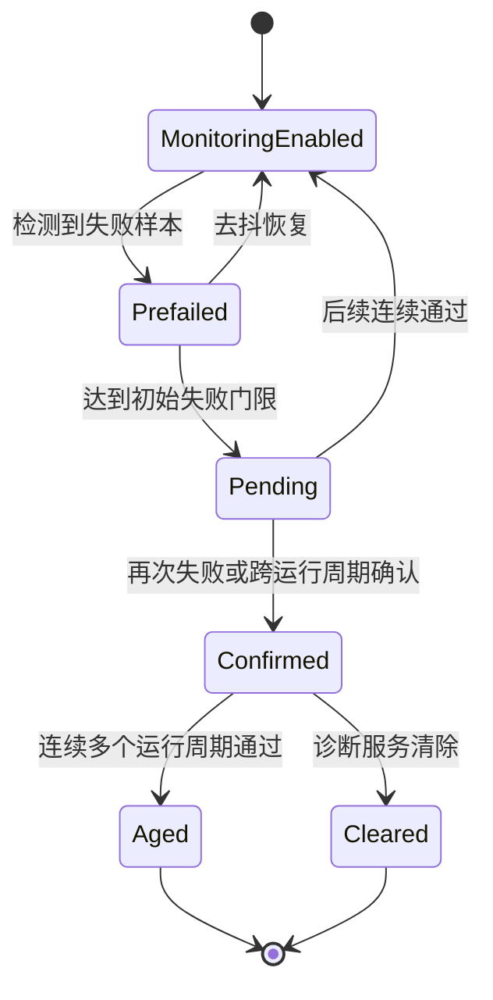

# 基础概念
DTC 是 Diagnostic Trouble Code，中文通常叫故障码或诊断故障码。它的表面形式可以是 `P0301` 这样的报码，也可以是诊断报文里的三字节编号，但本质上它表示的是：某个被定义过的故障事件，已经被 ECU 以标准化方式记录下来，并可通过诊断接口对外呈现。

这里最容易忽略的一点是，DTC 不是原始故障本身。原始故障可能是传感器断路、电源欠压、通信超时、标定非法、算法输出超界、执行器卡滞。DTC 是系统在定义好监测条件和判定规则之后，对这些故障现象做出的诊断表达。

因此，DTC 更接近一种工程化结果，而不是物理世界里的原生事实。
- 同一个物理问题，可能引起多个 DTC。
- 不同项目里，同一类问题也可能被映射成不同的 DTC 设计。

# 编码体系与数据结构
## OBD 里的五位报码
最熟悉的 DTC 形式通常是 `P0301`、`C1234`、`U0100` 这种五位码。它们更接近法规和通用诊断设备面向人的展示形式，尤其常见于 OBD 相关场景。

这五位码可以拆开理解：
- 第 1 位表示系统域：`P` 是动力总成，`B` 是车身，`C` 是底盘，`U` 是网络通信。
- 第 2 位通常区分通用定义和厂商自定义。
- 第 3 位进一步表示子系统或故障大类。
- 第 4、5 位用于标识更具体的故障项。

例如，`P0301` 通常表示 1 缸失火，`U0100` 常被用来表示与发动机控制器通信丢失。这类报码的优势在于跨车型、跨工具可读性较好，但它并不能完整表达 ECU 内部所有诊断细节。

一方面，OEM 或一级供应商会有大量内部 DTC，它们未必直接映射成大家熟悉的五位码。另一方面，即便显示出来的是同一条五位码，不同项目在快照内容、确认条件、老化条件上的实现也可能完全不同。

## UDS 诊断报文里的 DTC
当进入 UDS 诊断交互，看见的通常不是 `P0301` 这种字符串，而是按标准定义传输的 DTC 记录。

在很多实现里，DTC 在报文里以三字节编号出现，再配上一个状态字节，组成最常见的 `DTCAndStatusRecord`。

也就是说，诊断链路里真正流动的数据，更像下面这样：
- DTC 编号
- DTC 状态字节
- 快照记录号及其数据
- 扩展数据记录号及其数据
- 发生计数、老化计数等内部管理信息

外部工具之所以能把它显示成 `Pxxxx`、`Cxxxx` 或厂商自定义文本，往往依赖诊断数据库、ODX/CDD 描述文件或工具内置映射。没有这些映射时，工程师在抓包里看到的通常只是十六进制编号。

## 一个 DTC 真正有用，靠的不只是编号
把 DTC 只当成一个编码，会低估它在工程中的信息密度。真正能帮助分析问题的，通常是与这个编号绑定的一整套上下文。

| 组成部分                    | 作用                     | 没有它会发生什么            |
| :---------------------- | :--------------------- | :------------------ |
| DTC 编号                  | 唯一标识故障类型               | 无法稳定分类和统计           |
| 状态字节                    | 表示当前是否失败、是否确认、是否本循环失败等 | 读到报码却不知道当前是否仍然活跃    |
| Snapshot / Freeze Frame | 保留故障触发时的关键工况           | 很难复盘问题发生环境          |
| Extended Data           | 存放额外诊断信息，如次数、内部状态、原始量  | 排障深度不足              |
| 存储策略                    | 决定是否掉电保留、是否写 NVM       | 故障可能丢失或频繁磨损存储       |
| 清除与老化规则                 | 决定报码何时消失               | 清码逻辑混乱，售后无法判断是否真正修复 |

因此，评估一个 DTC 设计得好不好，不能只看名字是不是清楚，更要看它是否保留了足够的分析上下文。

## 状态字节是理解 DTC 的核心入口
UDS 里很多 DTC 读取结果都会带一个状态字节。这个字节不是装饰信息，而是诊断语义最浓缩的一部分。原文指出，常见的 8 个状态位是理解 DTC 的核心入口。

| 位 | 常见名称 | 典型含义 |
| :--- | :--- | :--- |
| bit0 | `testFailed` | 当前最近一次判定结果为失败 |
| bit1 | `testFailedThisOperationCycle` | 本运行周期内出现过失败 |
| bit2 | `pendingDTC` | 故障已初步成立，但通常还未达到确认门限 |
| bit3 | `confirmedDTC` | 故障已被确认并进入稳定记录状态 |
| bit4 | `testNotCompletedSinceLastClear` | 自上次清码后，该监测尚未完整执行 |
| bit5 | `testFailedSinceLastClear` | 自上次清码后，至少失败过一次 |
| bit6 | `testNotCompletedThisOperationCycle` | 本运行周期内监测尚未跑完 |
| bit7 | `warningIndicatorRequested` | 请求点亮某个告警指示 |

这些状态位的价值在于，它们把“当前活跃故障”和“历史曾经发生过的故障”区分开了。

比如，一条 DTC 可能已经不是当前失败，但 `confirmedDTC` 和 `testFailedSinceLastClear` 仍然保留；反过来，也可能监测刚刚第一次失败，已经出现 `testFailed`，但还没进入 `confirmedDTC`。

这也是售后分析里经常遇到的情况：
- 报码还在，但物理故障已经暂时消失。
- 问题明明复现过，诊断仪却只能看到待确认状态。

如果不理解状态字节，单看“有没有报码”往往会误判。

# DTC 的产生、确认与消失
## DTC 的起点是监测条件，而不是报码表
每个 DTC 的上游都应该有一个明确的监测器。这个监测器负责回答两个问题：什么时候允许开始监测，什么条件下判定失败。

例如，一条“前视摄像头以太网链路中断”的 DTC，不可能在 ECU 上电瞬间就立刻监测。更合理的设计通常会要求若干使能条件成立，例如电源稳定、网络栈初始化完成、摄像头上电完成、功能处于允许工作状态。只有在这些条件具备之后，链路超时才有诊断意义。

如果使能条件定义得太粗糙，就容易产生伪故障。工程上大量“偶发报码”并不是硬件真有问题，而是监测器在不该工作的时机提前运行了。

## 去抖决定了 DTC 是敏感还是稳定
真实系统里，很多异常不是持续性的，而是抖动式出现。电压瞬时跌落、CAN 总线偶发拥塞、摄像头启动慢了几百毫秒、温度接近阈值时来回摆动，这些都可能让监测结果在通过和失败之间反复跳动。

如果监测一失败就立即确认为 DTC，系统会非常敏感，但报码质量很差。如果门限太高，又会让真实故障长时间无法被记录，影响排障和安全。

因此 ECU 通常会引入去抖机制，常见方式有两类：
- 计数型去抖：连续失败若干次才认为故障成立，连续通过若干次才认为恢复。
- 时间型去抖：失败持续超过设定时长才确认，通过持续足够久才清除临时状态。

在 AUTOSAR Classic 的常见实现里，监测模块把事件状态上报给 DEM，DEM 再根据配置好的去抖算法更新事件状态、DTC 状态位和存储行为。这一步决定了 DTC 是不是“见风就是雨”，也决定了售后读到的报码是否可信。

## 从首次失败到确认报码
不同 OEM 的策略会有差异，但主线通常类似。下面这张图把一个典型 DTC 从监测到清除的状态演进串了起来。

图里最值得记住的不是状态名字，而是两个分界点：
- 第一个分界点是“第一次可信失败”，它决定系统是否进入待确认状态。
- 第二个分界点是“确认故障”，一旦越过这一步，报码往往会写入非易失存储，并在诊断仪上稳定可见。

很多现场问题就卡在这两个门槛之间。故障确实出现过，但还没被确认，所以工程师只能看到 `pending`；或者物理问题已经恢复，但 `confirmed` 还在，因为老化条件尚未满足。

## Snapshot 和 Extended Data
一个只带编号的 DTC，分析价值通常很低。现场工程师真正想知道的是，报码出现时系统处在什么工况下。

因此很多平台会为关键 DTC 配置快照数据。常见内容包括：
- 电源电压、温度、车速、档位、点火状态
- 相关报文的超时计数、序列号、校验状态
- 传感器原始值、标定状态、初始化阶段
- 运行周期编号、时间戳、唤醒原因

扩展数据则更偏向内部诊断细节，例如：
- 故障发生次数
- 自上次清码后的失败次数
- 内部子错误码
- 去抖计数器当前值
- 降级策略是否已触发

对于智驾域控、摄像头、雷达这类复杂系统，快照和扩展数据往往比报码本身更有分析意义。因为这类系统的故障根因常常落在边界条件里，例如时间同步偏差、链路带宽不足、镜头加热未完成、感知进程尚未完全进入就绪态，而不是简单的器件坏了。

## 清除和老化
很多人把报码没了统称为清除，但在 ECU 内部，至少要区分两种机制。

第一种是主动清除。典型方式是外部诊断仪通过 `0x14 ClearDiagnosticInformation` 请求清除某个 DTC 组或全部 DTC。这个动作通常会清掉事件存储、快照、扩展数据以及相关状态位。

第二种是自然老化。故障在若干个运行周期内持续不再出现，系统根据配置的 aging 规则，把曾经确认过的报码从活跃历史里移除。老化强调的是问题长期不再复现，它更像一种诊断上的自愈确认。

这两者的工程含义完全不同。
- 主动清除只能说明记录被抹掉了，不能证明物理故障已经修复。
- 自然老化则更接近“系统经历了足够多的正常运行验证”。

如果售后流程把二者混为一谈，报码管理就会失真。

# DTC 在诊断协议里的读取与管理
## 读 DTC 主要依赖 `0x19`
在 UDS 中，读取 DTC 的核心服务是 `ReadDTCInformation`，服务号是 `0x19`。它不是一个单一动作，而是一组围绕 DTC 展开的查询能力。

项目里常见的几个子功能包括：
- 按状态掩码统计 DTC 数量
- 按状态掩码读取 DTC 列表
- 读取某条 DTC 的快照记录
- 读取某条 DTC 的扩展数据记录

如果工程师想看当前已经确认的故障，工具通常会先按状态掩码筛选 `confirmedDTC`，再把符合条件的 DTC 编号和状态字节列出来。

如果想继续深挖，就会针对某条 DTC 再去读对应的 Snapshot 和 Extended Data。

因此，`0x19` 的设计思路不是“把所有东西一次性吐出来”，而是先给出故障索引，再按需下钻。这对总线带宽、工具性能和诊断交互稳定性都更友好。

## 清 DTC 依赖 `0x14`，但清掉不代表故障不存在
清除 DTC 的标准入口是 `ClearDiagnosticInformation`，服务号 `0x14`。在很多 ECU 中，它支持按 DTC 组清除，也支持清除全部故障记录。

这里最容易被误解的是，清码只作用于诊断存储，不会直接修复导致报码的根因。如果底层故障条件仍然存在，那么清码之后，只要监测器再次运行，DTC 很可能马上重新置位。

这也是维修现场很常见的一类误判：诊断仪清码成功，于是以为问题已经解决；结果车辆一通电或一上路，报码立刻回来。真正被验证的不是“故障是否修复”，而只是“诊断存储是否可写”。

## DCM 和 DEM 的分工，决定了 DTC 链路怎么落地
如果项目采用 AUTOSAR Classic，DTC 的软件分层通常可以粗略理解成这样：
- 监测逻辑负责判断某个事件是通过还是失败。
- DEM 负责事件去抖、状态位维护、事件存储、快照和扩展数据管理。
- DCM 负责把外部 UDS 请求转换成对 DEM 的查询或控制。

也就是说，`0x19` 和 `0x14` 这些服务看起来是诊断协议能力，但真正决定一条 DTC 是否存在、长什么样、带哪些上下文的，核心通常在 DEM 配置和监测逻辑实现。

如果前端诊断协议做得很标准，而后端事件定义很粗糙，最终得到的 DTC 一样会难用。

## DTC 读取结果为什么经常和日志看起来对不上
这是联调阶段非常常见的问题。开发同学在日志里明明看到异常，但诊断仪没有报码；或者报码还在，日志里却已经连续通过了很久。

造成这种不一致的原因通常有几类：
- 日志记录的是原始异常，而 DTC 受使能条件和去抖策略约束。
- 日志按毫秒级打印，DTC 只在确认后才入库。
- 日志掉电可能丢失，DTC 写入了非易失存储。
- 某些内部错误只做调试日志，并未对外映射成 DTC。
- DTC 已经进入历史状态，但日志里当前没有活跃异常。

这说明 DTC 不是日志系统的替代品，日志也不是 DTC 的替代品。前者强调跨阶段、跨工具的一致诊断接口，后者强调开发排障时的细粒度现场信息。两者应该互补，而不是互相替代。

# 智驾系统里几类典型 DTC
智驾域控和传统车身 ECU 相比，故障来源更复杂，很多 DTC 都与时序、算力和通信链路有关。

| 场景 | DTC 关注点 | 更值得保留的快照 |
| :--- | :--- | :--- |
| 摄像头或雷达链路中断 | 是物理断链、初始化未完成，还是网关未放通 | 端口状态、上电状态、初始化阶段、最近报文时间 |
| 时间同步失效 | 是 PTP 丢失、时钟漂移超限，还是主时钟切换 | 主从时钟状态、偏差量、同步源 ID、切换次数 |
| 感知算法超时 | 是输入帧断流、CPU 紧张，还是任务调度阻塞 | 输入帧率、任务耗时、CPU 负载、队列积压 |
| 标定或配置非法 | 是版本不匹配、参数越界，还是 NVM 读写损坏 | 软件版本、参数版本、校验结果、回退动作 |
| 热管理异常 | 是传感器过温还是域控降频 | 温度点、风扇状态、功耗模式、限频状态 |

从上下文可以推断，这一部分主要想强调：
- 智驾系统里的 DTC 往往不只是器件损坏。
- 很多报码与链路超时、时间同步、初始化时序、资源不足、降级策略触发有关。
- 要分析这类 DTC，必须结合快照、扩展数据、运行阶段和系统状态一起看，而不能只盯着报码名字。
