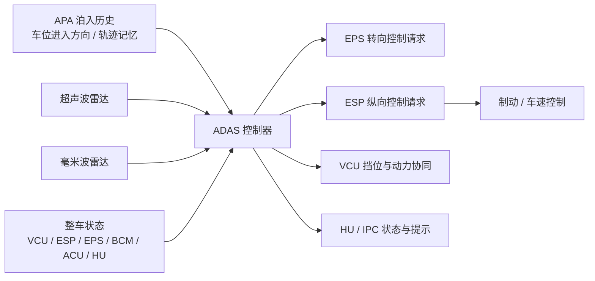
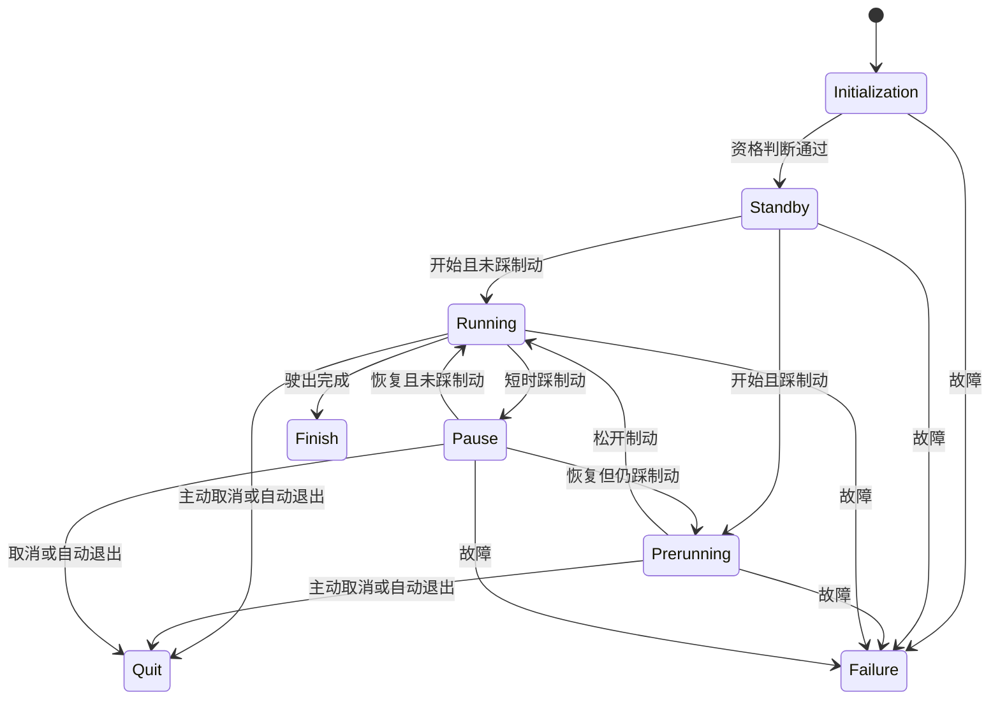

# 定位
本文档定义乘用车高级驾驶辅助系统中的自动驶出功能。APO 的职责是在车辆满足自动驶出前提条件时，利用历史自动泊入信息、车身周边环境探测结果和底盘执行能力，自动规划并执行从平行车位驶出的轨迹，使车辆在驾驶员监督下完成从车位到可继续人工接管驾驶状态的过渡。

本文档面向整车功能定义、ADAS 系统设计、路径规划与控制开发、HMI 定义、底盘联调、测试验证和项目管理使用。后续软件需求、标定参数、信号 ICD 和测试用例应基于本文档继续分解。

# 适用范围
本文档覆盖的对象是平行车位场景下的自动驶出辅助功能。APO 的核心目标包括：
- 判断当前车辆是否具备自动驶出资格。
- 根据历史自动泊入轨迹和周边障碍物信息生成自动驶出路径。
- 在自动驶出过程中完成横向与纵向协同控制。
- 通过 HMI 与驾驶员进行状态交互、开始确认、暂停恢复和退出提示。
- 在异常、接管或故障场景下安全退出并将车辆移交给驾驶员或底盘安全机制。

本文档不单独定义以下内容：
- APA 自动泊入的完整功能规范。
- EPS、ESP、VCU、HU 的底层控制策略和驱动实现。
- 全量通信矩阵、诊断和 BootLoader 实现细节。
- 法规认证文本。

# 系统目标与边界
## 系统目标
APO 的系统目标可以分为三层。

第一层是场景辅助目标。系统应在车辆已通过自动泊入进入平行车位，且周边空间满足自动驶出条件时，为驾驶员提供自动驶出辅助，降低低速窄空间下反复换挡和低速转向操作负担。

第二层是安全目标。系统应在驶出过程中持续感知车身周边障碍物，并结合轨迹规划结果进行横纵向协同控制；当驾驶员接管、环境不再满足、系统发生异常或故障时，功能应及时退出并进入安全制动和驻车流程。

第三层是系统协同目标。APO 应与 APA 泊入结果、超声波雷达、毫米波雷达、EPS、ESP、VCU、HU 和 IPC 形成稳定闭环，保证功能资格判断、路径执行、暂停恢复和退出提示的一致性。

## 系统边界
从系统工程角度看，APO 不是单一控制器功能，而是一条跨历史轨迹记忆、环境感知、路径规划、底盘执行和驾驶员交互的系统链路。

系统边界内包含以下内容：
- 自动驶出资格判断。
- 驶出方向选择和路径规划。
- 横向控制请求与纵向控制请求生成。
- 暂停、恢复、完成、退出和故障状态管理。
- 障碍探测和驾驶员提示。

系统边界外但与功能成功率和安全性强相关的内容包括：
- APA 泊入结束时的轨迹记录质量。
- 超声波和毫米波雷达的探测精度与可用性。
- EPS 对目标转角和控制请求的执行质量。
- ESP 对速度限制、停车点和制动模式的执行质量。
- HU / IPC 对 APO 状态提示的呈现一致性。

## 外部依赖系统
|外部系统|向 APO 提供|APO 向其输出|系统角色|
|---|---|---|---|
|APA 泊入功能|当前车位是否由自动泊入进入、泊入轨迹、进入方向|无|APO 资格前提|
|超声波雷达|车身周边近距离障碍物信息|无|主环境感知|
|毫米波雷达|车外目标补充信息|无|辅助环境感知|
|EPS|转向控制可用性、执行状态、方向盘角和扭矩|目标转角、功能请求、控制请求|横向执行|
|ESP|车速、驻停状态、AP 控制可用性、纵向控制状态|速度限制、停车点、制动模式、功能状态|纵向执行|
|VCU|挡位、油门开度、换挡接管反馈、故障等级|挡位目标间接请求|动力与挡位协同|
|BCM / ACU|车门、舱盖、尾门、安全带|无|车辆与驾驶员状态|
|HU / IPC|开始/取消/恢复选择、交互界面|APO 状态、提示、方向、故障和告警|人机交互|

# 运行前提与 ODD 边界
## 功能前提
APO 只允许在满足以下前提时进入可用状态：
- 当前车位是通过 APA 自动泊入进入的。
- 当前车位类型为支持的平行车位。
- 车辆与周边车辆、围栏或障碍物的距离满足自动驶出最小空间要求。
- 车辆静止。
- 车辆档位处于 D 或 R。
- 车门、前舱盖、后尾门关闭。
- 驾驶员在座且系安全带。
- ADAS 控制器、超声波雷达、ESP、EPS、VCU 处于可用状态。

任一前提不满足时，系统不得进入 APO 待命或执行状态。

## 场景边界
APO 的目标场景是由自动泊入进入的平行车位自动驶出。该功能不覆盖垂直车位、斜列车位或纯人工泊入后直接启用的驶出场景。

APO 典型适用工况包括：
- 车辆在平行车位内静止。
- 车辆前后存在障碍物，但车位长度和周边空间满足驶出所需最小条件。
- 驾驶员在车内完成开始确认并持续监控。
- 路面坡度、障碍物高度和环境条件在系统能力范围内。

## 环境与几何边界
APO 的能力边界至少包括：
- 仅支持平行车位，最小车位长度为 `6.25 m`。
- 场地坡度应小于 `10°`。
- APO 过程中车速不应超过 `10 km/h`。
- 允许跨越的障碍物高度范围为 `5 cm ~ 8 cm`。
- 自动驶出完成时，车身与周边障碍物距离不应小于 `0.5 m`。

## 感知边界
APO 对障碍识别的最低能力边界包括：
- 识别范围：距车身 `0.5 m ~ 3.0 m`。
- 识别时间：障碍进入识别范围后 `0.1 s` 内完成识别。
- 障碍物最小尺寸要求：
|障碍类别|最小尺寸要求|
|---|---|
|车体 / 墙体|最小长度 200 cm，最小高度 80 cm|
|圆形物体|最小直径 50 cm，最小高度 80 cm|
|方形物体|最小直径 100 cm，最小高度 80 cm|
|路沿|最小高度 10 cm，最小长度 2.0 m，与地面最小角度 85°|

# 功能定义与系统行为
## 功能概述
APO 的系统本质，是在自动泊入成功后的特定车位场景下，利用已知车位关系和实时障碍探测信息，自动生成驶出轨迹，并对车辆进行低速横纵向协同控制，直至车辆驶出车位。

该功能不等同于任意低速自动转向，也不等同于路径搜索型泊车系统。它对如何进入当前车位具有依赖，因此 APO 资格判断是功能链路中的第一约束。

## 功能子能力分解
|子能力|功能说明|关键输入|关键输出|
|---|---|---|---|
|资格判断|判断当前车辆是否具备 APO 可用条件|APA 历史状态、档位、静止状态、门盖、安全带、故障状态|APO 可用 / 不可用|
|驶出方向管理|确定左侧或右侧驶出|HU 选择、历史泊入方向、空间条件|APO 方向|
|环境感知|获取车身周边障碍物距离与位置|超声波雷达、毫米波雷达|障碍物距离与分类|
|路径规划|根据历史轨迹与环境构建驶出路径|泊入轨迹、障碍物、车位边界|目标路径|
|横向控制|输出目标转角和 EPS 控制请求|目标路径、车辆姿态|ADAS_APTarSteeringAngle 等|
|纵向控制|输出速度限制、停车点和制动模式|剩余路径、障碍距离、档位需求|ADAS_AP_BrakeModeStatus 等|
|状态管理|管理 Initialization、Standby、Prerunning、Running、Pause、Finish、Quit、Failure|驾驶员操作、系统状态|APO 状态机|
|HMI 管理|提示开始、松刹车、执行中、暂停、完成、取消、故障|APO 状态、方向、告警|图标、文本、声音|

## 自动驶出行为
在 APO 待命状态下，驾驶员可通过 HMI 选择开始自动驶出。系统根据驾驶员选择的驶出方向、上次自动泊入轨迹和当前环境感知结果生成驶出路径。在执行过程中，APO 持续更新车辆与周边障碍物的相对关系，并对目标转角、目标速度限制和停车点进行实时调整，使车辆按规划轨迹低速驶出车位。

APO 驶出方向应与功能允许方向一致，并与历史泊入几何关系兼容。若选择的方向与可行驶出空间不一致，系统不得进入运行态。

## 人机交互行为
APO 需要通过 HMI 与驾驶员完成多轮交互：
- 在待命阶段询问是否开始自动驶出。
- 在驾驶员踩住制动踏板时提示松开制动以继续。
- 在运行阶段提示自动驶出进行中。
- 在暂停阶段提供继续和取消选择。
- 在完成、取消和故障阶段提供明确结束语义。

HMI 显示与提示音必须与 APO 状态机保持一致，不得出现界面显示仍在运行、但底盘控制已经退出的状态不一致问题。

## 障碍识别与避障行为
APO 在运行过程中应使用超声波雷达为主、毫米波雷达为辅，对车身周边障碍物进行实时探测。系统需要具备两类能力：
- 障碍识别能力：识别车身周边障碍物是否进入风险范围。
- 障碍约束能力：在路径规划和速度控制中对障碍物形成约束，避免碰撞。

障碍探测结果应优先用于路径约束、告警和必要退出，不应将障碍物出现默认解释为进入 `Pause` 的充分条件。

# 状态机定义
## 状态集合
APO 状态机由以下八个状态组成：
- `Initialization`：功能初始化与资格判断状态。
- `Standby`：功能可用，等待驾驶员开始自动驶出。
- `Prerunning`：驾驶员已发出开始指令，但仍踩住制动踏板，等待松开制动。
- `Running`：系统正在控制车辆自动驶出。
- `Pause`：运行过程中驾驶员短时踩下制动踏板，功能暂停，等待恢复或取消。
- `Finish`：自动驶出完成。
- `Quit`：主动取消或可恢复异常退出。
- `Failure`：不可恢复故障退出。

## 状态机主流程

## 状态转移条件
本节统一采用如下逻辑口径：
- `全部满足` 表示 `AND`。
- `任一满足` 表示 `OR`。
- 若某条迁移包含多个条件组，则按“组内 AND、组间 OR”解释。
- 每个自然语言条件后均补充对应信号值逻辑。对于系统必须存在但当前未冻结到总线的量，使用内部信号名表示，后续应在 ICD 或软件设计说明中冻结。

### Initialization 到 Standby
`Initialization -> Standby` 应在以下条件`全部满足（AND）`时触发：
- 传感器信号正常：`APO_InternalSensorHealth = Normal`。
- ESP、VCU、EPS 工作状态正常：`EPS_ErrorFlag = Normal AND EPS_APStatus = Available AND VCU_CH_FaultLevel = Normal AND ESP_ESPFault = Normal`。
- ADAS 控制器状态正常：`ADAS_ECUFaultStatus = Normal`。
- 车辆允许自动泊出：`APO_InternalAvailable = TRUE`。
- 车辆档位为 D 或 R：`VCU_CH_ActualGearShiftPosition = D OR VCU_CH_ActualGearShiftPosition = R`。
- 车辆静止：`ESP_VehicleStandStill = Standstill`。
- 车辆四门、前舱盖、后尾门关闭：`BCM_FLDoorStatus = Closed AND BCM_FRDoorStatus = Closed AND BCM_RLDoorStatus = Closed AND BCM_RRDoorStatus = Closed AND BCM_HoodAjarStatus = Closed AND PLG_RearLatchPosition = Locked`。
- 驾驶员在车内：`ADAS_APDriverInCarStatus = DriverInCar`。
- 驾驶员系安全带：`ACU_DriverBuckleStatus = Buckled`。

### Standby 到 Initialization
`Standby -> Initialization` 应在以下情形中`任一满足（OR）`时触发：
- 不允许自动泊出：`APO_InternalAvailable = FALSE`。
- 车辆档位不为 D 且不为 R：`VCU_CH_ActualGearShiftPosition != D AND VCU_CH_ActualGearShiftPosition != R`。
- 车辆未静止：`ESP_VehicleStandStill != Standstill`。
- 驾驶员按取消泊出按钮：`HU_APOControl = Disable`。
- 驾驶员离开驾驶位：`ADAS_APDriverInCarStatus = DriverNotInCar`。
- 车辆门盖打开：`BCM_FLDoorStatus = Ajar OR BCM_FRDoorStatus = Ajar OR BCM_RLDoorStatus = Ajar OR BCM_RRDoorStatus = Ajar OR BCM_HoodAjarStatus = Ajar OR PLG_RearLatchPosition != Locked`。
- 驾驶员解开安全带：`ACU_DriverBuckleStatus = Unbuckled`。

### Standby 到 Running
`Standby -> Running` 应在以下条件`全部满足（AND）`时触发：
- 驾驶员选择开始自动驶出：`HU_APOControl = Right OR HU_APOControl = Left`。
- 驾驶员未踩制动踏板：`IB_BrakePedalStatus = NotPressed`。
- 车辆允许自动泊出：`APO_InternalAvailable = TRUE`。

### Standby 到 Prerunning
`Standby -> Prerunning` 应在以下条件`全部满足（AND）`时触发：
- 驾驶员选择开始自动驶出：`HU_APOControl = Right OR HU_APOControl = Left`。
- 驾驶员踩下制动踏板：`IB_BrakePedalStatus = Pressed`。
- 车辆允许自动泊出：`APO_InternalAvailable = TRUE`。

### Prerunning 到 Running
`Prerunning -> Running` 应在以下条件`全部满足（AND）`时触发：
- 驾驶员松开制动踏板：`IB_BrakePedalStatus = NotPressed`。
- APO 开始请求仍然有效：`HU_APOControl = Right OR HU_APOControl = Left OR APO_InternalResumeLatched = TRUE`。

### Running 到 Pause
`Running -> Pause` 应在以下条件`全部满足（AND）`时触发：
- 驾驶员踩下制动踏板：`IB_BrakePedalStatus = Pressed`。
- 制动持续时间不超过暂停阈值：`APO_InternalBrakePressTimer <= 6 s`。

### Pause 到 Running
`Pause -> Running` 应在以下条件组中满足其一，即`（A）OR（B）`：
- 条件组 A：驾驶员点击继续，且未踩制动踏板。对应信号逻辑：`HU_SuspendFollowupAction = Resume AND IB_BrakePedalStatus = NotPressed`。
- 条件组 B：系统保持恢复授权，且驾驶员在 Pause 后松开制动。对应信号逻辑：`APO_InternalResumeLatched = TRUE AND IB_BrakePedalStatus = NotPressed`。

### Pause 到 Prerunning
`Pause -> Prerunning` 应在以下条件`全部满足（AND）`时触发：
- 驾驶员点击继续：`HU_SuspendFollowupAction = Resume`。
- 驾驶员仍踩住制动踏板：`IB_BrakePedalStatus = Pressed`。

### Running 到 Finish
`Running -> Finish` 应在以下条件`全部满足（AND）`时触发：
- 自动驶出完成：`APO_InternalManeuverFinished = TRUE`。
- 车辆姿态和与周边障碍物距离满足完成判据：`APO_InternalFinishPoseValid = TRUE`。

### Prerunning / Running / Pause 到 Quit
`Prerunning -> Quit`、`Running -> Quit`、`Pause -> Quit` 应在以下情形中`任一满足（OR）`时触发：
- 驾驶员连续踩制动超过阈值：`IB_BrakePedalStatus = Pressed AND APO_InternalBrakePressTimer > 6 s`。
- 驾驶员进行转向接管：`EPS_EPSTouqbar > 3.0 Nm AND APO_InternalSteerOverrideTimer > 200 ms`。
- 驾驶员踩油门超过退出阈值：`VCU_CH_AccelPedalPosition > 5% AND VCU_CH_AccelPedalPositionValid = Valid`。
- 驾驶员进行换挡操作：`VCU_CH_GearControlFeedback = ControlledbyDriver`。
- 驾驶员离开驾驶位：`ADAS_APDriverInCarStatus = DriverNotInCar`。
- 车辆门盖打开：`BCM_FLDoorStatus = Ajar OR BCM_FRDoorStatus = Ajar OR BCM_RLDoorStatus = Ajar OR BCM_RRDoorStatus = Ajar OR BCM_HoodAjarStatus = Ajar OR PLG_RearLatchPosition != Locked`。
- 驾驶员在暂停状态下点击取消：`HU_SuspendFollowupAction = Quit`。
- 驾驶员解开安全带：`ACU_DriverBuckleStatus = Unbuckled`。
- 路径上存在无法跨越的陡坎或坡度过大：`APO_InternalRoadGeometryInvalid = TRUE`。

### 任意运行态到 Failure
任意运行态进入 `Failure` 应在以下情形中`任一满足（OR）`时触发：
- ESP、VCU、EPS 工作状态异常：`EPS_ErrorFlag != Normal OR EPS_APStatus = Failure OR VCU_CH_FaultLevel = Failure OR ESP_ESPFault = Failure`。
- 传感器异常：`APO_InternalSensorHealth = Failure`。
- ADAS 控制器异常：`ADAS_ECUFaultStatus = Failure`。

## 状态转移逻辑汇总
|状态转移|逻辑关系|说明|
|---|---|---|
|Initialization -> Standby|AND|所有资格判断条件必须同时成立|
|Standby -> Initialization|OR|任一资格条件失效即可回退|
|Standby -> Running|AND|开始且未踩制动|
|Standby -> Prerunning|AND|开始但仍踩制动|
|Prerunning -> Running|AND|松开制动且开始请求有效|
|Running -> Pause|AND|短时踩制动|
|Pause -> Running|OR|恢复且未踩制动|
|Pause -> Prerunning|AND|恢复但仍踩制动|
|Running -> Finish|AND|驶出完成判据成立|
|Prerunning/Running/Pause -> Quit|OR|任一接管或退出条件满足|
|任意运行态 -> Failure|OR|任一关键故障满足|

# 详细功能需求
## 功能资格需求
### APO-SYS-001 自动泊入依赖
APO 只应在车辆由 APA 自动泊入当前平行车位后提供功能资格。系统应保留当前车位由自动泊入进入的状态标记，并在 APO 资格判断中使用。

### APO-SYS-002 车位和空间资格
APO 应在确认当前车位类型、车辆与前后障碍物距离以及横向空间满足驶出要求后，才进入可用待命状态。

### APO-SYS-003 车辆与驾驶员前提
车辆必须静止，档位处于 D 或 R，驾驶员在车内且系安全带，车门、前舱盖、后尾门关闭，系统方可允许 APO 待命。

## 开始与方向选择需求
### APO-SYS-004 开始交互
当 APO 满足可用条件时，HMI 应向驾驶员展示开始和取消按钮，由驾驶员明确确认是否开始自动驶出。

### APO-SYS-005 驶出方向选择
APO 应支持驾驶员通过 HMI 选择自动驶出方向，并将方向选择发送给 ADAS 控制器。系统不得在驾驶员未明确选择的情况下直接进入运行态。

### APO-SYS-006 带制动开始
若驾驶员发出开始指令时仍踩住制动踏板，系统应进入 `Prerunning`，并通过 HMI 提示驾驶员松开制动踏板。

## 路径规划与控制需求
### APO-SYS-007 路径生成
APO 应基于历史自动泊入轨迹、当前车位几何关系和周边障碍物信息生成自动驶出路径。

### APO-SYS-008 横向控制
在 APO 运行过程中，ADAS 应向 EPS 发送 APO 功能请求、控制请求和目标转角，EPS 应在响应允许后进入受控状态。

### APO-SYS-009 纵向控制
在 APO 运行过程中，ADAS 应向 ESP 发送制动模式状态、剩余停车距离和最大限制车速，ESP 应基于这些量执行纵向控制。

### APO-SYS-010 换挡协同
当路径执行需要换挡时，系统应先将剩余停车距离设为零，使车辆停止运动，再通过整车协同完成换挡，不得在车辆运动过程中无约束切换挡位。

### APO-SYS-011 实时更新
APO 在执行过程中应实时更新车辆位置、周边障碍物信息和目标路径，不得在环境明显变化后仍坚持执行已失效的静态路径。

## 暂停与恢复需求
### APO-SYS-012 短时踩制动暂停
在 `Running` 状态下，驾驶员短时踩下制动踏板时，APO 应进入 `Pause`，停止车辆运动并保持当前转向控制上下文。

### APO-SYS-013 暂停交互
进入 `Pause` 后，HMI 应显示继续和取消按钮，并提示自动驶出已暂停。

### APO-SYS-014 继续执行
驾驶员在 `Pause` 状态下点击继续后，若制动踏板已松开，应直接恢复 `Running`；若仍踩住制动，应先转入 `Prerunning`，待松开制动后继续执行。

## 完成需求
### APO-SYS-015 完成判据
APO 应在车辆已驶出车位，且车辆姿态、车身与周边障碍物距离满足完成要求时，判定本次自动驶出完成。

### APO-SYS-016 完成后处理
进入 `Finish` 后，系统应停止横纵向控制，提示自动驶出已完成，并向底盘请求安全停车和 P 档收尾。

## 驾驶员接管与退出需求
### APO-SYS-017 控制权优先级
驾驶员控制权始终高于 APO。驾驶员的制动、转向、油门、换挡和取消动作均应优先于系统控制。

### APO-SYS-018 油门退出
当驾驶员油门开度超过 `5%` 时，APO 应立即退出。

### APO-SYS-019 转向退出
当驾驶员方向盘力矩超过 `3.0 Nm` 且持续时间超过 `200 ms` 时，系统应判定为转向接管并退出 APO。

### APO-SYS-020 连续制动退出
当驾驶员连续踩制动超过 `6 s` 时，系统应退出 APO，而不应仅维持暂停状态。

### APO-SYS-021 主动取消
驾驶员可通过 HMI 取消按钮主动退出 APO。处于暂停状态下点击取消，系统应直接转入 `Quit`。

### APO-SYS-022 自动退出
当驾驶员离座、解开安全带、打开门盖、换挡、道路几何不再满足、系统判断不再安全等场景发生时，APO 应自动退出。

## 障碍识别与告警需求
### APO-SYS-023 障碍识别
APO 应识别车身周边规定范围内满足最小尺寸要求的障碍物，并将其纳入路径和速度控制约束。

### APO-SYS-024 低速雷达显示
在 APO 初始化和执行阶段，系统应向 HMI 提供车身周边雷达距离显示所需信号，用于低速障碍提示。

### APO-SYS-025 障碍处理策略
障碍物探测结果应优先用于速度限制、路径收缩、告警和必要退出。冻结版本中，不应因单纯障碍物出现而默认进入 `Pause`。

## 人机交互需求
### APO-SYS-026 Standby 交互
在 `Standby` 状态下，HMI 应显示开始和取消按钮。

### APO-SYS-027 Prerunning 交互
在 `Prerunning` 状态下，HMI 应提示“请松开制动踏板以进行自动驶出”。

### APO-SYS-028 Running 交互
在 `Running` 状态下，辅助转向图标应高亮显示，方向盘图标转动方向和角度应与实际转向一致，并提示“自动驶出进行中”。

### APO-SYS-029 Pause 交互
在 `Pause` 状态下，HMI 应显示继续和取消按钮，并提示“自动驶出暂停”。

### APO-SYS-030 Finish / Quit / Failure 交互
在 `Finish`、`Quit`、`Failure` 状态下，图标应执行结束动画并伴随提示音，分别显示“自动驶出已完成”“自动驶出已取消”“高级自动驾驶功能故障”等清晰语义。

### APO-SYS-031 显示安全性
APO 的图标、文本、方向信息和提示音不得影响驾驶员对真实车辆周边环境的判断，不得通过复杂或延迟的交互制造二次风险。

## 故障处理需求
### APO-SYS-032 故障退出
当 EPS、ESP、超声波雷达、ADAS 控制器、VCU 等关键部件发生不可恢复故障时，APO 应退出，且在故障恢复前不得再次开启。

### APO-SYS-033 故障隔离
若仅超声波传感器故障，则 APA、APO、BSD 等依赖超声波感知的功能应不可用，其他不依赖该感知链路的功能可继续使用。若发生 EPS、ESP 或 ADAS 控制器故障，则所有相关辅助驾驶功能应不可用。

### APO-SYS-034 故障后的安全停车
在 `Failure` 或异常 `Quit` 状态下，APO 应请求退出 EPS 控制、请求 ESP 执行适当减速制动、车辆静止后拉起 EPB，并请求整车切换至 P 档。

# 系统接口需求
## 主要硬件配置
|类别|配置|作用|
|---|---|---|
|前视摄像头|1 个，LVDS 接入，综合视距 150 m+，分辨率 1280 x 960|场景辅助感知|
|超声波雷达|12 个探头 + 控制器，私有 CAN|近距离障碍探测主传感器|
|前向毫米波雷达|1 个，私有 CAN，探测距离 160 m|环境补充感知|
|组合开关 / HU 交互|整车 CAN|驾驶员交互和功能选择|
|EPS|外部执行接口|横向控制|
|ESP|外部执行接口|纵向控制、停车、制动|
|VCU|外部执行接口|动力与档位协同|

## 输入信号分组
|输入类别|典型信号|用途|
|---|---|---|
|驾驶员输入|HU_APOControl、HU_SuspendFollowupAction、IB_BrakePedalStatus|开始、恢复、暂停、取消|
|驾驶员状态|ADAS_APDriverInCarStatus、ACU_DriverBuckleStatus|驾驶员在位和安全带状态|
|车身状态|BCM_FLDoorStatus、BCM_FRDoorStatus、BCM_RLDoorStatus、BCM_RRDoorStatus、BCM_HoodAjarStatus、PLG_RearLatchPosition|门盖条件|
|车辆状态|VCU_CH_ActualGearShiftPosition、VCU_CH_AccelPedalPosition、VCU_CH_GearControlFeedback、ESP_VehicleStandStill、ESP_VehicleSpeed|车辆运动和接管识别|
|EPS 状态|EPS_APStatus、EPS_EPSTouqbar、EPS_SteeringAngle、EPS_ErrorFlag|横向执行反馈|
|ESP 状态|ESP_APAvailable、ESP_APLCStatus、ESP_AP_CDDCtrlActive、ESP_AP_CDDVehiHoldStatus、ESP_ESPFault|纵向执行反馈|
|感知结果|超声波距离信号、毫米波目标信号|障碍识别与路径约束|

## 输出信号分组
|输出类别|典型信号|用途|
|---|---|---|
|EPS 控制|ADAS_EPS_APFuncReq、ADAS_EPS_APCtrlReq、ADAS_APTarSteeringAngle|横向控制请求|
|ESP 控制|ADAS_AP_BrakeModeStatus、ADAS_AP_FailureBrakeMode、ADAS_AP_MaxVelocityLimit、ADAS_RemainDistToStopPoint|纵向控制请求|
|状态与交互|ADAS_APOFuncStatus、ADAS_APWarning、ADAS_APODirection|HMI 状态与告警|
|挡位协同|ADAS_GearTarget 或等效内部请求|完成或异常退出后的收尾控制|
|雷达显示|ADAS_DISTANCE_* 系列信号|低速障碍物显示|

## 通信约束
- 整车 CAN 波特率应满足 `500 kbps` 要求。
- APO 相关信号必须与整车通信矩阵的位定义、滚动计数器和校验要求保持一致。
- HU、ADAS、ESP、EPS 和 VCU 对 APO 状态枚举值的解释必须一致。
- APO 控制链路中的目标车速、目标转角、剩余停车距离、制动模式等量纲必须统一。

# 性能要求
## 自动驶出能力
|指标项|要求|
|---|---|
|换挡次数|<= 5 次|
|驶出用时|无障碍情况下 < 120 s|
|支持车位类型|平行车位|
|最小车位长度|6.25 m|
|场地坡度|< 10°|
|可跨越障碍物最大高度|5 cm ~ 8 cm|
|车速范围|<= 10 km/h|
|成功率|> 90%|

## 控制品质
|指标项|要求|
|---|---|
|车速控制精度|保持在 1 km/h 内|
|最小稳定车速|< 1.5 km/h|
|加减速度范围|-2 m/s^2 ~ 1.5 m/s^2|
|加速度变化率|<= 4 m/s^3|
|正常制动最大减速度|<= 2 m/s^2|
|紧急制动最大刹车距离|<= 0.15 m|
|完成时车身与障碍物最小距离|>= 0.5 m|

## 障碍识别能力
|指标项|要求|
|---|---|
|识别范围|0.5 m ~ 3.0 m|
|识别时间|0.1 s|
|识别对象|车体 / 墙体、圆形物体、方形物体、路沿等满足最小尺寸要求的障碍物|

# 失效、降级与局限性
## 失效分类
APO 的失效至少分为三类：
- 资格失效类：尚未进入运行态前，因车位资格、车辆状态或驾驶员状态不满足而不可用。
- 可恢复退出类：运行中因驾驶员接管或条件变化退出。
- 不可恢复故障类：关键部件故障导致进入 Failure。

## 主要局限性
APO 在以下场景下可能无法正常工作或性能显著下降：
- 车辆不是通过自动泊入进入当前车位。
- 当前车位不是平行车位或尺寸不足。
- 坡度超过 `10°`。
- 大雨、大雪、大雾、烟雾等低能见度环境。
- 超声波传感器被雨雪、泥水、污渍遮挡或损坏。
- 极端高温、极寒或强电磁干扰导致传感器性能下降。

## 驾驶员责任
APO 是低速辅助功能，不是无人泊车替代。驾驶员必须始终在车内、持续关注周边环境，并随时准备通过制动、方向盘、油门或换挡立即接管车辆。

# 验证与测试要求
## 测试环境约束
|类别|要求|
|---|---|
|路面|干燥、平整铺装道路|
|路面坡度|<= 1%|
|路面峰值制动减速度系数|>= 0.9|
|能见度|满足正常测试要求|
|温度与降水|无明显降雨降雪，环境在系统允许范围内|

## 测试项组织建议
系统级验证建议至少覆盖以下维度：
- 功能资格判断测试。
- 开始和方向选择测试。
- Prerunning 与松刹车开始测试。
- Running 执行与路径连续性测试。
- Pause / Resume / Quit 状态转换测试。
- 驾驶员制动、油门、转向、换挡接管退出测试。
- 故障注入与 Failure 处理测试。
- 完成判据与收尾动作测试。
- 障碍识别范围、尺寸和识别时间测试。

## 关键验证场景
- 由 APA 自动泊入后的平行车位成功进入 APO 待命。
- 驾驶员开始后未踩制动直接进入 Running。
- 驾驶员开始后踩住制动进入 Prerunning，再松开制动进入 Running。
- Running 中短时踩制动进入 Pause，点击继续后恢复。
- Running 中连续踩制动超过 `6 s` 触发退出。
- Running 中方向盘力矩超过阈值触发退出。
- Running 中油门开度超过 `5%` 触发退出。
- 运行中打开车门、解开安全带、离座、换挡触发退出。
- 超声波、EPS、ESP、ADAS 控制器故障触发 Failure。
- 自动驶出完成后进入 Finish 并完成 P 档收尾。
