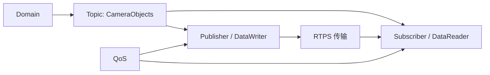
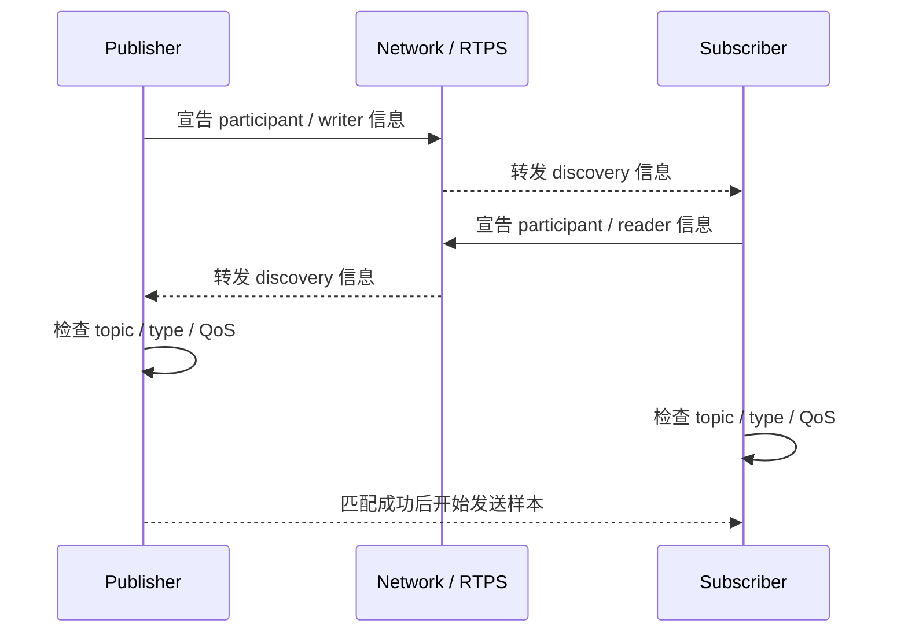
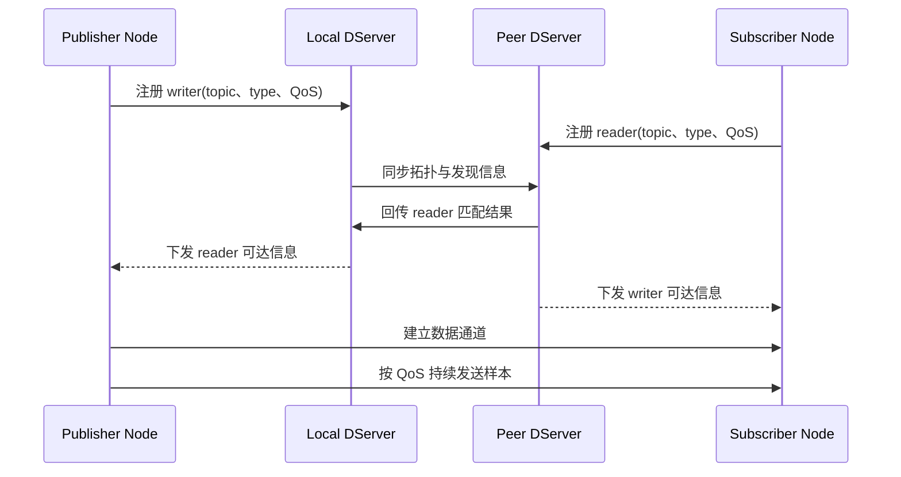
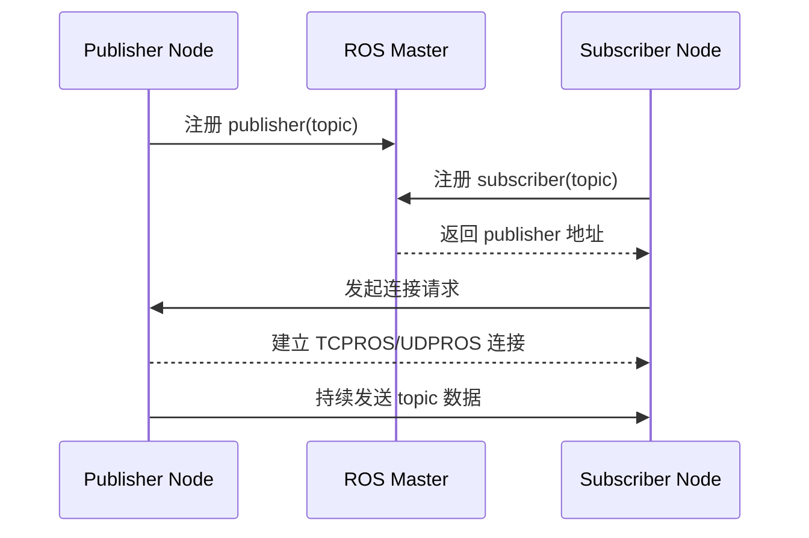
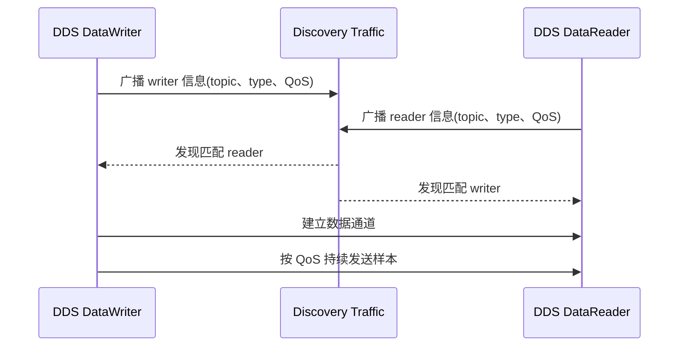

# 分布式数据系统
第一次接触 DDS，很容易把它当成另一个网络协议，或者把它和 `TCP`、`UDP`、`SOME/IP` 并列去记。这样记不算错，但会很快碰到理解边界。DDS 真正解决的问题，不是某个报文怎样从 A 发到 B，而是多节点系统里的数据怎样被持续地产生、发现、订阅、过滤、投递和管理。

**如果系统里只有两个进程做一问一答，那么普通 socket、RPC 甚至共享内存都够用**。DDS 出现的场景通常不是这样。它更适合那种**节点很多、数据种类很多、发布频率很高、订阅关系不断变化**，而且业务希望把**发送者和接收者尽量解耦**的系统。智驾域控、机器人平台、仿真系统和分布式感知链路都很符合这个特征。

从工程角度看，DDS 可以理解成一套面向数据流的中间件体系。**开发者更关心 topic、类型、QoS、发布者和订阅者，而不是每条链路的 IP、端口和连接状态**。底层网络当然仍然存在，但它被收进了中间件内部。于是团队日常讨论的问题，会从谁连上了谁，逐渐变成谁发布了什么数据、哪些订阅者能看见它、延迟是多少、历史深度留多少、丢样本时系统应不应该等。

这也是为什么在很多智驾团队里，大家更常提 DDS 而不是 `SOME/IP`。算法、融合、规划和日志系统更直接面对的是高频数据分发问题，而不是 ECU 服务接口问题。前者的工作语言天然更接近 DDS。

# 运行模型
DDS 的抽象层次不算少，但核心关系并不复杂。它把一个分布式系统拆成 **domain、topic、类型、发布者、订阅者和 QoS** 这些稳定对象，然后靠 discovery 和底层传输把它们动态组织起来。

先把关系看清：

两个约束：第一，通信不是按进程名或 IP 直接绑定的，而是围绕 topic 和类型组织。第二，数据能不能真正匹配成功，不只看 topic 名字，还要看 QoS 是否兼容。

## Domain、Topic 和 Type
Domain 可以理解成一块逻辑隔离的通信空间。处在不同 domain 的参与者，即使在同一张网络里，也不会自然发现彼此。这个机制很实用，因为它让一套中间件能在开发、仿真、量产、回放等不同环境里并行存在，而不至于把所有流量混在一起。

Topic 是 DDS 里最核心的命名对象。它是一类数据流的稳定身份。开发时说某个模块订阅了 `PerceptionObjects`，本质上是在说**它关心这类数据，而不关心这些数据到底来自哪一个具体进程**。这样的抽象会直接改变系统耦合方式。发布者可以替换，订阅者可以增加，甚至同一 topic 可以同时被录包、监控、可视化和算法模块消费，而不需要让发布端逐个感知这些下游节点。

**Type 决定了 topic 上的数据结构**。它让分布式系统里不同节点对同一份数据有一致的字段理解。没有这一层，发布订阅会退化成无约束字节流，类型升级、版本兼容和工具链支持都会迅速变得混乱。

## Publisher、Subscriber、DataWriter、DataReader
DDS 常把对象拆得比较细。Publisher 和 Subscriber 更像管理容器，**真正执行写入和读取的是 DataWriter 和 DataReader**。这个拆分的价值不在于概念完整，而在于它允许一组数据流共享某些配置，并把资源管理、发现关系和 QoS 绑定到更合适的层级。

在实际工程里，开发者通常会把注意力放在 DataWriter 和 DataReader 上，因为样本就是在这里被写入和取出的。只不过理解 DDS 时，最好不要把它简单等同成一个 `publish()` 和一个 `callback()`。它背后还带着实例状态、历史缓存、匹配关系、可靠性控制和生命周期管理。

## Discovery 和 RTPS
DDS 好用的一个前提，是节点不需要手工维护大规模连接表。新节点加入网络后，系统会通过 discovery 机制让发布者和订阅者互相看见，并判断彼此是否匹配。这个能力对大型分布式系统很关键，因为节点拓扑经常变化，手工维护会迅速失控。

如果只看定义，这一步容易显得抽象。把它放到一个发布者上线、订阅者随后加入的过程里，会更容易理解：

这张图里最值得记住的是 discovery 的判断逻辑。节点先互相看见，再交换自己拥有哪些 writer 和 reader，最后按 topic、type 和 QoS 做匹配。只有匹配成功，后面的样本传输才会真正发生。因此很多看起来像网络没通的问题，根因其实是 discovery 成功了，但 QoS 或类型没有对上。

很多 DDS 实现会使用 RTPS，也就是 Real-Time Publish-Subscribe 协议，作为互联互通的线协议基础。对使用者来说，RTPS 的意义在于：DDS 并不是只停在抽象 API 上，它有一套更接近网络侧的实际传输语义。抓包、跨厂商互通、发现流量分析和性能定位，经常都会落到这一层。

这也解释了一个容易混淆的点。DDS 不是简单建立在某一个固定 socket 模型之上的应用库，它是一整套从数据模型到发现机制再到线协议的中间件体系。

### 多中心 Discovery
**标准 DDS 的分布式发现很优雅，但节点数、topic 数、网段数一上来，广播流量、状态同步、跨 VLAN 管理、问题定位都会变复杂**。
这也是为什么一些面向量产整车系统的中间件，会在保留 DDS 数据模型和 QoS 语义的同时，对 discovery 机制做进一步工程化收敛。以理想开源的星环 OS `VBS` 为例，官方资料里提到它支持多中心全局发现，引入 `DServer` 这类发现控制组件，用来做注册、拓扑同步、跨网段信息传播和冗余管理。这样做的重点不是让所有通信重新退回单点调度，而是把大规模系统里最容易失控的发现面单独治理起来。
如果把这个过程放进一条典型时序里，控制面和数据面的分工会更直观：

这里最容易混淆的地方，是把它直接类比成 `ROS Master`。这个类比只对了一半。`ROS Master` 更像中心登记点，节点先去它那里查彼此地址；而 `VBS` 这类设计更强调**发现面和数据面解耦**。也就是说，发布者和订阅者是否存在、topic 和 type 是否匹配、跨 VLAN 怎么同步，这些问题可以由 `DServer` 协助管理；但真正的业务数据传输，仍然尽量走发布端和订阅端之间的直接路径，或者走系统选出来的最优传输通道，而不是都绕回中心转发。

从工程角度看，这样的改动解决的是规模化问题。小系统里，纯分布式 discovery 很自然；到了整车级分布式计算平台，节点数量、topic 数量、子网数量和冗余要求都明显上升，如果还完全依赖广播式发现，控制面流量、状态一致性和故障定位成本都会持续放大。多中心 discovery 的价值，主要在于把这些成本压回到一个可治理范围内，同时支持主备、冗余和跨域部署。

当然，这也不是没有代价。系统里会多出一类需要运维和监控的基础组件，发现链路的设计也会更复杂。所以更准确的理解不是中心化一定更先进，或者分布式一定更先进，而是**在大规模量产系统里，常见做法是让控制面适度集中，让数据面尽量保持高效直达**。这和 `ROS Master` 那种以单中心登记支撑小到中等规模机器人系统的思路，看起来相似，但目标、规模和落点并不相同。

# QoS 
如果只知道 DDS 是发布订阅，中间件的味道还不够浓。真正把 DDS 和普通消息分发系统拉开差距的，是 QoS。很多系统能发消息，但只有少数系统会把时延、可靠性、历史深度、存活语义和资源边界正式提升为协议对象。

## 为什么 QoS 是核心
在智驾系统里，不同数据流的失败代价并不一样。相机目标列表掉一帧，可能只是某次检测缺失；控制命令掉一帧，后果就完全不同；录包系统希望多留历史，实时控制则更怕旧数据积压。把这些差异全部埋在业务代码里，会让每条链路都长出一套自己的补丁逻辑。DDS 的思路是把这类共性约束提前抽象成 QoS，让通信双方在匹配时就说明白这条数据流应该按什么规则被处理。

这类设计的好处很直接。系统架构讨论可以从模糊的感觉变成明确的配置，例如某条链路到底要 reliable 还是 best effort，history 取 keep last 还是 keep all，depth 设几条，deadline 有没有约束，late joiner 是否需要拿到历史样本。很多性能和稳定性问题，最后都不是代码算法本身有 bug，而是 QoS 假设和业务语义没有对齐。

## 几个最常碰到的 QoS
可靠性通常是最先被提到的维度。`reliable` 更强调样本尽量送达，代价是更高的状态管理、重传和潜在抖动；`best effort` 更强调当前样本尽快发送，不为丢失样本补偿。它和 `TCP`、`UDP` 时的思路有相通之处，但 DDS 把这种选择提升到了数据流语义层，而不是让每个业务自己重新发明一遍。

history 和 depth 决定缓存如何保留。`keep last` 表示只保留最近若干条样本，适合周期状态和高频流；`keep all` 则意味着尽量完整保留，但它会更快碰到内存和资源边界。在高频 topic 上，depth 设得过大，常见结果不是更稳，而是延迟、积压和内存占用一起上升。

durability 解决的是晚加入节点能否看到历史数据。对配置类、地图类或某些系统状态类 topic，这个能力很有用，因为订阅者不一定总是先于发布者启动。相反，对纯实时流量来说，把旧样本重新送给刚上线的节点未必有意义。

deadline、liveliness 和 lifespan 更像系统运行期的约束。它们回答的是数据多久必须来一次、发布者是否还活着、样本超过多久应被视为过期。这些能力会直接影响系统监控、健康管理和超时处理逻辑。

把常见 QoS 放在一起看，边界更容易记：

| QoS 维度 | 核心问题 | 工程含义 |
|:--|:--|:--|
| Reliability | 样本必须尽量送达还是允许丢失 | 在完整性与时延之间取舍 |
| History / Depth | 保留多少历史样本 | 影响延迟、内存与 late joiner 行为 |
| Durability | 新加入节点能否拿到旧数据 | 影响状态同步与初始化 |
| Deadline | 数据多久至少来一次 | 影响超时检测与健康管理 |
| Lifespan | 样本多久后失效 | 影响旧数据污染系统的风险 |
| Liveliness | 发布者是否仍然有效 | 影响节点存活判断 |

## QoS 不是越强越好
刚接触 DDS 时，很容易把 QoS 理解成一组选项，默认觉得越可靠、越完整、缓存越多越安全。真实系统里常常相反。QoS 配置本质上是在约束资源和失败模式。`reliable + keep all + 大 depth` 看起来面面俱到，但在高频数据流上经常意味着更大的积压、更重的重传压力和更复杂的尾延迟问题。

所以 DDS 的工程能力并不只是它支持很多 QoS，而是它迫使团队把数据语义和系统资源放在一起讨论。什么数据必须到，什么数据过时就该丢，什么链路允许晚到，什么链路不能积压，这些问题在 DDS 里无法长期含糊处理。

# 放到智驾系统里理解
DDS 在智驾系统里常见，不是因为它理论上更优雅，而是因为它正好落在一个高频数据分发系统的痛点上。感知结果、定位状态、预测对象、规划轨迹、调试主题、录包流和可视化输出，往往都更像持续流动的数据，而不是一次次显式调用服务。

## 为什么智驾团队更常提 DDS
如果团队日常开发的是分布式计算节点，而不是面向整车 ECU 的服务接口，那么开发者最常面对的问题就会是 topic 命名、消息结构、订阅链路、回放、录包和 QoS 调优。这些问题都天然落在 DDS 语境里。你会更常听到 publisher、subscriber、latency、drop、history depth、reliable、best effort，而不会频繁听到 `SOME/IP` 的方法调用、服务发现和 ECU 级接口编排。

从系统形态上说，DDS 更适合描述一张数据流网络，`SOME/IP` 更适合描述一张服务网络。前者强调谁在持续发布哪些数据、哪些模块订阅它们；后者更强调某个 ECU 或服务提供了哪些方法、事件和字段。两者都可能运行在同一套车载以太网上，但它们服务的对象不完全一样。

## DDS 和 `SOME/IP` 的边界
把 DDS 和 `SOME/IP` 直接对立起来，通常会把问题简化过头。更有帮助的方式，是看它们分别更擅长支撑哪类系统组织方式。

| 维度 | DDS | `SOME/IP` |
|:--|:--|:--|
| 核心抽象 | 数据流、topic、QoS | 服务、方法、事件、字段 |
| 更典型场景 | 智驾计算节点、机器人系统、仿真与录包 | 车载 ECU 服务接口、AUTOSAR 生态、整车服务化通信 |
| 设计重点 | 发布订阅解耦、数据分发、QoS 管理 | 服务发现、方法调用、接口治理 |
| 团队感知 | 算法、平台、中间件团队更常直接接触 | 车端平台、整车网络、AUTOSAR 团队更常直接接触 |

如果一个团队主要开发感知、融合、规划和回放链路，那么他们日常几乎总会说 DDS；如果一个团队主要负责 ECU 间接口、诊断、服务治理和 AUTOSAR 平台，那么他们更可能频繁说 `SOME/IP`。区别不一定在于技术谁更先进，而在于团队正站在哪一层系统上工作。

## ROS 1 和 DDS
在自动驾驶和机器人语境里，ROS 1 很容易让人产生一个直觉：既然 ROS 1 早就有 topic、publisher 和 subscriber，这和 DDS 的发布订阅到底差在哪里。这个问题值得单独分开，因为两者确实有相似表象，但抽象层并不相同。

ROS 1 首先是一套机器人软件框架。它定义了 node、topic、message、service、parameter、tf 和工具链，发布订阅只是其中一部分。DDS 则更像一套中间件标准，重点在数据模型、发现机制、QoS 和线协议。换句话说，ROS 1 更接近开发框架，DDS 更接近通信中间件本体。

先看 ROS 1 的典型发布订阅过程。它的关键特征是先通过 ROS Master 做中心登记，再由发布端和订阅端建立后续传输关系。

再看 DDS 的典型发布订阅过程。它的关键特征是发布者和订阅者通过分布式 discovery 互相发现，然后按 QoS 匹配结果直接交换数据。

把两张图放在一起看，差异可以直接落成下面几条：
- ROS 1 的发现过程更中心化，很多节点关系要先经过 ROS Master；DDS 的发现过程更分布式，节点之间通过 discovery 自行互相看见。
- ROS 1 的典型关注点是 node、topic 和工具链协作；DDS 的典型关注点是 topic、type、QoS、DataWriter 和 DataReader。
- ROS 1 能很好支撑大量机器人开发，但 QoS 语义没有像 DDS 那样被系统化提升为一等通信对象；DDS 从设计开始就把 reliability、history、durability、deadline 这些约束纳入中间件层。
- ROS 1 更像一套完整开发框架，DDS 更像一套底层数据分发中间件标准。这也是为什么 ROS 2 会保留 ROS 的开发抽象，同时在底层大量借助 DDS。

## ROS 2 和 DDS
DDS 在机器人和自动驾驶开发圈存在感很强，还有一个现实原因是 ROS 2。ROS 2 常把 DDS 作为底层中间件抽象的基础，因此很多开发者即使没有直接研究过 DDS 标准，也会通过 ROS 2 的 topic、QoS 和 discovery 机制间接使用它。这样一来，DDS 不再只是底层通信协议的概念，而变成了整套开发方法的一部分。

不过，把 ROS 2 和 DDS 完全画等号也不准确。对工程团队来说，更稳妥的理解是：ROS 2 借助 DDS 的数据分发和 QoS 能力建立了一套更上层的机器人软件组织方式，因此很多自动驾驶和机器人团队对 DDS 的体感，会比传统车载服务协议更强。
