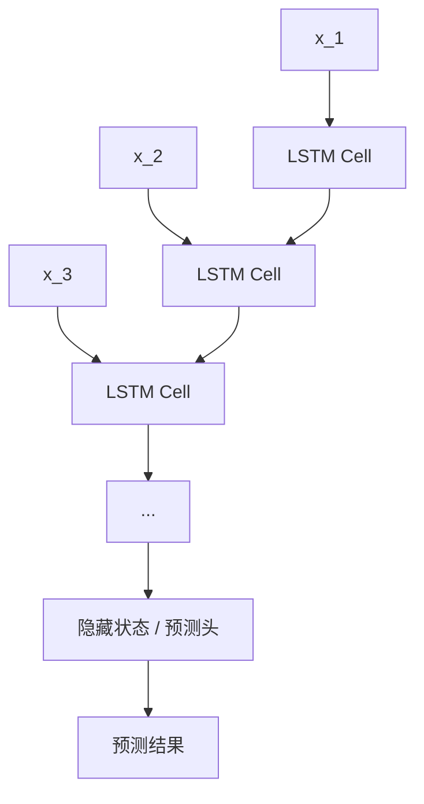
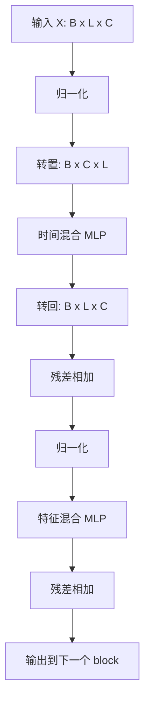

`TSMixer` 是一类面向固定窗口时序预测的 all-MLP 架构。它的输入通常写成一个历史窗口矩阵 $\mathbf{X} \in \mathbb{R}^{L \times C}$，其中 $L$ 表示历史长度，$C$ 表示变量数；模型随后沿时间维和变量维交替做 mixing，再由预测头输出未来窗口。它的重要性不只在于结果本身，而在于它把时序预测里两类最常见的依赖关系拆开处理：同一变量跨时间的依赖，以及同一时间步跨变量的依赖。

本文只讨论 `TSMixer` 最典型的使用语境，也就是固定窗口、多变量、直接多步预测。文中 `MLP` 指若干层全连接网络，batch 输入记作 $\mathbf{X} \in \mathbb{R}^{B \times L \times C}$，预测目标记作 $\mathbf{Y} \in \mathbb{R}^{B \times H \times C}$，其中 $H$ 是预测长度。

# 递推式建模与窗口混合
## LSTM 的递推式建模
`LSTM` 的基本思路是沿时间轴递推。模型在第 $t$ 个时间步接收当前输入 $\mathbf{x}_t$，同时读取上一步保留下来的隐藏状态和记忆状态，再通过门控机制决定哪些历史信息继续保留、哪些新信息写入内部状态。到序列末端后，隐藏状态会被送入预测头，输出分类结果、回归结果或未来序列。

下面这张图展示的是 `LSTM` 最常见的处理顺序。它的关键特征不是网络深度，而是同一个单元沿时间方向反复展开。

这类结构天然适合处理顺序性很强的数据流，也便于在线滚动更新。代价同样明确：计算过程带有串行性，长序列训练往往更慢，跨变量关系主要通过隐藏状态间接表达，而不是以独立模块的形式显式建模。原始 `LSTM` 论文的核心贡献，就是利用门控记忆单元缓解普通 `RNN` 的梯度传播和长程依赖问题。[Long Short-Term Memory](https://direct.mit.edu/neco/article/9/8/1735/6109/Long-Short-Term-Memory)

## TSMixer 的问题设定
`TSMixer` 针对的是另一类很常见的任务形态：给定固定长度的历史窗口，直接预测固定长度的未来窗口。这类任务在公开基准和工业预测场景里都很常见，例如电力负荷、交通流量、销售序列、服务器监控指标，以及带外生变量的需求预测。

在这种设定下，输入样本通常已经是一个固定大小的窗口，而不是无限向前延展的流式序列。模型因此不必坚持递推式处理，可以把整个窗口视为一个整体对象来建模。`TSMixer` 论文的出发点正是这个语境：现实时间序列往往是多变量的，并且经常伴随额外协变量；同时，前一阶段多项工作又表明，简单线性模型在长序列预测基准上也可能很强。[TSMixer, OpenReview](https://openreview.net/forum?id=wbpxTuXgm0) [Google Research 页面](https://research.google/pubs/tsmixer-an-all-mlp-architecture-for-time-series-forecasting/)

于是问题被重新组织成两个更直接的目标：
- 同一变量在不同时间位置之间如何交换信息。
- 同一时间位置上的不同变量如何交换信息。

`TSMixer` 的贡献就在于用结构化的 `MLP` 明确地回答了这两个问题。

## TSMixer 的核心定义
对单个样本而言，`TSMixer` 的输入可以写成：
$$
\mathbf{X} \in \mathbb{R}^{L \times C}
$$
如果把它看成一张表，那么行对应时间步，列对应变量。`TSMixer` 的处理过程不是沿时间一步一步展开，而是对这张表交替执行两类变换：
- 时间混合：让同一变量在不同时间位置之间交换信息。
- 特征混合：让同一时间步上的不同变量之间交换信息。

这正是 `Mixer` 这一命名的含义。`MLP` 在这里不是无结构地堆叠，而是被放在两个明确的维度上使用。*这个思想与视觉里的 `MLP-Mixer` 很接近，只是后者处理的是 token 和 channel，而 `TSMixer` 处理的是时间维和变量维。[MLP-Mixer, NeurIPS 2021](https://proceedings.neurips.cc/paper/2021/hash/cba0a4ee5ccd02fda0fe3f9a3e7b89fe-Abstract.html)*

## 与 LSTM 的差别
`LSTM` 和 `TSMixer` 的差别，不在于谁更像时序模型，而在于二者对输入窗口的组织方式不同。前者把序列看成递推过程，后者把窗口看成待混合的矩阵对象。

| 维度 | `LSTM` | `TSMixer` |
|:--|:--|:--|
| 基本思路 | 沿时间轴递推更新状态 | 对整个窗口做维度混合 |
| 时间建模方式 | 一个时间步接一个时间步 | 整个窗口同时进入计算 |
| 变量关系建模 | 主要通过隐藏状态间接表达 | 通过 feature mixing 显式建模 |
| 并行能力 | 较弱 | 较强 |
| 在线更新 | 更自然 | 需要重新取窗口或增量设计 |
| 典型适用场景 | 流式、递推式、顺序约束强 | 固定窗口、多变量、直接多步预测 |

如果任务天然要求在线滚动更新，`LSTM` 往往更顺手；如果任务已经被整理成固定窗口监督学习问题，`TSMixer` 这样的窗口混合结构就会更直接。

# TSMixer 的结构
## 输入表示
在最常见的设定里，一个 batch 的输入张量写成：
$$
\mathbf{X} \in \mathbb{R}^{B \times L \times C}
$$
其中：
- $B$ 是 batch size。
- $L$ 是历史窗口长度。
- $C$ 是变量数。

如果只看单个样本，可以把它想成一张 `L x C` 的表。下面这个示例更接近常见的多变量预测输入。

| 时间步 | 温度 | 湿度 | 风速 | 负荷 | 电压 | 电流 | 节假日特征 |
|:--|:--|:--|:--|:--|:--|:--|:--|
| 1 | ... | ... | ... | ... | ... | ... | ... |
| 2 | ... | ... | ... | ... | ... | ... | ... |
| 3 | ... | ... | ... | ... | ... | ... | ... |
| ... | ... | ... | ... | ... | ... | ... | ... |
| 96 | ... | ... | ... | ... | ... | ... | ... |

模型面对的不是某一个单点，而是整个历史窗口。时间关系和变量关系都在这张表内部展开。

## Mixer block
忽略实现细节后，一个 `TSMixer` block 可以写成：
$$
\mathbf{X}^{(1)} = \mathbf{X} + \mathrm{TimeMix}(\mathrm{Norm}(\mathbf{X}))
$$
$$
\mathbf{X}^{(2)} = \mathbf{X}^{(1)} + \mathrm{FeatureMix}(\mathrm{Norm}(\mathbf{X}^{(1)}))
$$

这组公式表达的是一个很稳定的骨架：先做时间维混合，再做特征维混合，两步之间都带残差连接。残差连接的作用是保留原始表示，减轻深层堆叠带来的优化压力；归一化则用于稳定训练。

下面这张图对应的是一个 block 的数据流。它比公式更容易看出张量是如何在两个维度之间切换的。

图里最需要记住的是两点：时间混合发生在转置后的最后一维上，特征混合则直接发生在变量维上；整个 block 的主线不是递推，而是两类维度变换的交替执行。

## 时间混合
时间混合负责建模同一变量在不同时间位置之间的关系。实现时，输入张量通常会先从 `[B, L, C]` 转成 `[B, C, L]`，这样每个变量对应的整段历史序列都会落到最后一维上。随后模型在这个长度为 $L$ 的维度上施加线性层或 `MLP`，使早期时刻、近期时刻、周期位置和局部峰值之间可以建立可学习的联系。

这种做法与 `LSTM` 的区别很明显。`LSTM` 通过递推把信息从前一个时间步传到后一个时间步；`TSMixer` 则是在一个前向过程中同时看到整个历史窗口，并直接学习各个时间位置之间的映射关系。只要输入窗口全部来自过去，这种整窗处理不会引入信息泄漏。

## 特征混合
特征混合负责建模同一时间步上不同变量之间的耦合。对于每个时间位置，模型都会把当前的 $C$ 维变量向量送入一个前馈网络：
$$
\mathbb{R}^{C} \rightarrow \mathbb{R}^{d_{\mathrm{ff}}} \rightarrow \mathbb{R}^{C}
$$

这里的 $d_{\mathrm{ff}}$ 是特征混合内部的隐藏维度。它通常大于 $C$，用于提供更高维的非线性组合空间。经过这一层后，温度、湿度、风速、负荷、日历特征等变量之间的组合关系会被吸收到表示中。

对多变量预测任务而言，这一步很重要。许多真实数据集的难点并不只在时间依赖本身，而在变量间关联是否被写进了模型结构。`TSMixer` 通过单独的 feature mixing，把这件事从隐式假设变成了显式模块。

## 张量形状
如果把一个 block 展开成张量变化，逻辑会更清楚。假设：
- `B=32`
- `L=96`
- `C=7`
- `d_ff=32`

那么一个 block 可以近似理解成下面这组形状变换：

| 步骤 | 张量形状 | 含义 |
|:--|:--|:--|
| 输入 | `[32, 96, 7]` | `32` 条样本，每条样本包含 `96` 个时间步、`7` 个变量 |
| 转置后 | `[32, 7, 96]` | 把每个变量的整段历史抽出来 |
| 时间混合后 | `[32, 7, 96]` | 在时间维上做线性变换或 `MLP` |
| 转回后 | `[32, 96, 7]` | 回到原来的时间步布局 |
| 特征扩展 | `[32, 96, 32]` | 在每个时间步上进入更宽的隐藏空间 |
| 特征回投 | `[32, 96, 7]` | 回到原变量维 |
| 残差输出 | `[32, 96, 7]` | 输出到下一个 block |

多个 block 叠加后，模型会反复执行这组时间混合和特征混合。随着层数增加，窗口内部的时间关系和变量关系会被逐步重组到更适合预测的表示空间里。

## 预测头
`TSMixer` 的末端通常接一个预测头，把历史表示映射成未来窗口。常见做法是沿时间长度维把 $L$ 映射到 $H$，最终输出：
$$
\hat{\mathbf{Y}} \in \mathbb{R}^{B \times H \times C}
$$

这意味着模型通常采用直接多步预测，而不是递推预测。它会一次性生成未来 $H$ 个时间步的结果，而不是先生成 $t+1$，再把预测值喂回模型继续预测 $t+2$。对固定窗口任务而言，这种做法计算路径更短，也更容易与标准监督学习框架对齐。

## 一个具体例子
假设任务是天气相关的多变量预测：输入为过去 `96` 个时间步，变量包括温度、湿度和风速，输出为未来 `24` 个时间步的这三个变量。此时单个样本就是一张 `96 x 3` 的表。

模型首先会沿时间维分别处理温度、湿度和风速的历史序列，学习各自的时间模式；随后在每个时间步上混合这三个变量，吸收它们之间的即时耦合关系。多个 block 叠加后，预测头再把历史窗口映射为 `24 x 3` 的未来结果。这个例子里没有复杂的注意力机制或显式记忆单元，模型的主要工作就是在两个维度上不断重组信息。

## 训练目标
训练阶段的目标很直接。模型接收历史窗口 $\mathbf{X}$，输出未来窗口 $\hat{\mathbf{Y}}$：
$$
\hat{\mathbf{Y}} = f_{\theta}(\mathbf{X})
$$
随后将预测结果与真实未来窗口 $\mathbf{Y}$ 做误差计算。最常见的损失之一是均方误差：
$$
\mathcal{L} = \frac{1}{BHC}\|\mathbf{Y} - \hat{\mathbf{Y}}\|_2^2
$$

在大量窗口样本上重复这个过程后，模型会逐步学到哪些历史模式对应趋势延续，哪些片段对应周期重复，哪些变量组合具有稳定的相关结构。`TSMixer` 的关键不在于训练目标特殊，而在于它如何组织窗口内部的信息流。

# 适用边界与选型
## 优势来源
`TSMixer` 常被当作强基线，原因主要来自任务形态和模型结构的匹配。对于固定窗口预测，整窗处理本身就是自然设定；对于多变量数据，feature mixing 又提供了明确的跨变量建模路径；对于训练和部署，all-MLP 结构通常比递推模型更容易并行，也更容易和现有张量算子栈对齐。

论文结果也说明了这一点。`TSMixer` 在多个主流时序数据集上表现具有竞争力，并且在 M5 forecasting 这类带有丰富协变量和跨序列信息的任务里，能够较好地利用 cross-variate information 和 auxiliary features。[TSMixer, OpenReview](https://openreview.net/forum?id=wbpxTuXgm0) [Google Research 官方实现](https://github.com/google-research/google-research/tree/master/tsmixer)

## 局限
`TSMixer` 的优势并不意味着它适合所有场景。它首先依赖固定窗口设定；如果任务天然要求在线一步一步滚动更新，递推式模型通常更顺手。其次，它对极长历史、多尺度变化或强层次结构的处理能力并不是天然给出的，后续很多模型，例如 `PatchTST`、`TimeMixer` 等，正是在这些方向上继续扩展。

另外，基本版 `TSMixer` 面向的是标准点预测框架。若任务强调概率预测、分位数预测或显式不确定性估计，仍需要在输出头和损失函数层面做额外设计。

## 选型建议
项目起步阶段如果只需要一个有效基线，可以按任务形态先做粗分：
- 更偏向 `LSTM`：数据按时间持续到来，在线递推重要，或者希望先保留顺序模型作为传统基线。
- 更偏向 `TSMixer`：任务已经被整理成固定窗口预测，输入是多变量时序，并且希望模型结构简单、训练更并行。

在不确定数据更适合哪类归纳偏置时，同时保留一个递推式基线和一个窗口混合基线，通常是更稳妥的做法。这样更容易判断当前任务到底更依赖状态递推，还是更依赖窗口内部的全局时间关系和跨变量关系。

## 结论
`TSMixer` 可以看作固定窗口多变量预测场景中的一种结构化 `MLP`。它把时间关系和变量关系拆成两个独立但交替执行的 mixing 过程，再用预测头一次性输出未来窗口。与 `LSTM` 相比，它放弃了递推式状态更新，换来了更直接的窗口建模方式和更强的并行性；与简单线性模型相比，它又通过非线性 mixing 保留了更强的表示能力。这也是它在近年的时序预测讨论中持续出现的原因。

# 参考资料
- [TSMixer: An All-MLP Architecture for Time Series Forecasting, OpenReview](https://openreview.net/forum?id=wbpxTuXgm0)
- [TSMixer: An all-MLP Architecture for Time Series Forecasting, Google Research 页面](https://research.google/pubs/tsmixer-an-all-mlp-architecture-for-time-series-forecasting/)
- [Google Research 官方实现](https://github.com/google-research/google-research/tree/master/tsmixer)
- [MLP-Mixer: An all-MLP Architecture for Vision, NeurIPS 2021](https://proceedings.neurips.cc/paper/2021/hash/cba0a4ee5ccd02fda0fe3f9a3e7b89fe-Abstract.html)
- [Long Short-Term Memory, Neural Computation 1997](https://direct.mit.edu/neco/article/9/8/1735/6109/Long-Short-Term-Memory)
