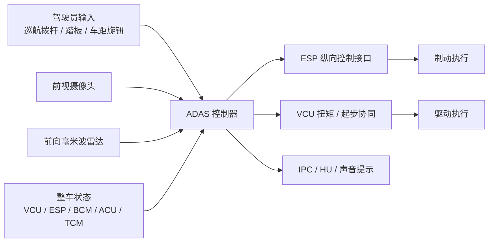
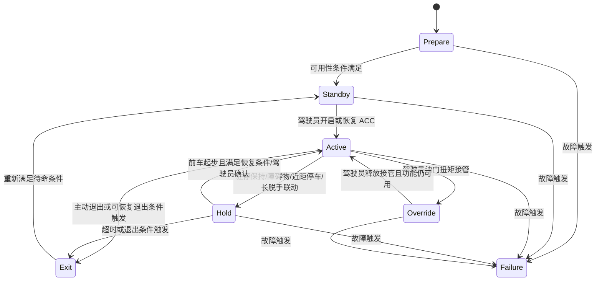

# ACC 功能规范

## 功能范围

本文档定义乘用车高级驾驶辅助系统中的自适应巡航控制功能。ACC 的职责是在满足系统可用条件时，对车辆纵向运动进行自动控制，使车辆能够按照驾驶员设定的巡航速度行驶，或者按照设定的车间时距跟随前车，并在前车减速、停车、再起步的过程中维持连续的跟车控制。

本文档面向整车功能定义、ADAS 系统设计、控制策略开发、HMI 定义、底盘联调、测试验证和项目管理使用。若后续需要继续下钻到软件需求、标定参数、CAN/LIN 信号定义或测试用例级别，应以本文档为系统基线继续分解。

本文档不单独定义以下内容：

- 摄像头、毫米波雷达和底盘执行器的底层控制算法实现。
- 整车通信矩阵的完整信号级 ICD。
- ESP、VCU、HMI、LKA、AEB 等其他系统的完整功能规范。
- 法规认证文本。

本文档对这些系统仅从 ACC 功能所需的系统接口和协同关系角度提出约束。文中若存在接口命名与功能语义不完全一致的情况，以正文需求语义和文末待统一项为准。

# 1. 系统目标与边界

## 1.1 系统目标

ACC 的系统目标可以概括为三层。

第一层是驾驶辅助目标。系统应在高速或中低速跟车场景下减轻驾驶员持续控制油门和制动的负担，使纵向跟驰更平顺，降低重复操作强度。

第二层是安全目标。系统应在前向目标存在的情况下维持合理的车间时距，并在可控范围内处理前车减速、停车和再次起步场景。驾驶员必须始终是最终责任主体，任何时候驾驶员的制动、换挡和退出指令都应高于系统控制权。

第三层是系统协同目标。ACC 应与摄像头、毫米波雷达、ADAS 控制器、ESP、VCU、HMI 以及相关辅助驾驶功能形成稳定的闭环接口关系，在可用状态下实现纵向控制，在不可用状态下及时、明确、可追溯地退出或降级。

## 1.2 系统边界

从系统边界上看，ACC 不是一个独立的执行系统，而是一个跨传感、决策、执行和交互链路的功能组合。

系统边界内包含以下内容：

- 驾驶员操作输入的解析与状态判断。
- 前向目标感知结果的接收与融合使用。
- 目标车速、目标时距和期望纵向加速度的生成。
- 与 ESP、VCU 的纵向控制协同。
- 与 HMI 的状态、告警和提示交互。
- 与 LKA、AEB 等功能的互斥或联动。

系统边界外但与功能成败强相关的内容包括：

- 摄像头和毫米波雷达的底层检测性能。
- ESP 对目标加速度、驻车保持和退出模式的执行质量。
- VCU 对扭矩请求、扭矩接管和驱动起步的响应。
- HMI 对状态提示和警告语义的一致呈现。

## 1.3 外部依赖系统

ACC 的主要外部依赖系统如下。

| 外部系统 | 向 ACC 提供 | ACC 向其输出 | 系统角色 |
| --- | --- | --- | --- |
| 前视摄像头 | 前向目标、车道与场景辅助信息 | 无 | 前向环境感知 |
| 前向毫米波雷达 | 距离、相对速度、目标列表 | 无 | 前向主目标感知 |
| ESP | 车速、制动可用性、VLC/CDD 状态、故障状态 | 目标加速度、驻停请求、起步请求、退出模式 | 纵向执行 |
| VCU | 档位、加速踏板、扭矩接管请求、ACC 可用性 | 扭矩协同、起步协同间接请求 | 驱动执行与整车状态 |
| BCM / ACU / TCM | 车门、舱盖、安全带、巡航拨杆、距离旋钮等状态 | 无 | 驾驶员状态与开关输入 |
| IPC / HU | 显示和提示通道 | ACC 状态、设定值、告警、声音提示 | 人机交互 |
| LKA / AEB / FCW | 协同状态和安全接管约束 | 互斥或联合退出条件 | 功能交互 |

# 2. 运行前提与 ODD 边界

## 2.1 运行前提

ACC 仅在车辆和系统均处于可用状态时允许进入待命或激活流程。最低前提包括：

- 车辆处于 D 档。
- 驾驶员系紧安全带。
- 车门、前舱盖、后尾门处于关闭锁止状态。
- ESP 处于 ON，且纵向控制功能可用。
- ADAS 控制器、融合传感器和相关执行接口无故障。
- 驾驶员未踩制动踏板。

若以上任一前提不满足，系统不得进入 ACC 激活态；若在 ACC 运行过程中失效，则系统应按退出或故障流程处理。

## 2.2 场景边界

ACC 的主要目标场景是铺装道路上的中高速巡航和跟车巡航。系统支持以下典型工况：

- 前方无车时的定速巡航。
- 同车道单前车或可识别主目标的跟车巡航。
- 跟车减速至停车的 Stop&Go。
- 前车短时起步后的自动恢复跟车。
- 半径满足要求的弯道跟车。

ACC 的场景边界至少包含以下限制：

- 路面坡度不应超过约 `10%`。
- 弯道适应能力满足 `R >= 125 m` 的等级要求，低于该条件时性能无法保证。
- 在大雨、大雪、大雾、烟雾、极端温度、传感器遮挡或污损等场景下，功能可能受限或不可用。
- 行人不能作为 ACC 启动时的跟车目标。
- 当传感器性能不足以稳定识别本车道前方主目标时，系统不得维持正常跟车控制。

## 2.3 速度边界

本文档采用以下工程口径：

- 无前车场景的 ACC 开启车速范围：仪表车速 `5 km/h` 至 `135 km/h`。
- 有前车目标场景的 ACC 开启车速范围：仪表车速 `0 km/h` 至 `135 km/h`。
- 目标巡航车速设置范围：仪表车速 `15 km/h` 至 `130 km/h`。
- 无前车情况下，车速低于退出阈值时应退出 ACC。
- 车速高于上限过渡阈值时应退出 ACC。

说明：文中不同位置对 `15/30 km/h` 以及 `135/137 km/h` 存在不一致表达；具体标定阈值应以冻结后的系统参数表为准。

# 3. 功能定义与系统行为

## 3.1 功能概述

ACC 在系统层面的本质，是一个依据前向目标状态和驾驶员设定值生成纵向控制请求的功能。系统有两个主控制目标：

- 当本车道前方无有效约束目标时，以设定巡航车速为主目标。
- 当本车道前方存在有效主目标时，以设定时距约束下的目标跟驰为主目标。

这两个目标之间由系统自动切换，驾驶员不需要显式切换模式。切换原则是以当前更严格、更安全的纵向约束为准。

## 3.2 功能子能力分解

从系统工程角度，可将 ACC 划分为以下子能力模块：

| 子能力 | 功能说明 | 关键输入 | 关键输出 |
| --- | --- | --- | --- |
| 可用性判断 | 判定系统能否进入待命和激活 | 车速、档位、安全带、车门、ESP、故障状态 | 可用/不可用 |
| 设定值管理 | 管理目标车速、时距档位、记忆车速与恢复逻辑 | 拨杆、旋钮、当前车速 | 巡航目标值 |
| 主目标管理 | 选择并维护 ACC 主跟驰目标 | 摄像头、毫米波雷达、融合结果 | 主目标 ID |
| 纵向控制决策 | 根据设定值和前向目标生成目标加速度 | 车速、相对距离、相对速度、时距设定 | 目标加速度、驻停/起步请求 |
| 驾驶员接管管理 | 识别制动、油门扭矩接管、取消动作 | 踏板、拨杆、扭矩接管标志 | Override / Exit |
| 驻停与恢复管理 | 支持停车等待、Hold、提醒起步和退出 | 前车状态、驻停时长、障碍物 | Hold、Driveoff、Exit |
| HMI 管理 | 状态显示、提示音、不可用原因提示 | ACC 状态、设定值、故障状态 | 图标、文本、声音 |

## 3.3 定速巡航行为

在前方无有效主目标，或前方目标未对本车纵向运动形成约束时，ACC 应进入定速巡航行为。系统根据目标巡航车速与当前车速的偏差计算目标加速度，并将纵向控制请求发送给 ESP，由 ESP 协调驱动与制动执行，使车辆速度趋近驾驶员设定值。

该模式下，ACC 的主要控制目标是车速跟踪精度和控制平顺性，而不是距离保持。IPC 不应显示前车锁定标识。

## 3.4 跟车巡航行为

在当前车道内存在可用的前向主目标，且该目标对本车形成纵向约束时，ACC 应自动切换到跟车巡航行为。系统应优先选择本车道内最近且可信的主目标，并依据目标距离、相对速度和设定车间时距生成目标加速度。

ACC 应在跟车过程中维持设定的稳态时距。对于加减速过渡，允许短时间内出现时距偏离，但系统应在合理时间内恢复到安全范围以上。

## 3.5 Stop&Go 行为

在跟车场景中，若前车减速直至停车，ACC 应具备将本车控制至静止的能力。停车后，系统应根据前车再次起步时间、前方障碍物情况和驻停持续时间决定是自动恢复跟车、进入 Hold，还是退出功能。

Stop&Go 是 ACC 的扩展能力，不应被理解为一个完全独立的功能。其本质仍然是跟车巡航在零速附近的连续延伸，但它对执行器协同、前车识别稳定性、起步授权和驾驶员提示提出了更高要求。

## 3.6 弯道跟车行为

ACC 应具备一定曲率范围内的弯道跟车能力。在满足曲率半径要求时，系统可根据弯道工况降低纵向控制目标，使本车能够在弯道中继续保持合理时距和正确主目标。

该能力不意味着 ACC 对所有弯道均可用。若弯道曲率超出系统能力边界，系统可以性能下降、提示驾驶员接管或直接退出作为保护策略。

# 4. 状态机定义

## 4.1 状态集合

为便于系统设计和测试追踪，ACC 状态机建议统一为以下七个系统状态：

- `Prepare`：系统初始化完成，功能前提正在被监测，但尚未具备待命条件。
- `Standby`：功能可用，等待驾驶员进入或恢复 ACC。
- `Active`：ACC 正在执行纵向控制，包括定速巡航、跟车巡航和 Stop&Go。
- `Hold`：车辆已驻停，系统暂停自动起步，需要等待条件恢复或驾驶员确认。
- `Override`：驾驶员通过油门扭矩接管纵向控制，ACC 逻辑继续运行但不主导驱动输出。
- `Exit`：因主动退出或可恢复原因退出，等待重新进入。
- `Failure`：因不可恢复故障退出，在故障消除前不得再次开启。

说明：`Pause mode` 和 `ADAS_ACCHoldDisp` 在系统语义上都指向驻停后的暂停态。本文档统一使用 `Hold` 作为更易于设计和验证的状态名称。

## 4.2 状态机主流程

## 4.3 状态准入条件

本节对状态转移条件统一采用显式逻辑口径：

- `全部满足` 表示逻辑与，即 `AND`。
- `任一满足` 表示逻辑或，即 `OR`。
- 若某条迁移同时包含多组条件，则使用“组内 AND、组间 OR”的方式明确描述。
- 每个自然语言条件后均补充对应的信号值逻辑。对于当前尚未冻结到总线、但系统实现必须存在的内部判断，本文档使用内部信号名表示，并建议在后续 ICD 或软件设计说明书中冻结。

### 4.3.1 Prepare 到 Standby

ACC 从 `Prepare` 进入 `Standby` 时，应在以下条件`全部满足（AND）`时触发：

- 驾驶员未踩制动踏板：`IB_BrakePedalStatus = NotPressed`。
- 车辆满足开启车速条件：`(ADAS_MainObjectID = noacctarget AND 5 km/h <= InstrumentSpeed <= 135 km/h) OR (ADAS_MainObjectID != noacctarget AND 0 km/h <= InstrumentSpeed <= 135 km/h)`。
- 四门、前舱盖、后尾门均关闭并锁止：`BCM_FLDoorStatus = Closed AND BCM_FRDoorStatus = Closed AND BCM_RLDoorStatus = Closed AND BCM_RRDoorStatus = Closed AND BCM_HoodAjarStatus = Closed AND PLG_RearLatchPosition = Locked`。
- 驾驶员安全带系紧：`ACU_DriverBuckleStatus = Buckled`。
- 车辆处于 D 档：`VCU_CH_ActualGearShiftPosition = D`。
- AEB/ABS/ESP/TCS 等自动制动或车身稳定干预未激活：`ESP_AEBBACtrlActive = Inactive AND ESP_AEBCtrlActive = Inactive AND ESP_ABSCtrlActive = Inactive AND ESP_VDCCtrlActive = Inactive AND ESP_TCSCtrlActive = Inactive`。
- 整车允许 ACC 可用，且 ESP 的 VLC 能力可用：`VCU_CH_ACCAvailable = Available AND ESP_VLCAvailable = Available`。
- 驾驶员未将 ESP 关闭：`ESP_UserSwitchStatus = ON`。

### 4.3.2 Standby 到 Active

ACC 从 `Standby` 进入 `Active` 时，应在以下条件`全部满足（AND）`时触发：

- 驾驶员通过 ACC 进入拨杆动作、速度加减拨杆动作或恢复动作发出进入指令：`TCM_ACCSetSwitchStatus = ON OR TCM_ACCSpdPlusSwitchStatus = ON OR TCM_ACCSpdMinusSwitchStatus = ON OR ACC_InternalResumeReq = TRUE`。
- 系统可用性条件仍保持成立：`VCU_CH_ACCAvailable = Available AND ESP_VLCAvailable = Available AND ADAS_FusionFaultStatus = Normal AND ADAS_ECUFaultStatus = Normal`。
- 对于本驾驶循环第一次进入 ACC，应仅允许通过规定的进入拨杆动作进入：`(ACC_InternalFirstEntryInDriveCycle = TRUE -> TCM_ACCSetSwitchStatus = ON) AND (ACC_InternalFirstEntryInDriveCycle = FALSE -> ACC_InternalResumeReq = TRUE OR TCM_ACCSetSwitchStatus = ON OR TCM_ACCSpdPlusSwitchStatus = ON OR TCM_ACCSpdMinusSwitchStatus = ON)`。

进一步展开后，`Standby -> Active` 的逻辑应理解为：

- 条件组 A：系统保持可用，且驾驶循环内已存在 ACC 开启历史，同时驾驶员发出恢复动作。对应信号逻辑：`VCU_CH_ACCAvailable = Available AND ESP_VLCAvailable = Available AND ACC_InternalActivatedInDriveCycle = TRUE AND ACC_InternalResumeReq = TRUE`。
- 条件组 B：系统保持可用，且驾驶员发出规定的进入拨杆动作。对应信号逻辑：`VCU_CH_ACCAvailable = Available AND ESP_VLCAvailable = Available AND TCM_ACCSetSwitchStatus = ON`。
- 以上两组满足其一即可进入 `Active`，因此整体是`（A）OR（B）`。

### 4.3.3 Active 到 Hold

ACC 从 `Active` 进入 `Hold` 时，应在以下情形中`任一满足（OR）`时触发：

- 跟车驻停后，前车在规定时间内未重新起步：`ESP_VehicleStandStill = Standstill AND ADAS_MainObjectID != noacctarget AND Fusion_MainObjectMotionState = Stationary AND ACC_InternalStandstillTimer > 180 s`。
- 跟车驻停后前方出现障碍物、行人或自行车目标：`ESP_VehicleStandStill = Standstill AND Fusion_ObjectInPath = TRUE AND Fusion_ObjectClass IN {Obstacle, Pedestrian, Bicycle}`。
- 跟车驻停后，本车与前车距离小于 `2.0 m`：`ESP_VehicleStandStill = Standstill AND ADAS_MainObjectID != noacctarget AND Fusion_MainObjectLongitudinalDistance < 2.0 m`。
- 本车由静止开启 ACC，且开启时与前车距离小于 `5.0 m`：`ACC_InternalActivationFromStandstill = TRUE AND ADAS_MainObjectID != noacctarget AND Fusion_MainObjectLongitudinalDistance < 5.0 m`。
- LKA 长时间脱手处罚联动导致 ACC 进入驻停暂停：`LKA_ACC_HoldReq = TRUE OR (ADAS_ACCTouchWarning = LongLeave AND ACC_InternalHoldReason = HandsOffPenalty)`。

### 4.3.4 Active 到 Override

当以下条件`全部满足（AND）`时，系统应判定为扭矩接管，ACC 转入 `Override`：

- 驾驶员踩下加速踏板：`VCU_CH_AccelPedalPosition > 0 AND VCU_CH_AccelPedalPositionValid = Valid`。
- 驾驶员需求扭矩大于 ACC 当前纵向控制扭矩需求：`VCU_CH_TorqOverrideReq = OverrideRequest`。

### 4.3.5 Active 或 Hold 到 Exit

`Active -> Exit` 或 `Hold -> Exit` 应在以下情形中`任一满足（OR）`时触发可恢复退出：

- 驾驶员主动取消 ACC：`TCM_ACCCancelSwitchStatus = ON`。
- 驾驶员踩下制动踏板：`IB_BrakePedalStatus = Pressed`。
- 车辆换挡离开 D 档：`VCU_CH_ActualGearShiftPosition != D`。
- 车门、舱盖或尾门打开：`BCM_FLDoorStatus = Ajar OR BCM_FRDoorStatus = Ajar OR BCM_RLDoorStatus = Ajar OR BCM_RRDoorStatus = Ajar OR BCM_HoodAjarStatus = Ajar OR PLG_RearLatchPosition != Locked`。
- 驾驶员解开安全带：`ACU_DriverBuckleStatus = Unbuckled`。
- 驾驶员设置 ESP OFF：`ESP_UserSwitchStatus = OFF`。
- 无前车时车速低于最低保持阈值：`ADAS_MainObjectID = noacctarget AND InstrumentSpeed < 3 km/h`。
- 车速超过系统上限过渡阈值：`InstrumentSpeed > 137 km/h OR ESP_VehicleSpeed > 134.09 km/h`。
- Hold 超时未恢复：`(ACC_InternalHoldReason = HandsOffPenalty AND ACC_InternalHoldTimer > 100 s) OR (ACC_InternalHoldTimer > 600 s)`。

### 4.3.6 任意运行态到 Failure

任意运行态进入 `Failure` 应在以下情形中`任一满足（OR）`时触发：

- 融合传感器故障：`ADAS_FusionFaultStatus = Failure`。
- ADAS 控制器故障：`ADAS_ECUFaultStatus = Failure`。
- ESP 故障：`ESP_VLCFault = Failure OR ESP_ErrorFlag = Failure`。
- EPS 故障或整车其他关键纵向控制链路故障：`EPS_ErrorFlag = Failure OR ACC_InternalPowertrainCriticalFault = TRUE`。

进入 `Failure` 后，ACC 在故障恢复前不得再次开启。

## 4.4 状态转移逻辑汇总

为避免状态机实现、联调和测试时对逻辑关系产生歧义，状态转移条件可汇总为下表。

| 状态转移 | 逻辑关系 | 说明 |
| --- | --- | --- |
| `Prepare -> Standby` | `AND` | 所有功能可用前提必须同时成立 |
| `Standby -> Active` | `(进入动作 AND 系统可用)` `OR` `(恢复动作 AND 系统可用 AND 已有历史开启记录)` | 首次进入与恢复进入分开理解 |
| `Active -> Hold` | `OR` | 任一 Hold 触发场景即可进入 |
| `Active -> Override` | `AND` | 需同时满足踩油门和扭矩超越 |
| `Override -> Active` | `AND` | 驾驶员释放接管且系统仍可用 |
| `Active -> Exit` | `OR` | 任一主动退出或自动退出条件满足即可退出 |
| `Hold -> Exit` | `OR` | 任一退出条件或超时条件满足即可退出 |
| `任意运行态 -> Failure` | `OR` | 任一关键故障满足即可转入 Failure |

### 4.4.1 Override 到 Active

`Override -> Active` 的恢复逻辑应在以下条件`全部满足（AND）`时触发：

- 驾驶员油门接管请求消失：`VCU_CH_TorqOverrideReq = NoRequest`。
- 驾驶员需求扭矩不再高于 ACC 当前控制扭矩：`VCU_CH_TorqOverrideReq != OverrideRequest`。
- ACC 功能仍可用：`VCU_CH_ACCAvailable = Available`。
- ESP 的纵向控制功能仍可用：`ESP_VLCAvailable = Available`。

### 4.4.2 Hold 到 Active

`Hold -> Active` 不应笼统写为“条件恢复”，而应区分为以下两类，整体逻辑为`（A）OR（B）`：

- 条件组 A：非驻停惩罚类 Hold 结束，且系统允许直接恢复。对应信号逻辑：`ACC_InternalHoldReason = TemporaryPause AND ESP_VehicleStandStill != Standstill AND ADAS_ACCTouchWarning = Normal AND ACC_InternalResumeAllowed = TRUE`。
- 条件组 B：前车再次起步，且前方恢复条件满足，驾驶员完成油门确认，系统允许重新起步。对应信号逻辑：`ADAS_MainObjectID != noacctarget AND Fusion_MainObjectMotionState = Moving AND Fusion_ObjectInPath = FALSE AND VCU_CH_AccelPedalPosition > 0 AND VCU_CH_AccelPedalPositionValid = Valid AND ACC_InternalResumeAllowed = TRUE`。

### 4.4.3 Exit 到 Standby

`Exit -> Standby` 应在以下条件`全部满足（AND）`时触发：

- 导致退出的可恢复原因已经消失：`IB_BrakePedalStatus = NotPressed AND ACU_DriverBuckleStatus = Buckled AND VCU_CH_ActualGearShiftPosition = D AND BCM_FLDoorStatus = Closed AND BCM_FRDoorStatus = Closed AND BCM_RLDoorStatus = Closed AND BCM_RRDoorStatus = Closed AND BCM_HoodAjarStatus = Closed AND PLG_RearLatchPosition = Locked AND ESP_UserSwitchStatus = ON`。
- ACC 重新满足待命可用条件：`VCU_CH_ACCAvailable = Available AND ESP_VLCAvailable = Available AND ((ADAS_MainObjectID = noacctarget AND 5 km/h <= InstrumentSpeed <= 135 km/h) OR (ADAS_MainObjectID != noacctarget AND 0 km/h <= InstrumentSpeed <= 135 km/h))`。
- 系统未处于 `Failure`：`ADAS_FusionFaultStatus = Normal AND ADAS_ECUFaultStatus = Normal AND ESP_VLCFault = Normal AND EPS_ErrorFlag = Normal`。

# 5. 详细功能需求

## 5.1 功能开启与首次进入逻辑

### ACC-SYS-001 功能开启入口

ACC 应支持通过巡航拨杆进入功能。驾驶员单次规定动作可进入 ACC；在 ACC 与 LKA 均处于可用待命时，特定双击动作可联合开启 ACC 与 LKA。

### ACC-SYS-002 首次进入限制

在一个驾驶循环中，第一次进入 ACC 时，系统只应接受定义好的进入拨杆动作。其他恢复类动作在首次进入前不应生效，以避免误操作导致非预期激活。

### ACC-SYS-003 拨杆识别时序

拨杆动作识别应具备明确的时序门限，包括最短有效保持时间和多次拨杆之间的时间间隔约束，以避免抖动触发或误判为联合功能动作。

## 5.2 巡航车速设定与历史车速管理

### ACC-SYS-004 默认记忆车速

车辆上电后，系统应存在默认记忆巡航车速，默认值为 `30 km/h`。

### ACC-SYS-005 基于当前车速或记忆车速进入

若驾驶员通过向内拨杆进入 ACC，系统应根据记忆巡航车速是否仍为默认值，决定按当前车速或记忆车速设定目标巡航车速。

### ACC-SYS-006 恢复功能

当 ACC 曾在当前驾驶循环中开启过，且退出原因允许保留记忆车速时，系统应支持通过恢复动作进入记忆车速 ACC。

### ACC-SYS-007 记忆车速保留规则

若 ACC 因驾驶员踩制动、解开安全带或开门等行为退出，系统应保留上一次巡航设定车速，供恢复使用。若 ACC 因驾驶员主动取消动作退出，系统不应保留退出前设定值。

## 5.3 车速调节需求

### ACC-SYS-008 车速设定范围

ACC 目标巡航车速设定范围应为仪表车速 `15~130 km/h`。

### ACC-SYS-009 设定步长

驾驶员通过速度加减拨杆调节目标巡航车速时，系统应按 `5 km/h` 步长离散变化。

### ACC-SYS-010 非整数倍对齐规则

若当前目标车速不是 `5 km/h` 的整数倍，则首次调节时应先跳转到相邻整数倍，再按 `5 km/h` 步长继续变化。

### ACC-SYS-011 上下限提示

当目标巡航车速已达到上限 `130 km/h` 或下限 `15 km/h`，驾驶员继续调节时，系统应维持当前值不变，并通过 HMI 给出已达边界的提示。

说明：信号名 `ADAS_ACCVelLessThan30` 与当前速度下限口径并不一致，不应将其理解为最小设定值是 `30 km/h`。接口命名可以保留，但 HMI 和需求语义应按当前标定值解释。

## 5.4 车间时距设定需求

### ACC-SYS-012 车距档位

ACC 应支持 `7` 档期望车间时距设置，驾驶员通过车距旋钮进行增减调节。

### ACC-SYS-013 时距调节边界

当驾驶员要求增加时距且已位于最大档位时，系统不应继续增大；当要求减小时距且已位于最小档位时，系统不应继续减小。

### ACC-SYS-014 时距显示

驾驶员调节车距档位后，系统应向 IPC 发送当前期望时距档位，并在规定时间内显示。

### ACC-SYS-015 待统一项

文中给出 `0.86 / 1.03 / 1.20 / 1.37 / 1.54 / 1.71 / 1.88 s` 七档离散时距，而性能章节给出 `1.4~2.0 s` 范围。该差异表明控制标定口径与性能验收口径尚未完全统一。系统方案、标定和测试团队应在量产基线中冻结唯一版本，并同步更新 HMI、控制参数表和测试规范。

## 5.5 激活与纵向控制需求

### ACC-SYS-016 定速巡航控制

当前方无有效主目标时，ACC 应根据目标巡航车速与实际车速计算期望加速度，并向 ESP 发送纵向控制请求，使本车趋近设定车速。

### ACC-SYS-017 跟车巡航控制

当前方存在影响本车正常行驶的主目标，且该目标处于行驶状态时，ACC 应进入跟车巡航，依据目标车辆相对距离、相对速度和设定时距生成纵向控制请求。

### ACC-SYS-018 主目标选择

若前方存在多个目标，ACC 应自动选择本车道内最近且可信的主目标，并向 HMI 输出对应主目标锁定信息。

### ACC-SYS-019 目标切换原则

主目标切换应以保持纵向控制连续性和抑制误跟随为原则。若目标识别可信度不足，系统不应进行激进切换导致控制突变。

### ACC-SYS-020 车间时距恢复

在动态过渡过程中允许车间时距短暂低于临界值，但系统应在可接受时间内恢复到安全范围以上。

## 5.6 停走与起步需求

### ACC-SYS-021 跟车刹停

在跟车场景下，前车减速至停止时，ACC 应能够请求车辆减速并制动至静止。

### ACC-SYS-022 驻停保持

车辆静止后，ESP 应承担驻车保持功能，系统应接收驻停状态反馈，并在规定保压时长内维持驻停能力。

### ACC-SYS-023 短时自动恢复

若本车尚未完全刹停而前车已重新起步，ACC 应取消驻停请求并重新回到巡航或跟车判断逻辑。

### ACC-SYS-024 前车短时起步后的自动起步

若本车已刹停且前车在 `180 s` 内重新起步，ACC 应可请求车辆起步，并重新进入巡航或跟车控制流程。

### ACC-SYS-025 Hold 进入条件

若本车已刹停且前车在 `180 s` 内未起步，或前方存在障碍物、行人、自行车目标，或车辆近距离驻停条件触发，ACC 应转入 `Hold`。

### ACC-SYS-026 Driveoff 提示

在 `Hold` 状态下，若前车再次起步且恢复条件满足，系统应向驾驶员发出明确的起步提示，提示方式至少包括视觉提示，量产方案中建议保留声音提示。

### ACC-SYS-027 驾驶员确认起步

当场景风险不允许自动直接起步时，系统应要求驾驶员踩下油门踏板确认起步。驾驶员确认后，ACC 方可向 ESP/VCU 发出起步协同请求。

### ACC-SYS-028 超时退出

若驻停持续时间达到系统允许上限，例如 `600 s` 保压后仍未恢复，则 ACC 应退出，必要时由底盘系统执行 EPB 拉起等后续安全动作。

## 5.7 驾驶员接管需求

### ACC-SYS-029 控制权优先级

驾驶员控制权始终高于 ACC。驾驶员踩制动、换挡、主动取消、油门扭矩接管等行为都应优先于系统纵向控制。

### ACC-SYS-030 油门扭矩接管

当驾驶员踩下油门踏板，且驾驶员需求扭矩高于 ACC 当前控制扭矩时，系统应判定进入 `Override`。

### ACC-SYS-031 Override 期间行为

在 `Override` 状态下，ACC 可继续维护目标车速、主目标和期望加速度计算，但驱动主导权属于驾驶员。系统应向 HMI 明确提示当前处于接管状态。

### ACC-SYS-032 Override 退出

当驾驶员释放油门且扭矩接管请求消失，并且 ACC 可用条件仍满足时，系统应自动退出 `Override`，恢复到 `Active`。

### ACC-SYS-033 Override 下设定当前车速

在 `Override` 状态下，驾驶员应能够通过拨杆将当前车速设定为新的目标巡航车速。

## 5.8 人机交互需求

### ACC-SYS-034 显示内容

ACC HMI 至少应显示以下内容：

- ACC 当前状态。
- 设定巡航车速。
- 当前车间时距档位。
- 主目标锁定状态。
- Hold、Driveoff、Override、不可用和故障提示。

### ACC-SYS-035 Active 显示

在 `Active` 状态下，HMI 应显示 ACC 激活图标；若存在主目标，还应显示前车图示及锁定标识。

### ACC-SYS-036 Exit 显示

当 ACC 退出时，图标应执行快速闪烁或其他可识别退出动画，并向驾驶员显示需立即接管或巡航不可用等信息。

### ACC-SYS-037 Failure 显示

当 ACC 发生故障时，HMI 应显示高级辅助驾驶功能故障或等效语义信息，并配合提示音进行告知。

### ACC-SYS-038 显示安全性

所有 ACC 显示和提示均不得干扰驾驶员正常驾驶行为，不得因为信息表达复杂或时机不当而引发二次风险。

## 5.9 货车并线预警联动需求

### ACC-SYS-039 功能定位

系统可在 ACC 激活条件下提供货车并线预警能力。该能力应被视为附着在 ACC 激活运行条件上的场景预警功能，而不应与 ACC 核心纵向控制链路混淆。

### ACC-SYS-040 触发前提

货车并线预警仅应在以下前提下工作：

- ACC 处于激活状态。
- 仪表车速不低于 `60 km/h`。
- 目标车速度不低于 `6 m/s`。
- 目标处于规定最远判定距离内。
- TTC 满足触发门限。
- ACC 未处于 `Override` 状态。
- 未触发长时间脱手惩罚。
- 对应功能开关处于使能状态。
- 目标不是当前 ACC 主目标。

### ACC-SYS-041 提示策略

货车并线预警应区分不同级别的预警门限，并保证高等级预警对低等级预警具备抑制关系。预警显示和声音提示应与 ACC 主状态显示解耦，避免驾驶员误以为纵向控制策略已发生切换。

## 5.10 退出与故障处理需求

### ACC-SYS-042 主动退出

驾驶员通过取消拨杆或踩下制动踏板时，系统应立即执行主动退出。

### ACC-SYS-043 联合退出

当 ACC 与 LKA 联合工作时，需根据拨杆语义和系统定义执行单功能退出或联合退出，不得出现界面状态与实际控制状态不一致。

### ACC-SYS-044 自动退出条件

ACC 应在以下条件下自动退出：

- 车门、舱盖、尾门打开。
- 驾驶员安全带解开。
- 车辆离开 D 档。
- AEB 触发。
- ESP OFF。
- 车辆无前车且车速过低。
- 车辆超速超过系统允许阈值。
- 驻停后 Hold 持续超时。
- 关键零部件故障。

### ACC-SYS-045 故障隔离与功能降级

若仅融合传感器故障，则 ACC、LKA、ALC、AEB、FCW 等依赖前向融合感知的功能应不可用，其他非依赖功能可继续工作。若发生 ESP、EPS、ADAS 控制器等关键故障，则全部相关辅助驾驶功能应不可用。

### ACC-SYS-046 退出后的车辆状态

若 ACC 在车辆静止状态下异常退出，系统应考虑车辆驻车安全，必要时进入 P 档或触发等效安全驻车策略。该策略应与底盘和整车控制规范保持一致。

# 6. 系统接口需求

## 6.1 传感器与执行器配置

ACC 相关主要硬件配置如下：

| 类别 | 配置 | 作用 |
| --- | --- | --- |
| 前视摄像头 | 1 个，LVDS 接入，综合视距 `150 m+`，分辨率 `1280 x 960` | 前向视觉感知 |
| 前向毫米波雷达 | 1 个，私有 CAN，探测距离 `160 m`，最多 `32` 个目标 | 前向距离和速度感知 |
| 组合开关 | 1 套，整车 CAN | 驾驶员控制输入 |
| ESP / 制动系统 | 外部执行接口 | 纵向执行、驻停、退出 |
| VCU | 外部执行接口 | 扭矩控制和起步协同 |

说明：超声波雷达配置主要服务泊车和盲区相关功能，对 ACC 主链路不是核心必需项，本文档不将其列为 ACC 主功能的关键前提。

## 6.2 输入信号分组

ACC 应至少接收以下输入信号类别：

| 输入类别 | 典型信号 | 用途 |
| --- | --- | --- |
| 驾驶员操纵 | `TCM_ACCSetSwitchStatus`、`TCM_ACCCancelSwitchStatus`、`TCM_ACCSpdPlusSwitchStatus`、`TCM_ACCSpdMinusSwitchStatus`、`TCM_ACCDistSwitchStatus` | 进入、退出、设定调节 |
| 车辆状态 | `VCU_CH_ActualGearShiftPosition`、`ESP_VehicleSpeed`、`IB_BrakePedalStatus`、`VCU_CH_AccelPedalPosition` | 状态判断与接管识别 |
| 车身状态 | 车门、舱盖、尾门、安全带相关信号 | 可用性与退出条件 |
| 底盘可用性 | `ESP_VLCAvailable`、`ESP_VLC_CDDCtrlActive`、`ESP_VLC_CDDVehiHoldStatus` | 执行闭环 |
| 故障与可用性 | `ADAS_FusionFaultStatus`、`ADAS_ECUFaultStatus`、`VCU_CH_ACCAvailable` | 故障处理 |
| 感知结果 | 主目标 ID、相对距离、相对速度、静止/运动目标状态 | 巡航和跟车控制 |

## 6.3 输出信号分组

ACC 应至少输出以下控制和交互信号类别：

| 输出类别 | 典型信号 | 用途 |
| --- | --- | --- |
| 纵向控制 | `ADAS_VLCAxTarAim`、上下限与舒适上下限信号 | 请求 ESP 执行纵向控制 |
| 驻停 / 起步 | `ADAS_ACCStandstillReq`、`ADAS_ACCDriveoffReq` | Stop&Go 协同 |
| 模式输出 | `ADAS_MRR_ACCMode`、`ADAS_VLCECGPOvrd` | 向 ESP 通知当前模式 |
| HMI 显示 | `ADAS_ACCStandby`、`ADAS_ACCActive`、`ADAS_ACCHoldDisp`、`ADAS_ACCDriveoffDisp`、`ADAS_ACCOverRideDisp` | 状态显示 |
| 设定值输出 | `ADAS_ACCCruiseSpeed`、`ADAS_ACCCruiseDistance`、`ADAS_MainObjectID` | 显示和协同 |
| 不可用/故障 | `ADAS_ACCUnAvailableWarning`、`ADAS_FaultStatus`、`ADAS_FusionFaultStatus`、`ADAS_ECUFaultStatus` | 告警与降级 |

## 6.4 通信约束

- 整车 CAN 波特率应满足 `500 kbps` 要求。
- 信号位定义、校验、滚动计数器等应与整车通信矩阵保持一致。
- LIN 接口的速率和协议应满足整车定义。
- ACC 相关应用信号、底盘信号和 HMI 信号必须在接口规范层保持单位、量纲、取值语义和异常值编码一致。

# 7. 性能要求

## 7.1 控制性能

ACC 的主要性能指标应至少满足以下要求：

| 指标项 | 要求 |
| --- | --- |
| 定速巡航稳态车速控制精度 | `<= 1 km/h` |
| 纵向加速度控制精度 | 稳态误差 `<= 0.1 m/s^2`，超调 `<= 0.1 m/s^2` |
| 加速度响应延迟 | `<= 300 ms` |
| 减速度响应延迟 | `<= 400 ms` |
| 加速度响应分辨率 | `<= 0.1 m/s^2` |

## 7.2 加减速度能力

系统设计和标定至少应满足以下加减速度能力边界：

- 低速时应具备足够的最大减速度能力，以支撑跟车制动和停车。
- 高速时应保证减速度能力与舒适性之间的平衡。
- 最大减速度变化率和平均减速度变化率应限制在可接受范围内，以避免明显冲击。
- 加速能力应满足重新跟车和定速恢复要求，同时控制加速度变化率，保证纵向平顺性。

## 7.3 Stop&Go 相关性能

| 指标项 | 要求 |
| --- | --- |
| Stop&Go 刹停后与前车距离范围 | `2.5~5.5 m` |
| 驻车等待时长 | `180 s` |
| 驻车保压时长 | `600 s` |

## 7.4 检测与适应能力

| 指标项 | 要求 |
| --- | --- |
| 直道前车确定距离范围 | 至少覆盖 `12.5~93.75 m` 的确定距离区间 |
| 弯道适应能力 | 满足 `GB/T 20608 ACC IV` 等级，典型条件 `R >= 125 m` |
| 作用道路 | 中国道路车道线体系，参考 `GB 5768-2009` |

# 8. 失效、降级与局限性

## 8.1 失效分类

从系统工程角度，ACC 的失效至少应分为三类：

- 可恢复退出类：由驾驶员操作、运行条件变化或暂时不可用导致，退出后在条件恢复时可再次进入。
- 不可恢复故障类：由关键传感器、控制器、底盘执行链路故障导致，故障消除前禁止再次进入。
- 性能受限类：功能未必立刻退出，但性能无法保证，应通过提示、降级或退出保护驾驶员。

## 8.2 主要局限性

ACC 在以下场景下可能无法正常工作或性能显著下降：

- 大坡度路面。
- 大雨、大雪、大雾、烟雾等低能见度天气。
- 传感器被泥水、冰雪、污渍遮挡。
- 极寒、高温等超出传感器有效工作范围的环境。
- 小半径弯道或道路几何突变场景。
- 主目标识别不稳定、多目标遮挡严重或切入切出频繁的交通场景。

## 8.3 驾驶员责任

ACC 是驾驶辅助功能，不是自动驾驶替代。驾驶员必须持续关注前向道路和车辆状态，随时准备接管。系统任何显示和提示都不应被设计成使驾驶员误以为可以脱离驾驶责任。

# 9. 验证与测试要求

## 9.1 测试环境约束

测试场地和环境至少应满足以下条件：

| 类别 | 要求 |
| --- | --- |
| 路面 | 干燥、平整铺装道路 |
| 路面坡度 | `<= 1%` |
| 路面峰值制动减速度系数 | `>= 0.9` |
| 能见度 | `>= 1 km` |
| 照度 | `>= 2000 lux` |
| 环境温度 | `-20°C ~ 45°C` |
| 降水 | 无明显降雨或降雪 |
| 风速 | `< 3 m/s` |

## 9.2 测试项组织建议

为使 ACC 验证具备完整追踪关系，建议将测试项按以下维度组织：

- 可用性与进入条件测试。
- 目标车速和车距设定测试。
- 定速巡航控制测试。
- 跟车巡航测试。
- Stop&Go 与 Hold 测试。
- Override 与驾驶员接管测试。
- 主动退出和自动退出测试。
- 故障注入与降级测试。
- HMI 与提示一致性测试。
- 曲率、坡度和环境边界测试。

## 9.3 关键验证场景

系统级验证至少应覆盖以下关键场景：

- 无前车时由 `5 km/h` 以上进入 ACC 并稳定定速。
- 有前车时由静止开启 ACC 并跟车起步。
- 前车减速、刹停、`180 s` 内起步和超过 `180 s` 未起步场景。
- 前车刹停后本车与前车距离小于 `2.0 m` 的 Hold 场景。
- 静止开启 ACC 且与前车距离小于 `5.0 m` 的 Hold 场景。
- 驾驶员踩油门进入 Override、释放后恢复 Active。
- 驾驶员踩制动、解开安全带、开门、换挡、ESP OFF、AEB 触发等退出场景。
- 融合传感器故障、ESP 故障、ADAS 控制器故障等故障注入场景。

# 10. 待统一项与后续工程建议

## 10.1 待统一项

本文至少存在以下需要在系统基线中统一的问题：

- 车间时距七档数值与性能章节时距范围不一致。
- 最小速度相关信号命名与当前标定值不一致。
- 退出车速阈值在文中不同段落间存在不一致表达。
- `Pause`、`Hold`、`Standstill` 在不同章节中的系统语义未完全统一。

## 10.2 工程建议

为降低联调和测试歧义，建议项目后续补齐以下工程产物：

- 一份冻结后的 ACC 参数基线表。
- 一份面向系统接口的 ACC ICD 摘要。
- 一份 ACC 状态机与 HMI 联动对照表。
- 一份 ACC 退出原因到 HMI 文案的映射表。
- 一份 ACC 系统需求到测试用例的双向追踪矩阵。

## 10.3 基线使用建议

ACC 的难点不只在纵向控制算法本身，而在于它必须把感知可信度、驾驶员输入、底盘执行可用性、状态机一致性和 HMI 语义串成闭环。因此，这份文档更适合作为上层系统基线使用。后续的软件需求、标定参数、接口定义和测试用例，应在不改变本文核心状态机和需求语义的前提下继续细化。
