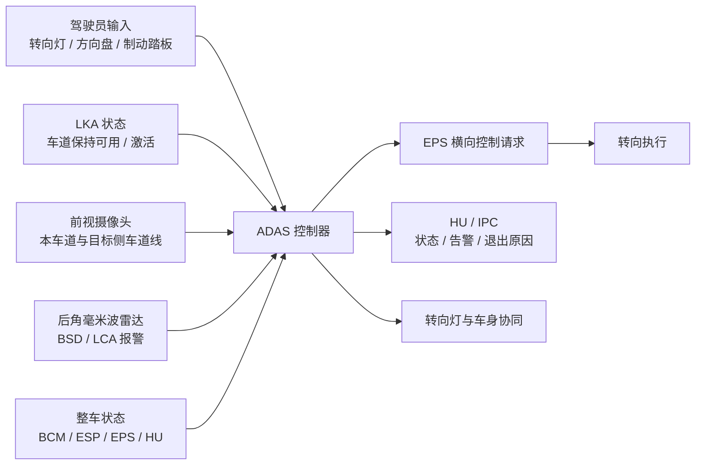
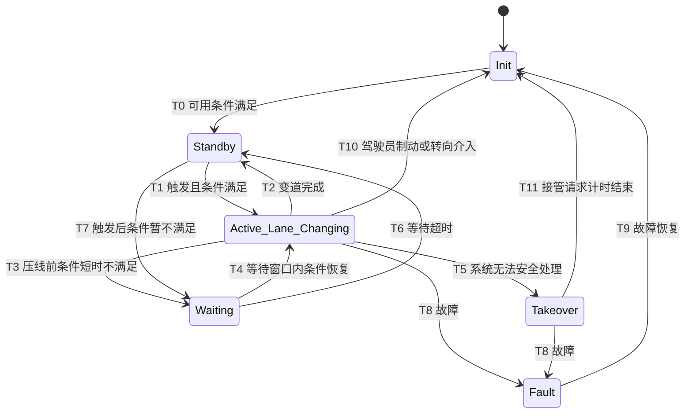

# ALC 功能规范
本文档定义乘用车高级驾驶辅助系统中的命令变道功能。ALC 是 Automated Lane Change 或 Assisted Lane Change 的工程缩写，在本文中指驾驶员通过转向灯提出变道意图后，系统在车道线、周边目标、车辆状态和执行器状态满足条件时，辅助车辆完成横向变道控制的 L2 辅助驾驶功能。

本文档面向整车功能定义、ADAS 系统设计、HMI 定义、LKA / LCA / BSD 协同开发、EPS 联调、底盘联调、测试验证和项目管理使用。后续软件需求、标定参数、通信矩阵、诊断规范和测试用例应基于本文档继续分解。

本文档不单独定义以下内容：
- LKA 车道保持功能的完整功能规范。
- LCA / BSD 并线辅助和盲区监测的完整功能规范。
- 摄像头、后角毫米波雷达、EPS、ESP、BCM、HMI 的底层算法和驱动实现。
- 全量通信矩阵、诊断服务、刷写流程和 BootLoader 实现。
- 法规认证文本。

# 1. 系统目标与边界
## 1.1 系统目标
ALC 的系统目标包括以下三类：
- 驾驶辅助目标：在 LKA 已开启且车辆处于适合变道的行驶条件下，识别驾驶员通过转向灯表达的变道意图，并在目标侧条件满足时辅助车辆平顺完成横向变道。
- 安全目标：持续判断本车车道线、目标侧车道、后向来车、盲区目标、车辆状态和执行器状态。当变道条件不满足、驾驶员接管、关键传感器故障或系统无法处理紧急状况时，停止变道控制并进入安全状态。
- 系统协同目标：与 LKA、前视摄像头、后角毫米波雷达、BSD / LCA、EPS、ESP、BCM、HU / IPC 建立一致的状态、接口和提示语义。

## 1.2 系统边界
ALC 的系统链路覆盖驾驶员意图识别、车道线感知、后向目标感知、路径规划、横向执行和 HMI 交互。

系统边界内包含以下内容：
- 驾驶员转向灯意图识别。
- ALC 开关和 LKA 状态判断。
- 目标侧车道线可用性判断。
- BSD / LCA 安全约束判断。
- 变道等待、执行、完成、接管和故障状态管理。
- 横向轨迹或目标转角请求生成。
- HMI 状态、等待、退出、接管和故障提示。

系统边界外但与功能成败强相关的内容包括：
- LKA 对本车道居中控制的稳定性。
- 前视摄像头对车道线类型、位置和置信度的识别质量。
- 后角毫米波雷达对相邻车道后向来车、盲区目标和高速接近目标的识别质量。
- EPS 对目标转角或横向控制请求的执行质量。
- ESP 对车速、稳定性状态和制动干预状态的上报质量。
- HU / IPC 对功能状态和退出原因的显示一致性。

## 1.3 外部依赖系统
ALC 的主要外部依赖系统如下。

| 外部系统 | 向 ALC 提供 | ALC 向其输出 | 系统角色 |
| --- | --- | --- | --- |
| LKA | LKA 开启状态、车道保持激活状态、车道居中能力 | 变道请求、功能协同状态 | ALC 基础能力前提 |
| 前视摄像头 | 本车道线、目标侧车道线、车道线类型、置信度、曲率 | 无 | 车道环境感知 |
| 后角毫米波雷达 | BSD / LCA 报警、目标侧后向车辆、盲区目标、相对速度 | 无 | 目标侧安全约束 |
| EPS | 横向控制可用性、故障状态、方向盘角、驾驶员转向力矩 | 目标转角、横向控制请求、退出请求 | 横向执行 |
| ESP | 车速、车辆稳定性状态、制动踏板状态、故障状态 | 无或横向协同状态 | 车辆动态状态 |
| BCM | 转向灯、四门两盖、安全带等车身状态 | 无 | 驾驶员意图和车身状态 |
| HU / IPC | ALC 开关、驾驶员设置、显示通道 | ALC 状态、等待原因、接管请求、故障提示 | 人机交互 |

# 2. 运行前提与场景边界
## 2.1 功能前提
ALC 只允许在满足以下前提时进入待命或可触发状态：
- LKA 功能已开启并处于可用状态。
- HU 中 ALC 设置开关开启。
- 表显车速满足 `45 km/h < v_display < 135 km/h`。
- 车辆实际车速满足 `40.78 km/h < v_actual < 128.16 km/h`。
- ADAS 控制器无故障。
- 前视摄像头无故障且无遮挡。
- 后角毫米波雷达无故障。
- EPS、ESP 等关联执行部件无故障。
- 车辆处于稳定行驶状态，驾驶员未踩制动踏板。
- 驾驶员未主动打方向盘介入。
- 车门、前舱盖、后尾门处于关闭或锁止状态。
- 驾驶员安全带处于系紧状态。

任一前提不满足时，系统不得进入 ALC 待命或执行状态。若在 ALC 执行过程中失效，系统应按照等待、退出、接管请求或故障流程处理。

## 2.2 触发条件
驾驶员通过目标侧转向灯提出 ALC 触发请求。转向灯信号作为候选变道意图输入，系统收到请求后，还需要完成意图确认、目标侧车道线判断、目标侧 BSD / LCA 判断和车辆状态判断，全部满足后才允许进入变道执行。转向灯短时闪烁或误碰不得直接触发变道。

进入变道执行至少需要满足以下条件：
- 驾驶员打开左侧或右侧转向灯。
- 转向灯方向与目标变道方向一致。
- 当前车道目标侧车道线为虚线或项目允许跨越的车道线类型。
- 目标侧 BSD / LCA 无报警。
- LKA 仍处于可用或激活状态。
- 车速仍处于 ALC 允许范围。
- EPS 横向控制能力可用。

若驾驶员发出变道请求，但目标侧车道线为实线或 BSD / LCA 报警，系统不得立即执行变道，应进入等待逻辑或保持 Standby，具体取决于当前状态。

## 2.3 适用场景
ALC 的目标场景是驾驶员监督下的车道变更辅助，适用场景包括：
- LKA 开启后，驾驶员拨动左侧或右侧转向灯，希望系统辅助完成相应方向变道。
- 本车以中高速稳定行驶，目标侧车道线为虚线，目标侧无盲区报警和快速接近风险。
- 变道触发瞬间条件暂不满足，系统在短时间内等待目标侧条件恢复。
- 变道执行过程中尚未压线，目标侧条件短时不满足，系统保持当前车道等待。

ALC 不适用于以下场景：
- 驾驶员脱手或无监督驾驶。
- 城市复杂路口、匝道汇入汇出、施工区、收费站、环岛等强交互场景。
- 实线、禁变车道线、无有效车道线或车道线置信度不足场景。
- 目标侧存在 BSD / LCA 报警或后向高速接近目标场景。
- 车辆横摆稳定性、制动稳定性或转向执行状态异常场景。

## 2.4 能力边界
ALC 的能力边界至少包括：
- 系统只在 L2 监督驾驶责任框架下工作，驾驶员始终承担监控和接管责任。
- 变道触发来自驾驶员转向灯输入，系统不主动发起无驾驶员意图的自主变道。
- 系统应同时依据转向灯、目标侧车道线类型和后向目标判断变道可执行性。
- 变道过程中若系统无法处理紧急状况，应进入接管请求或退出流程。
- 等待时间上限采用 `10 s` 作为当前工程口径，最终量产值需要通过标定冻结。

## 2.5 关键判定口径
以下判定口径用于全文统一理解：

| 术语 | 判定口径 | 说明 |
| --- | --- | --- |
| 转向灯有效 | BCM 去抖后的左侧或右侧转向灯状态持续有效，且方向唯一 | 单次闪烁、短拨或左右同时有效都不算有效请求 |
| 车道线可跨越 | 目标侧边界线为虚线或项目冻结的允许跨越线型 | 以感知输出和项目规则共同判定 |
| 有效报警 | BSD / LCA 报警经过去抖后仍持续有效 | 单个采样点报警不算有效约束 |
| 压线 | 任一车轮越过当前车道边界线 | 若项目采用车身中心点判定，应在参数表冻结 |
| 切入阶段 | 车辆已压线，但车身中心尚未完全进入目标车道 | 属于变道执行的中间态 |
| 不可逆阶段 | 从首次压线到车辆完全进入目标车道的阶段 | 该阶段内取消转向灯不应简单理解为中止变道 |
| 变道完成 | 车辆完全进入目标车道，且横向控制回收稳定 | 与 HMI 变道完成提示对应 |
| 主动转向介入 | 方向盘力矩或 EPS 接管信号持续超过阈值 | 单次力矩脉冲不算接管 |

例如，驾驶员左转向灯只闪一下就拨回中位，且车辆还没有压线，本次输入按短拨处理，ALC 应保持 `Standby` 或撤销请求。若左转向灯已经满足确认窗口，车辆也已经开始切入左侧车道，后续拨回中位只表示驾驶员撤回后续变道意图，系统仍按既定安全轨迹完成当前变道。此时若同时出现制动、主动转向介入或目标侧风险升高，系统进入接管或退出流程。

# 3. 功能定义与系统行为
## 3.1 功能概述
ALC 在系统层面的作用，是在 LKA 已开启的前提下，把驾驶员转向灯意图转化为受约束的横向变道控制。系统需要先判断目标侧是否允许变道，再决定执行、等待、退出或请求接管。

ALC 行为按以下阶段组织：
- 触发判断：识别转向灯方向，并确认目标侧车道线、BSD / LCA、车辆状态和系统状态。
- 变道执行：生成横向轨迹或目标转角请求，控制车辆由当前车道进入目标车道。
- 完成与恢复：确认车辆完成变道后，退出 ALC 执行态，回到 LKA / Standby 等后续状态。

## 3.2 功能子能力分解
ALC 可划分为以下子能力模块。

| 子能力     | 功能说明                 | 关键输入                  | 关键输出            |
| ------- | -------------------- | --------------------- | --------------- |
| 可用性判断   | 判断 ALC 是否具备待命条件      | LKA 状态、车速、HU 开关、故障状态  | ALC 可用 / 不可用    |
| 驾驶员意图识别 | 识别转向灯方向和变道请求         | 左右转向灯、驾驶员操作状态         | 目标变道方向          |
| 目标侧车道判断 | 判断目标侧车道线是否允许跨越       | 车道线类型、车道线置信度、曲率       | 目标侧可变道 / 不可变道   |
| 目标侧安全判断 | 判断 BSD / LCA 是否存在报警  | 后角雷达目标、盲区报警、接近速度      | 安全 / 等待 / 禁止    |
| 等待管理    | 在条件短时不满足时维持当前车道等待    | 等待计时、车道线、BSD / LCA 状态 | Waiting 状态、退出原因 |
| 变道控制    | 生成横向控制请求并完成车道变更      | 自车状态、车道线、目标方向         | EPS 控制请求、目标轨迹   |
| 接管管理    | 识别驾驶员制动、转向介入和系统不可控场景 | 制动踏板、方向盘力矩、系统风险状态     | Takeover / Exit |
| HMI 管理  | 提示待命、执行、等待、接管、故障     | ALC 状态、等待原因、退出原因      | 图标、文本、声音        |

## 3.3 变道触发行为
ALC 在 `Standby` 状态下监听驾驶员转向灯输入。驾驶员打开目标侧转向灯后，系统应读取目标侧车道线和 BSD / LCA 状态。

当目标侧车道线为虚线且 BSD / LCA 无报警时，ALC 可以进入 `Active_Lane_Changing` 状态并开始变道。变道方向应与转向灯方向一致，系统不得将左转向灯解释为右侧变道，也不得在转向灯取消后继续启动新的变道动作。

若转向灯触发时条件不满足，系统应进入等待逻辑。等待期间车辆仍应维持在当前车道内，不得提前压线或向目标侧明显偏移。

## 3.4 等待行为
ALC 等待行为分为两类：
- 触发前等待：驾驶员打开转向灯时，目标侧车道线为实线或 BSD / LCA 报警，系统进入 `Waiting`。等待时间未超过 `10 s` 且条件恢复时，系统可继续执行变道；超过等待时间后，系统应退出等待并回到 `Standby` 或 `Init`。
- 变道过程等待：车辆尚未压线时，若目标侧车道线变为不允许跨越，或 BSD / LCA 出现有效报警，系统应维持当前车道等待。条件在等待窗口内恢复时，系统继续执行变道；条件持续不满足时，系统退出 ALC。

若车辆已经压线或处于目标车道切入阶段，转向灯取消只表示驾驶员撤回后续变道意图。该阶段内应优先保持轨迹连续性，是否允许回退当前车道、是否切换 `Takeover`、是否继续完成变道，由项目安全策略冻结。

## 3.5 变道执行行为
ALC 进入变道执行状态后，应基于当前车道线、目标侧车道线、自车横向位置、航向角和车速生成平顺横向控制请求。变道轨迹应满足以下要求：
- 横向位移方向与驾驶员转向灯方向一致。
- 横向加速度和横向加加速度应满足舒适性约束。
- 变道过程中车辆不得越过非目标侧车道边界。
- 若目标侧车道线丢失，系统应停止继续推进变道，并进入接管请求或退出流程。
- 变道完成后，车辆应稳定进入目标车道，并恢复到车道保持或待命状态。

## 3.6 接管与退出行为
ALC 执行过程中，驾驶员制动、主动打方向盘介入、目标侧风险升高、系统无法处理紧急状况或关键传感器故障时，系统应退出变道控制或请求驾驶员接管。

ALC 属于 L2 辅助驾驶功能。进入 `Takeover` 后，系统不再主导控车，HMI 应提示驾驶员接管，横向控制请求应按安全策略退出或降级。

# 4. 状态机定义
## 4.1 状态集合
ALC 状态机采用以下状态集合：
- `Init`：系统初始化或不可用状态。
- `Standby`：ALC 前提满足，等待驾驶员通过转向灯触发。
- `Waiting`：驾驶员已提出变道意图，但目标侧条件暂不满足，系统维持当前车道等待。
- `Active_Lane_Changing`：系统正在执行自动变道。
- `Takeover`：系统无法继续安全执行，提示驾驶员接管，系统停止主导控车。
- `Fault`：关键传感器、控制器或执行器故障，ALC 不可用。

## 4.2 状态机主流程

## 4.3 状态转移条件
### T0：Init 到 Standby
`Init -> Standby` 应在以下条件全部满足时触发：
- LKA 功能开启。
- 表显车速满足 `45 km/h < v_display < 135 km/h`。
- 实际车速满足 `40.78 km/h < v_actual < 128.16 km/h`。
- HU 中 ALC 设置开关开启。
- ADAS 控制器、摄像头、后角毫米波雷达、ESP、EPS 无影响 ALC 的故障。
- 车门、前舱盖、后尾门和驾驶员安全带状态满足功能前提。

### T1：Standby 到 Active_Lane_Changing
`Standby -> Active_Lane_Changing` 应在以下条件全部满足时触发：
- 驾驶员开启左侧或右侧转向灯。
- 转向灯请求通过意图确认，未被判定为短时误触发。
- 转向灯方向对应的目标侧车道线为虚线。
- 目标侧 BSD / LCA 无报警。
- LKA 仍处于可用或激活状态。
- 驾驶员未踩制动踏板。
- 驾驶员未主动打方向盘介入。

转向灯请求应先经历确认窗口，再进入执行态。若驾驶员在车辆尚未压线前取消转向灯，系统应撤销本次变道请求。

### T2：Active_Lane_Changing 到 Standby
`Active_Lane_Changing -> Standby` 应在变道动作完成后触发。变道完成判据至少包括：
- 车辆横向位置已经进入目标车道。
- 车辆航向角与目标车道方向收敛。
- 目标车道线识别稳定。
- 横向控制可平顺回到车道保持或待命控制。

### T3：Active_Lane_Changing 到 Waiting
`Active_Lane_Changing -> Waiting` 应在以下条件任一满足时触发：
- 车辆尚未压线，目标侧车道线变为实线或不可跨越类型。
- 车辆尚未压线，目标侧 BSD / LCA 出现有效报警。

### T4：Waiting 到 Active_Lane_Changing
`Waiting -> Active_Lane_Changing` 应在以下条件全部满足时触发：
- `Waiting` 持续时长小于 `10 s`，该值量产前需要冻结。
- 目标侧车道线恢复为虚线或项目允许跨越类型。
- 目标侧 BSD / LCA 无报警。
- 驾驶员仍保持与目标方向一致的变道意图。

### T5：Active_Lane_Changing 到 Takeover
`Active_Lane_Changing -> Takeover` 应在以下条件任一满足时触发：
- 车道线丢失且无法确认安全边界。
- 目标侧车辆或障碍物快速逼近，继续变道会放大碰撞风险。
- 驾驶员制动或主动转向介入，系统不再适合主导横向控制。
- EPS、ESP 或其他横向相关部件出现影响控制能力的故障。
- 横向控制能力不足以保证车辆留在安全边界内。

进入 `Takeover` 后，系统不再主导控车。若仅退出 ALC 且 LKA 不退出，`ADAS_ALCWarning` 可采用 `0x7: other reason` 或项目定义的等效退出原因。

### T6：Waiting 到 Standby
`Waiting -> Standby` 应在等待超过 `10 s` 后触发。系统应取消本次变道请求，并通过 HMI 提示变道条件不满足或变道取消。

### T7：Standby 到 Waiting
`Standby -> Waiting` 应在以下条件任一满足时触发：
- 驾驶员开启转向灯后，目标侧车道线为实线或不可跨越类型。
- 驾驶员开启转向灯后，目标侧 BSD / LCA 报警。

转向灯短时闪烁且未达到意图确认窗口时，系统应保持 `Standby`，不得进入 `Waiting`。

### T8：运行态到 Fault
`Active_Lane_Changing / Takeover -> Fault` 应在以下条件任一满足时触发：
- 摄像头故障或摄像头被遮挡。
- ADAS 控制器故障。
- 后角毫米波雷达故障。
- ESP、EPS 等关联执行部件故障。

### T9：Fault 到 Init
`Fault -> Init` 应在以下条件全部满足时触发：
- 摄像头感知恢复正常。
- ADAS 控制器无故障。
- 后角毫米波雷达无故障。
- ESP、EPS 等关联部件恢复正常。

### T10：Active_Lane_Changing 到 Init
`Active_Lane_Changing -> Init` 应在以下条件任一满足时触发：
- 驾驶员踩制动踏板达到制动有效阈值。
- 驾驶员主动打方向盘介入并持续超过接管阈值。

### T11：Takeover 到 Init
`Takeover -> Init` 应在接管请求持续 `Ts` 后触发。`Ts` 为项目标定参数，需要在系统参数表中冻结。

# 5. 详细功能需求
## 5.1 功能开启与关闭
### ALC-SYS-001 功能开关
ALC 应受 HU 中 ALC 设置开关控制。开关关闭时，ALC 不得进入 `Standby` 或 `Active_Lane_Changing`。

### ALC-SYS-002 LKA 前提
ALC 只能在 LKA 功能开启且可用时工作。LKA 不可用、未开启或处于故障状态时，ALC 应保持不可用。

### ALC-SYS-003 车速范围
ALC 的工作车速应满足原始文档给出的速度口径：表显车速 `45 km/h ~ 135 km/h` 区间内，实际车速 `40.78 km/h ~ 128.16 km/h` 区间内。边界是否采用开区间或闭区间，应在量产标定参数表中冻结。

## 5.2 变道请求识别
### ALC-SYS-004 转向灯触发
ALC 应以驾驶员打开目标侧转向灯作为变道意图的输入信号。转向灯方向应决定目标变道方向，但系统**不得仅凭转向灯瞬时有效就直接进入变道执行**。

系统应对转向灯请求做意图确认，约束包括：
- 转向灯信号需要持续有效超过最小确认时间 `T_indicator_confirm`。
- 转向灯信号在确认窗口内不得出现左右方向跳变。
- 驾驶员在确认窗口内不得踩制动踏板或主动打方向盘介入。
- ALC 开关、LKA 状态、车速、车道线和 BSD / LCA 条件需要同时满足。
- 若转向灯信号只短时闪烁，持续时间小于 `T_indicator_confirm`，系统应按误触发处理，不进入 `Active_Lane_Changing`。

`T_indicator_confirm` 属于标定参数。参数过短会增加短拨或误碰转向灯触发 ALC 的概率；参数过长会带来响应迟滞。该参数应与可取消窗口配套定义，驾驶员在车辆压线前把转向灯拨回中位时，系统应取消本次请求。

### ALC-SYS-005 转向灯取消
转向灯取消应按变道阶段分开处理。
- 在系统尚未进入不可逆变道阶段前，驾驶员取消转向灯时，ALC 应取消本次变道请求并回到 `Standby` 或 LKA 控制。
- 在车辆已经压线、横向轨迹已经建立，或者已经进入目标车道切入阶段时，转向灯取消只表示驾驶员撤回后续变道意图，系统继续按既定变道轨迹执行。
- 若中途同时出现驾驶员制动、主动转向介入、目标侧风险升高或关键传感器故障，系统应优先进入 `Takeover` 或退出流程，由安全策略决定最终动作。

不可逆阶段的定义应在安全策略中冻结，通常以车轮是否越过车道边界、横向控制是否已进入稳定切入段作为分界。

### ALC-SYS-006 方向一致性
系统不得在无转向灯请求或转向灯方向不明确时执行自动变道。左右转向灯异常同时有效时，ALC 应判定输入无效并禁止变道。

## 5.3 目标侧条件判断
### ALC-SYS-007 车道线类型
ALC 仅允许在目标侧车道线为虚线或项目定义的可跨越车道线时执行变道。目标侧车道线为实线、双实线、车道线丢失或置信度不足时，系统不得执行变道。

### ALC-SYS-008 BSD / LCA 约束
目标侧 BSD / LCA 有效报警时，ALC 不得执行变道。若报警发生在车辆尚未压线阶段，系统应进入 `Waiting` 或退出；若报警发生在压线后阶段，应根据安全策略进入接管请求、继续完成或退出。

### ALC-SYS-009 等待窗口
当驾驶员已提出变道意图，但目标侧车道线或 BSD / LCA 条件暂不满足时，ALC 可进入等待。等待窗口采用 `10 s` 作为当前工程口径。等待窗口内条件恢复时，系统可继续执行变道；等待超时后，应取消本次变道请求。

## 5.4 横向控制需求
### ALC-SYS-010 变道轨迹
ALC 应生成连续、平顺、方向明确的横向变道轨迹。轨迹应避免横向加速度和横向加加速度突变，并应满足车辆稳定性约束。

### ALC-SYS-011 EPS 控制请求
ALC 应向 EPS 输出横向控制请求或目标转角请求。请求值应与车辆当前车速、横向偏差、车道线曲率和目标车道中心线一致。

### ALC-SYS-012 变道完成判据
ALC 应定义变道完成判据。完成判据至少应包含车辆进入目标车道、目标车道线稳定、车辆横向偏差收敛和横向控制请求平顺回收。

## 5.5 驾驶员接管需求
### ALC-SYS-013 制动接管
驾驶员踩制动踏板达到制动有效阈值时，ALC 应退出变道控制并回到 `Init` 或项目定义的安全状态。

### ALC-SYS-014 转向接管
驾驶员主动打方向盘介入时，ALC 应退出变道控制。转向介入判定可基于方向盘力矩、方向盘角速度或 EPS 驾驶员接管信号，具体阈值应在标定参数中冻结。单次方向盘力矩脉冲不计为接管事件。

### ALC-SYS-015 接管请求
当系统无法继续安全执行变道时，ALC 应进入 `Takeover`，通过 HMI 请求驾驶员接管，并停止继续主导横向控制。

## 5.6 HMI 需求
### ALC-SYS-016 显示状态
ALC HMI 至少应区分以下状态：
- ALC 可用。
- ALC 正在等待变道条件满足。
- ALC 正在执行变道。
- ALC 变道完成。
- ALC 变道取消。
- ALC 请求接管。
- ALC 故障或不可用。

### ALC-SYS-017 等待原因提示
ALC 进入 `Waiting` 时，应向驾驶员提示等待原因。原因类型包括目标侧车道线不可跨越、目标侧 BSD / LCA 报警、系统暂不满足变道条件。

### ALC-SYS-018 退出原因提示
ALC 退出或取消时，应向驾驶员提示明确原因。原因类型包括驾驶员制动、驾驶员转向介入、等待超时、车道线丢失、后向目标风险、系统故障。

### ALC-SYS-019 HMI 一致性
HMI 显示状态必须与 ALC 状态机保持一致。不得出现界面显示正在变道，但横向控制已经退出；也不得出现系统请求接管但 HMI 无提示的状态不一致问题。

## 5.7 故障处理需求
### ALC-SYS-020 摄像头故障
摄像头故障、遮挡或车道线感知不可用时，ALC 应进入 `Fault` 或不可用状态，不得继续执行变道。

### ALC-SYS-021 后角毫米波雷达故障
后角毫米波雷达故障时，ALC 无法可靠判断目标侧盲区和后向高速接近风险，应禁止进入变道执行。

### ALC-SYS-022 EPS / ESP 故障
EPS 故障、ESP 故障或车辆稳定性状态异常时，ALC 应退出或保持不可用。执行器故障恢复前，不得重新进入 ALC。

### ALC-SYS-023 故障恢复
故障恢复后，ALC 应先回到 `Init`，重新执行可用性判断。系统不得因为单个故障标志恢复就直接跳入变道执行态。

# 6. 系统接口需求
## 6.1 输入信号分组
ALC 输入信号可按以下类别组织。

| 信号类别 | 主要信号 | 用途 |
| --- | --- | --- |
| 驾驶员输入 | 左右转向灯、制动踏板、方向盘力矩 | 变道触发、接管判断 |
| LKA 状态 | LKA 开关、LKA 激活、LKA 故障 | ALC 基础前提 |
| 车道感知 | 目标侧车道线类型、车道线置信度、车道曲率 | 目标侧可变道判断 |
| 后向目标 | BSD 报警、LCA 报警、后向目标相对速度 | 目标侧安全判断 |
| 车辆状态 | 车速、档位、横摆稳定性、ESP 状态 | 运行边界判断 |
| 车身状态 | 四门两盖、安全带 | 可用性判断 |
| 故障状态 | 摄像头、雷达、ADAS 控制器、EPS、ESP 故障 | 故障降级 |

## 6.2 BCM 交互
ADAS 需要 BCM 提供以下信息，用于 ALC 功能逻辑判断：
- 整车四门两盖状态。
- `BCM_HoodAjaStatus`。
- `PLG_RearLatchPosition`。
- `BCM_FLDoorStatus`。
- `BCM_FRDoorStatus`。
- `BCM_RLDoorStatus`。
- `BCM_RRDoorStatus`。
- 驾驶员安全带佩戴状态。
- `BCM_DriverSBRStatus`。

## 6.3 输出信号分组
ALC 输出信号可按以下类别组织。

| 信号类别 | 主要信号 | 用途 |
| --- | --- | --- |
| 横向控制 | ALC 控制请求、目标转角、目标曲率 | EPS 执行 |
| 功能状态 | ALC Standby、Waiting、Active、Fault | HMI 和其他功能协同 |
| HMI 提示 | 等待原因、取消原因、接管请求、故障提示 | 驾驶员交互 |
| 协同状态 | LKA 协同状态、LCA / BSD 约束状态 | 功能互斥和降级 |

## 6.4 通信约束
ALC 相关信号必须满足以下约束：
- ALC、LKA、LCA / BSD、EPS、ESP、BCM、HMI 信号应在同一通信矩阵版本中冻结。
- 信号单位、取值范围、初始值、无效值、超时策略和故障值应在 ICD 中明确。
- 关键控制信号应定义超时处理和 E2E / rolling counter / checksum 等保护要求。
- 状态信号和 HMI 信号应保持语义一致，避免一个状态对应多个互相冲突的显示结果。

# 7. 性能要求
## 7.1 变道触发性能
ALC 在收到驾驶员转向灯请求后，应在规定时间内完成可变道条件判断。若条件满足，系统应平顺进入变道执行；若条件不满足，系统应进入等待或提示不可用。具体响应时间需要在项目性能参数表中冻结。

## 7.2 变道执行性能
ALC 变道执行应满足以下要求：
- 变道过程应平顺，避免明显横向冲击。
- 变道时间应处于可接受范围，具体值需结合车速和道路条件标定。
- 横向偏差和航向角应在变道完成后收敛。
- 目标车道进入后，系统应稳定回到车道保持控制。

## 7.3 等待性能
ALC 等待窗口采用 `10 s` 当前工程口径。等待期间系统应保持车辆在当前车道内，不得提前向目标侧明显偏移。等待超时后，应取消本次变道请求并提示驾驶员。

## 7.4 感知与安全性能
ALC 应依赖目标侧车道线和 BSD / LCA 报警共同判断变道安全。车道线识别置信度不足、目标侧报警或传感器故障时，系统不得继续执行变道。

# 8. 失效、降级与局限性
## 8.1 失效分类
ALC 失效可分为以下几类：
- 前提不满足类：LKA 未开启、ALC 开关关闭、车速越界、车身状态不满足。
- 环境不满足类：目标侧实线、车道线丢失、BSD / LCA 报警、目标侧风险过高。
- 驾驶员接管类：制动、主动转向介入、取消转向灯或其他项目定义的取消动作。
- 关键故障类：摄像头、后角毫米波雷达、ADAS 控制器、EPS、ESP 故障。
- 性能受限类：恶劣天气、车道线磨损、施工改道、强曲率道路、复杂交通交互。

## 8.2 主要局限性
ALC 在以下场景下可能无法正常工作或性能显著下降：
- 车道线不清晰、车道线类型识别错误或车道线置信度不足。
- 目标侧相邻车道车辆高速接近。
- 目标侧有摩托车、非机动车、异形障碍物或传感器难以稳定识别的目标。
- 雨雪雾、强光、逆光、积水、积雪、施工区等环境导致感知性能下降。
- 道路曲率过大、车道宽度异常或车道线拓扑复杂。
- 驾驶员在系统执行过程中频繁干预转向、制动或转向灯。

## 8.3 驾驶员责任
ALC 属于 L2 辅助驾驶功能。驾驶员必须持续关注道路、周边交通和车辆状态，并随时准备接管。系统显示正在变道或等待变道时，驾驶员仍需承担动态驾驶监督责任。

# 9. 验证与测试要求
## 9.1 测试环境约束
ALC 测试场地和环境至少应满足以下条件：
- 测试道路具备清晰车道线，支持左、右变道测试。
- 测试场地可布置目标侧车辆、后向接近车辆和盲区目标。
- 测试车辆状态、传感器状态和底盘执行状态可记录。
- CAN / Ethernet 数据、HMI 显示、摄像头目标、雷达目标和 EPS 执行状态可同步采集。
- 天气、光照、路面附着和车道线质量应满足测试规程要求。

## 9.2 测试项组织建议
ALC 验证建议按以下维度组织：
- 功能前提和开关测试。
- 车速边界测试。
- 转向灯触发测试。
- 左侧和右侧变道测试。
- 目标侧虚线和实线判断测试。
- BSD / LCA 报警抑制变道测试。
- Waiting 等待和超时测试。
- 变道完成判定测试。
- 驾驶员制动接管测试。
- 驾驶员转向介入测试。
- 摄像头、后角雷达、EPS、ESP 故障注入测试。
- HMI 状态和退出原因一致性测试。

## 9.3 关键验证场景
关键验证场景至少包括：
- LKA 开启、ALC 开关开启、车速在范围内，左转向灯触发左侧变道。
- LKA 开启、ALC 开关开启、车速在范围内，右转向灯触发右侧变道。
- 转向灯触发时目标侧为实线，系统进入等待或禁止变道。
- 转向灯触发时目标侧 BSD / LCA 报警，系统进入等待或禁止变道。
- 等待窗口内条件恢复，系统继续执行变道。
- 等待超过 `10 s`，系统取消本次变道。
- 变道过程中尚未压线时目标侧条件失效，系统进入等待。
- 变道过程中车道线丢失，系统请求接管或退出。
- 驾驶员踩制动，系统退出 ALC。
- 驾驶员主动打方向盘，系统退出 ALC。
- 摄像头遮挡、后角毫米波雷达故障、EPS 故障、ESP 故障，系统进入不可用或 Fault。

# 10. 待统一项与工程建议
## 10.1 待统一项
半成品文档中仍有以下内容需要项目后续冻结：
- ALC 中文名称、英文缩写和产品定义是否统一为命令变道。
- `Waiting` 等待时间 `10 s` 是否为最终量产值。
- `Takeover` 持续时间 `Ts` 的具体标定值。
- 压线后目标侧条件失效时的安全策略。
- ALC 与 LKA、LCA / BSD、HMI 之间的状态信号命名。
- `ADAS_ALCWarning == 0x7: other reason` 的退出原因映射表。
- 表显车速和实际车速边界的取值来源及闭开区间定义。
- 变道完成判据、横向舒适性指标和最大变道时间。

## 10.2 工程建议
为降低联调和测试歧义，后续建议补齐以下工程产物：
- ALC 状态机与 HMI 显示对照表。
- ALC 退出原因和提示文案映射表。
- ALC 与 LKA / LCA / BSD 协同状态矩阵。
- ALC 输入输出信号 ICD。
- ALC 参数表，包括车速边界、等待时间、接管时间、横向控制舒适性阈值。
- ALC 系统需求到测试用例的双向追踪矩阵。

## 10.3 基线使用建议
ALC 的工程难点集中在变道意图、目标侧安全、车道线合法性、等待策略、驾驶员接管和 HMI 语义的一致性。本文档适合作为系统层功能基线使用，后续软件需求、接口定义、标定参数和测试用例应在不改变状态机语义和安全边界的前提下继续细化。

# 参考来源
- `重要文献/ALC功能规范.docx`：M01B 命令变道功能规范半成品。
- `学习笔记/智驾系统开发/ACC 功能规范.md`：系统功能规范结构参考。
- `学习笔记/智驾系统开发/APO 功能规范.md`：状态机、接口和测试章节结构参考。
