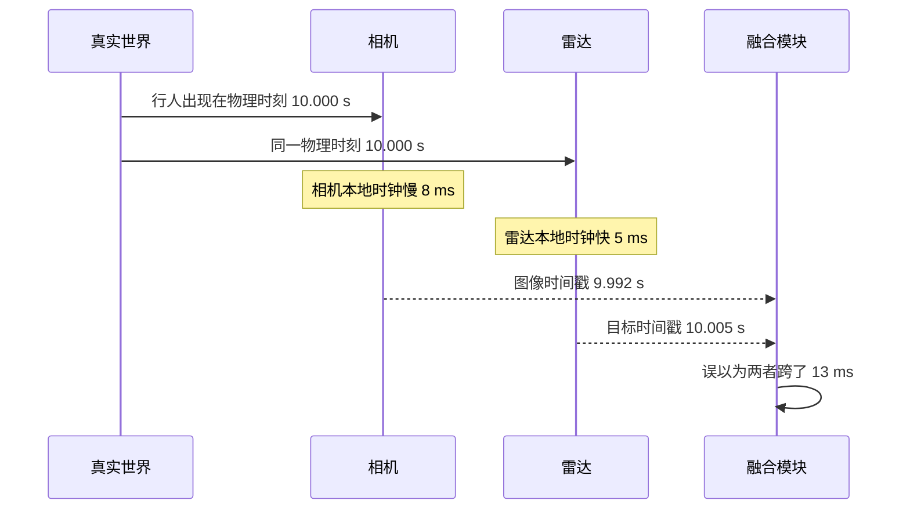
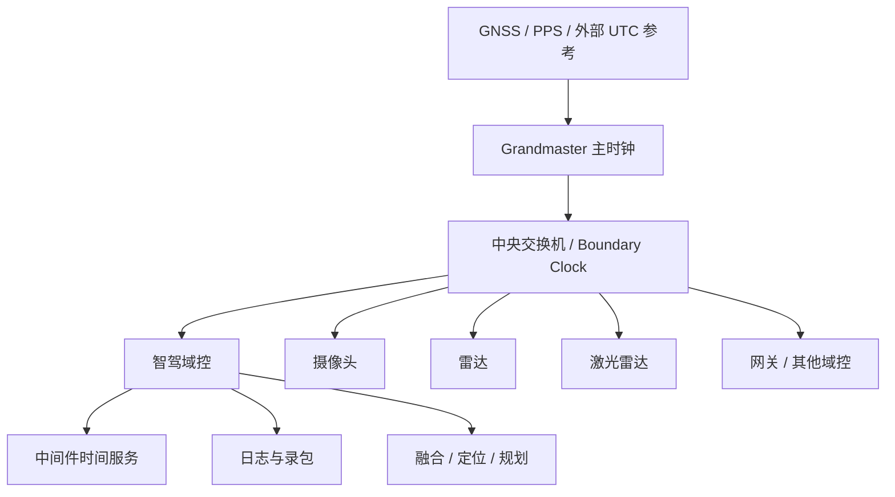
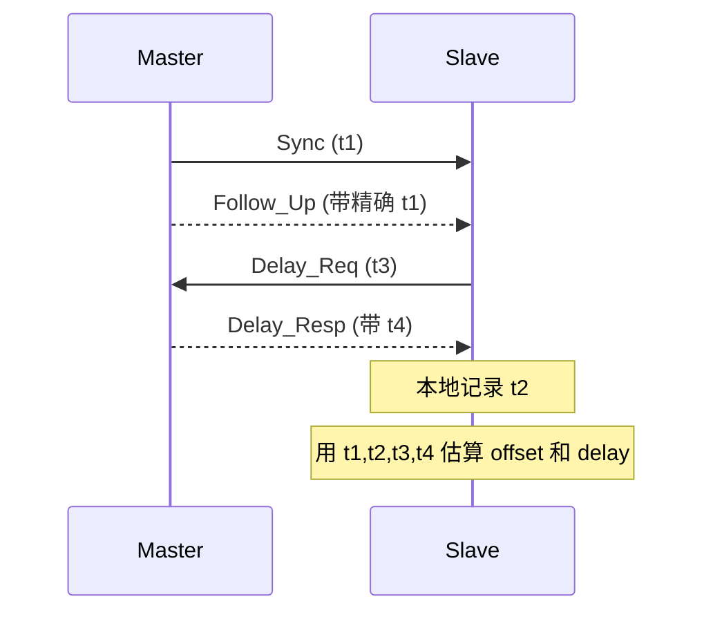
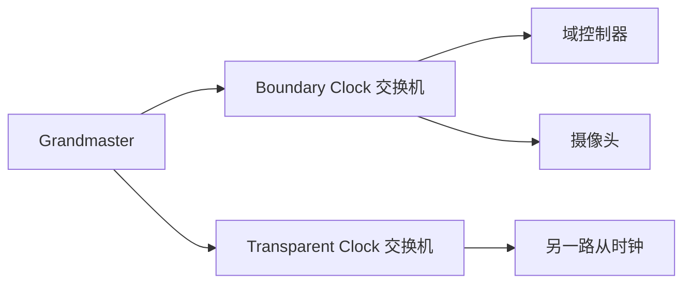
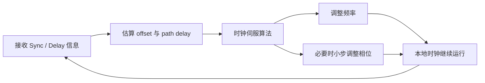
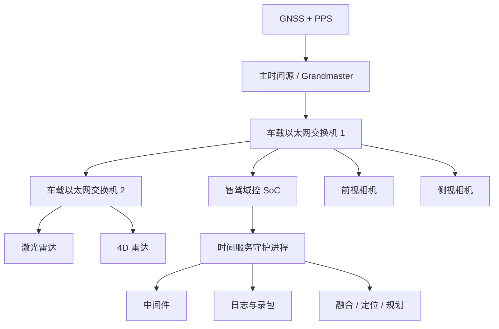

# 时间同步
同一个物理世界事件，系统里的不同节点，能不能把它标记成同一时刻发生的事？

这句话听起来很平常，但一旦放进真实工程里，后果就会非常具体：
- 相机说行人在 10.000 s
- 雷达说目标在 10.013 s
- IMU 说车身角速度对应的是 9.997 s
- 规划模块拿到的是 10.020 s 才到达的融合结果

如果这些时间戳背后的时钟体系不一致，那你看到的就不再是一个统一世界，而是几套互相错开的世界。

于是感知会错配，融合会发飘，日志很难对齐，问题分析会像在拼一份被故意打乱的监控录像。

# 时间同步的本质
第一次听时间同步，脑子里会自动浮现一个画面：

把设备 A 和设备 B 的系统时间都改成 12:00:00，不就同步了吗？

这其实只碰到了表面。

真正关心的不是屏幕上显示的时分秒看起来一不一样，而是：

两个节点对同一个物理事件打出来的时间戳，能不能放到同一根时间轴上比较。

比如一辆车经过减速带，理论上：
- IMU 应该在某个时刻看到纵向/垂向冲击
- 车身控制器应该在相近时刻看到轮速波动
- 摄像头应该在相近时刻拍到车头俯仰
- 记录系统应该能把这些数据在日志里对齐

如果这些节点的时间基不统一，那么你即使每个模块都工作正常，最终拼出来的系统画像也可能是错位的。


# 同步哪几件事？
如果你把时间同步只理解成一个概念，后面很容易乱。

更好的办法是把它拆成三件事。

第一件事是频率要尽量一致，也就是两只钟不能一个走得快、一个走得慢，不然哪怕某一刻对齐了，过一段时间也会慢慢漂开。

第二件事是当前偏差要小，意思是此刻两边到底差多少，不能永远隔着几毫秒、几十微秒各走各的。

第三件事是时间最好还能锚定到同一个上层参考，比如 UTC、GPS Time，或者车内统一认定的主时钟。

如果只做到了前两件事，系统内部可能已经够用了，至少几台设备能在一条相对统一的时间线上说话。如果第三件事也做到了，车端日志、云端数据、GNSS 轨迹、测试录像、售后分析就都更容易对齐。

很多团队一开始以为自己只需要相对同步，后面做大数据回放和问题复盘时，才发现绝对时间锚的重要性。

为了后面不绕，几个词可以先分开。

`offset` 是当前偏差，回答的是“我现在比主时钟快还是慢多少”；

`drift` 是频率漂移，回答的是“如果现在不管它，过一段时间我会不会越走越偏”；

`jitter` 是抖动，通常反映短时间内的不稳定；

`timestamp` 是事件时间戳，但这个词最容易被误用，因为很多系统虽然都有时间戳，打点的时刻却根本不是一回事。

一个很容易被忽略但特别重要的事实是：时间戳字段能表示到纳秒，不代表你的系统就真的同步到纳秒。字段精度和系统精度是两回事。很多平台只是格式上写得很细，真正能保证的误差可能还是微秒级，甚至毫秒级。

# 车里有哪些 clock？
现实系统里从来不只有一只钟。相反，真正的麻烦恰恰来自时钟太多，而且每只钟的用途还不一样。

最底层几乎都是本地晶振。每个 ECU、交换机、摄像头、SoC、MCU 都有自己的振荡源，它负责让设备本地的时间往前走。这类时钟是系统存在的前提，但天然会漂，温度、电压、器件老化都会影响它。

RTC 解决的是断电以后还能记住大概的日期时间，适合上电后先把系统时间拉到一个“看起来像真的”的范围，但它通常不承担高精度运行时同步的任务。

Monotonic clock 在操作系统里非常重要。它的价值不是绝对准确，而是单调递增，不会因为外部校时突然跳变。超时、调度、控制周期这类逻辑更适合基于 monotonic clock 来做，而不是 wall clock。

System clock 或 wall clock 更适合做绝对时间显示、日志打点和跨系统对齐，因为它可以对应到年月日时分秒，但也正因为它可能被外部同步机制调整，所以不适合拿来直接做所有实时逻辑。

在一些更高端的平台上，还会有 PHC，也就是硬件侧的高精度时钟，通常挂在网卡或专用时间模块上。它特别适合参与 PTP/gPTP 这类高精度同步。再往上，如果平台有 GNSS 或 PPS 输入，就等于给整套系统接入了一个更强的绝对时间参考。

把这些放在一张表里会更直观：
| 时钟类型   | 更像什么                     | 常见用途                     | 常见问题                     |
|:--------- |:--------------------------- |:--------------------------- |:--------------------------- |
| 本地晶振   | 每个节点自己的小钟           | 节点本地计时                 | 天然会漂                     |
| RTC        | 断电还能记住日期的表         | 上电初始化时间               | 精度通常不够高               |
| Monotonic  | 只管往前走的内部节拍器       | 超时、调度、控制周期         | 不直接对应绝对时间           |
| System Clock | 人能看懂的系统时间         | 日志、对外展示、跨系统对齐   | 可能被校时调整               |
| PHC        | 硬件侧高精度时钟             | PTP/gPTP、高精度时间基       | 依赖硬件与驱动支持           |
| GNSS/PPS   | 更强的外部时间锚             | UTC/GPS绝对时间参考          | 可能受环境遮挡影响           |

# 时间分发
时间同步通常不是某个节点单独完成的动作，而是一条完整链路。

最上层可能是 GNSS 或 PPS 给出绝对时间参考，中间有 Grandmaster 作为车内主时钟，交换机和域控负责把时间往下分发，底层应用再用这套时间去给数据打点、排序、融合、记录。


所以，时间同步本质上是链路问题。上游参考、主时钟、交换机、网络跳数、本机时钟管理、应用时间戳语义，只要其中任何一层做得差，最后坏掉的都会是数据时间轴。

# 常见方案对比
很多项目一开始问的是要不要上 PTP？

但这个问题其实问早了。先得看你到底要多准，以及这份时间最后给谁用。

如果只是让一些 Linux 主机、测试机、后台服务器的日志大体能对齐，NTP 通常够用。它成熟、部署轻、生态好，适合一般 IP 网络。可一旦关心的是多传感器对齐、闭环控制、车载高精度时戳，那 NTP 往往就不够了。它更像是把大家的挂钟校到同一个时区，而不是把所有设备的感知时间真正校到足够可信的精度。

PTP 和 gPTP 更像是面向高精度同步的正式方案。PTP 对应 IEEE 1588，强调精确测量链路时延、明确主从关系，并且尽量把时间戳打在更靠近物理收发的位置。gPTP 常见于 IEEE 802.1AS 体系，和车载以太网、TSN 的结合更紧，在智能车平台上会经常遇到。

GNSS + PPS 则更像顶层时间锚。它很强，尤其 PPS 的边沿非常硬，适合给主时钟提供绝对时间参考，但不是每个 ECU 都能直接接，也不是每个场景都有良好的卫星条件，所以工程上常常是它在最上层提供参考，车内再通过 gPTP/PTP 往下分发。

| 方案       | 更适合什么                     | 大致特点                               | 常见限制                                   |
|:--------- |:----------------------------- |:------------------------------------- |:----------------------------------------- |
| NTP        | 服务器、测试环境、一般日志对齐 | 简单成熟，精度要求不高时很好用         | 软件时戳多，抖动更大                       |
| PTP        | 高精度网络同步                 | 可结合硬件时戳做到更高精度             | 对硬件、交换机、驱动要求更高               |
| gPTP       | 车载以太网、TSN 场景           | 很适合做车内统一时间基                 | 依赖网络拓扑和车载交换机能力               |
| GNSS + PPS | 建立绝对时间锚                 | 对齐 UTC/GPS 能力强                    | 不是哪里都能直接接入                       |

> 成熟系统不是只用一种，而是分层用。后台和开发环境用 NTP，车内高精度链路用 gPTP/PTP，最上层再由 GNSS/PPS 给 Grandmaster 提供外部参考。

# PTP 和 gPTP
这两个协议之所以能比 NTP 更准，是因为它们更认真地回答了两个问题：
1. 主从当前到底差多少；
2. 报文在链路上到底花了多久。

一个典型的 PTP 测量过程，会围绕四个时间点展开：
1. 主时钟发 Sync 的时刻 t1
2. 从时钟收到它的时刻 t2
3. 从时钟发 Delay_Req 的时刻 t3
4. 主时钟收到它的时刻 t4。
只要这四个点测得够准，就能估算出主从偏差和路径时延。


在链路近似对称的前提下，常见公式大致是：
$$
offset = ((t2 - t1) - (t4 - t3)) / 2
$$

$$
delay  = ((t2 - t1) + (t4 - t3)) / 2
$$

去掉链路上的往返耗时之后，剩下的就是主从时间差；把去程和回程加起来，再平均一下，大致就是路径时延。

**真正影响精度的关键不只在公式，而在 t1/t2/t3/t4 到底打得准不准。**

如果这些时间戳来自软件层，中断、内核调度、驱动队列、DMA 完成时延都会把测量搞脏。

相反，如果时间戳能在 MAC、PHY 或 NIC 更靠近真实发包收包的地方取到，不确定性就会小很多。这也是为什么工程上几乎一提到高精度同步，就一定会提硬件时间戳。

# One-Step、Two-Step、Boundary Clock、Transparent Clock
One-Step 和 Two-Step 解决的是同一个问题：主时钟到底怎样把 Sync 真正发出的精确时刻告诉从时钟。

One-Step 是发包时就把时间写进报文，路径很直接，但对发送硬件能力要求高。

Two-Step 是先发一个 Sync，再补一个 Follow_Up，告诉你刚才那个 Sync 实际发出的精确时刻是多少。抓包时经常会一起看到这两个报文。

Boundary Clock 可以把它理解成一个会自己重新当主的中间站。它从上游学时间，学会以后再往下游发自己的同步。

Transparent Clock 则不是重新组织一套主从体系，而是尽量把自己转发报文时额外引入的耗时补偿进去。它更像一块诚实的路牌：我不重新给你发时间，但我会告诉你我在路上耽误了你多久。


# 缓慢时间同步
很多人会把时间同步想象成一次性动作：算出偏差，把表调一下，结束。

真实系统里不是这样。因为晶振会继续漂，温度会变，负载会变，网络时延会抖，所以从时钟通常一直在做一件事：**持续测偏差、估频差、缓慢修正自己。**

这也是为什么很多系统更喜欢慢慢拉频率去追主时钟，而不是频繁把时间一步跳过去。

直接跳时间看起来快，但应用层可能会被搞崩，典型表现包括定时器判断错误、日志时间倒退、控制周期异常、中间件消息顺序混乱。

**工程上常见的做法是启动初期或偏差太大时允许 step，正常运行后尽量改用 slew。**

# 打时间戳
拿摄像头举例，真实曝光开始、真实曝光结束、传感器内部成帧、数据从链路发出、主机网卡收到、驱动拿到 buffer、中间件发布消息、算法线程真正读到消息，这些都是不同的时刻。

如果你的目标是描述物理世界里的事件时刻，时间戳就应该尽量靠近事件源头，而不是靠近软件消费端。IMU 最理想的是采样时刻，相机更适合用曝光参考时刻，雷达更适合用测量周期内部真正有物理意义的参考点。

很多系统看起来已经完成对时，但融合还是乱，往下查才发现消息里写的其实是“数据被主机线程拿到”的时刻，而不是“传感器真正测到”的时刻。

这就是为什么时间同步往往分两层：一层是钟本身对齐，另一层是业务时间语义对齐。
前者靠协议和时钟伺服，后者靠接口定义和系统约束。只做前者不做后者，时间轴还是会歪。

# 车载时间同步架构


这个架构里至少有三件事同时发生。
- 第一，网络层通过 gPTP/PTP 把各个节点尽量拉到同一根时间线上。
- 第二，本机内部要把高精度硬件时钟、系统时间和应用能拿到的时间服务尽量理顺。
- 第三，业务层要明确每一类消息的时间戳到底表示什么。

项目里很常见的一种情况是，前两件事做得都不差，最后却因为“相机时间代表曝光开始还是帧到达”这种定义没统一，导致后面的融合和日志分析一路吵架。

# 同步系统的状态
时间同步并不是永远稳稳锁住。它通常会经历发现主时钟、逐步收敛、稳定锁定、上游暂时丢失、短时保持、长时间失锁这些状态。系统如果不把这些状态显式暴露出来，后面的业务就会假装时间永远可靠，最后一起掉坑。
```mermaid
stateDiagram-v2
    [*] --> FREERUN
    FREERUN --> ACQUIRING: 发现主时钟
    ACQUIRING --> LOCKED: 偏差收敛
    LOCKED --> HOLDOVER: 上游参考暂时丢失
    HOLDOVER --> LOCKED: 参考恢复并重新收敛
    HOLDOVER --> FREERUN: 保持超时或误差失控
  ```
很多看起来偶发的问题，其实都发生在 `LOCKED` 之前或者 `HOLDOVER` 期间。比如车辆刚上电，系统还没锁定，融合模块已经开始认真工作；或者主时钟掉了几秒，时间还勉强能用，但应用完全不知道自己已经退化了。

`holdover` 可以粗略理解成：上游参考暂时没了，但我先凭最近学到的频率信息，让本地时间不要立刻崩掉。它很有用，特别是在 GNSS 短时丢失、交换机短时切换、网络链路瞬时抖动的时候。如果一点 `holdover` 都没有，参考一断，下游所有节点马上乱掉；如果 `holdover` 做得不错，系统能比较平滑地跨过去。

但 `holdover` 也不能神化。它本质上是在没有老师盯着的情况下，靠刚刚学会的节奏自己继续走。时间一长，漂移还是会积累。所以系统设计时最好明确两件事：一是 `holdover` 允许持续多久，二是超过这个时间后业务怎么降级。对自动驾驶系统来说，这不该只是个后台参数，而应该进入系统健康状态。

