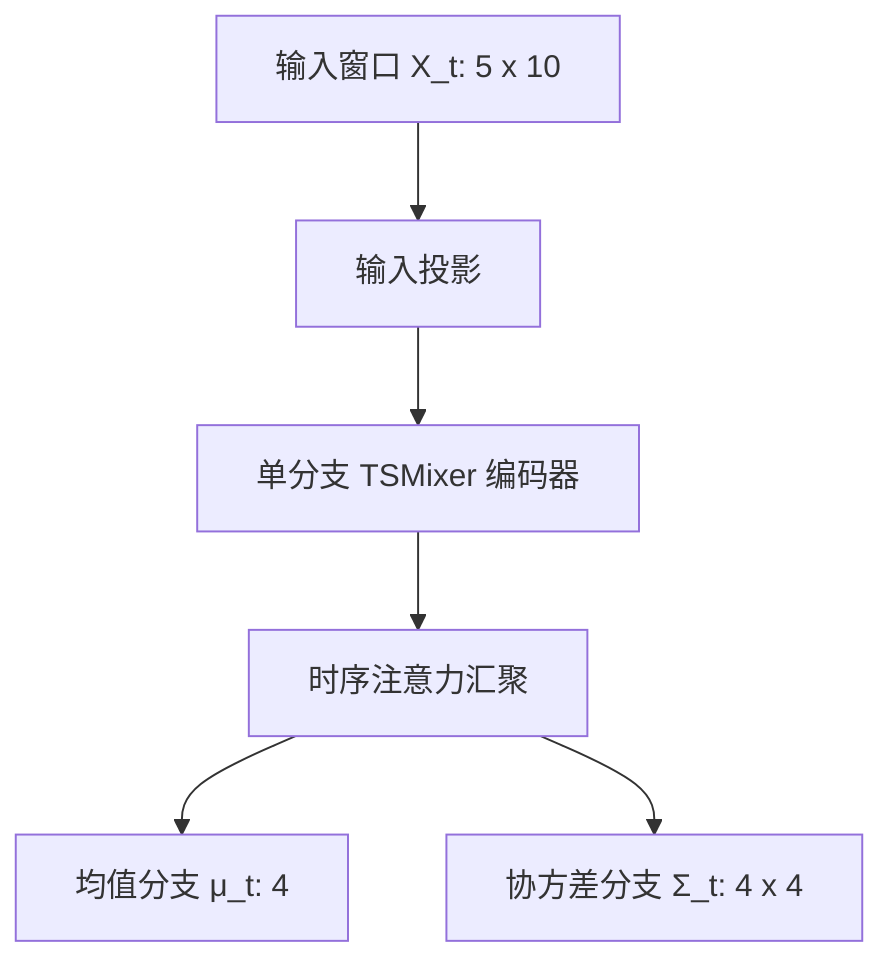

# 双阶段概率 TSMixer 轮荷估计
这篇笔记整理的是一个面向超短时序窗口的四轮垂向载荷估计方法。方法主体由单分支 `TSMixer` 编码器、时序注意力汇聚、均值与协方差解耦的概率回归头，以及“双阶段联合训练 + reduced-noise 微调”的优化策略组成。它的目标不是只输出四个确定值，而是在给出四轮轮荷估计的同时，显式建模四个输出之间的相关不确定性。

从任务形态看，这个问题具备三个比较明确的约束。第一，输入窗口很短，只有 `W=5` 个时刻，模型没有必要引入很重的递归状态传播。第二，输出是四轮轮荷的联合估计，前后轮、左右轮之间天然存在载荷转移带来的统计相关性。第三，传感器噪声和工况分布不均衡会直接影响模型在真实工况下的稳定性，因此训练阶段不能只围绕 clean 数据上的点误差展开。

# 任务与模型输出
## 任务定义
任务是在时刻 $t$ 基于最近 `5` 个采样点的车辆状态与悬架观测量，监督目标定义为四维轮荷向量：
$$
\mathbf{y}_t = [F_{\mathrm{z,fl},t}, F_{\mathrm{z,fr},t}, F_{\mathrm{z,rl},t}, F_{\mathrm{z,rr},t}]^\top \in \mathbb{R}^{4}.
$$

单时刻输入向量由 `10` 个观测量组成：
$$
\mathbf{x}_t = [v_{\mathrm{x},t}, a_{\mathrm{x},t}, a_{\mathrm{y},t}, \omega_{\mathrm{x},t}, \omega_{\mathrm{y},t}, \omega_{\mathrm{z},t}, c_{\mathrm{fl},t}, c_{\mathrm{fr},t}, c_{\mathrm{rl},t}, c_{\mathrm{rr},t}]^\top \in \mathbb{R}^{10}.
$$

其中，$v_{\mathrm{x},t}$ 为车速，$a_{\mathrm{x},t}$ 和 $a_{\mathrm{y},t}$ 分别为纵向与横向加速度，$\omega_{\mathrm{x},t}, \omega_{\mathrm{y},t}, \omega_{\mathrm{z},t}$ 为三轴角速度，$c_{\mathrm{fl},t}, c_{\mathrm{fr},t}, c_{\mathrm{rl},t}, c_{\mathrm{rr},t}$ 为四轮悬架压缩量。系统采样频率为 `20 Hz`，因此相邻采样点间隔为 `50 ms`。采用长度为 `W=5` 的滑动窗口后，模型输入为
$$
\mathbf{X}_t = [\mathbf{x}_{t-4}, \mathbf{x}_{t-3}, \mathbf{x}_{t-2}, \mathbf{x}_{t-1}, \mathbf{x}_{t}]^\top \in \mathbb{R}^{5 \times 10},
$$
模型实际学习的不是“窗口到四个标量”的确定性映射，而是“窗口到联合分布参数”的映射：
$$
f_\theta : \mathbb{R}^{5 \times 10} \rightarrow \mathbb{R}^{4} \times \mathcal{S}_{++}^{4}.
$$
其中 $\mathcal{S}_{++}^{4}$ 表示所有 `4 x 4` 对称正定矩阵的集合。更明确地写，
$$
f_\theta(\mathbf{X}_t) = (\boldsymbol{\mu}_t, \mathbf{\Sigma}_t),
$$
其中 $\boldsymbol{\mu}_t \in \mathbb{R}^{4}$ 为四轮轮荷的均值估计，$\mathbf{\Sigma}_t \in \mathcal{S}_{++}^{4}$ 为联合协方差矩阵。

如果只做确定性回归，模型会直接输出四个轮荷标量。本方法采用的是联合概率建模，因此最终输出不是单一回归结果，而是一组联合高斯分布参数。实际计算 `RMSE` 和 `MRE` 时，点预测取
$$
\hat{\mathbf{y}}_t = \boldsymbol{\mu}_t.
$$

## 为什么采用短窗口预测
这里把输入窗口固定为 `W=5`，并不是单纯为了压缩模型规模，而是由轮荷估计问题本身的动态特征决定的。在 `20 Hz` 采样频率下，`W=5` 对应最近 `5` 个采样点，也就是从 $\mathbf{x}_{t-4}$ 到 $\mathbf{x}_t$ 共跨越 `0.20 s` 的历史范围。
**垂向轮荷对纵向加速度、横向加速度、角速度和悬架压缩量的响应，主要集中在当前时刻附近的短时间范围内。对这种局部快速变化的状态量而言，模型首先需要抓住的是最近若干采样点之间的瞬时耦合，而不是很长时间跨度上的慢变量记忆**。

短窗口还有一个直接的工程好处。轮荷估计通常服务于更下游的状态估计、控制分配或稳定性判断，推理链路对时延比较敏感。如果窗口过长，输入缓存、前向计算和训练时的参数规模都会一起增加；而在 `W=5` 这类超短窗口下，模型既能保留最关键的局部动态信息，又不会把部署代价推得过高。对车载在线应用而言，这种设定更容易兼顾实时性和鲁棒性。

从建模角度看，短窗口与 `TSMixer` 的结构也比较匹配。`TSMixer` 的优势在于对整个窗口直接做时间混合和通道混合。当窗口只有 `5` 个时刻时，模型可以在很短的有效路径上完成跨时刻关系重组，不需要依赖递归传播去穿过一段很长的历史序列。对轮荷这类强局部动态任务来说，这种整窗建模通常比长窗口上的重记忆结构更直接。

当然，短窗口并不意味着历史信息永远不重要。如果采样频率下降、工况持续时间显著拉长，或者任务转向更强的趋势估计与长期状态恢复，那么窗口长度仍然可能需要重新调整。这里采用 `W=5`，本质上对应的是当前采样频率、输入变量集合和轮荷瞬态估计目标共同作用下的折中结果。

## 输出形式
模型最终输出两部分内容：
- 四轮轮荷的均值估计 $\boldsymbol{\mu}_t \in \mathbb{R}^{4}$。
- 四维相关协方差矩阵 $\mathbf{\Sigma}_t \in \mathbb{R}^{4 \times 4}$。

前者对应点估计结果，后者描述预测误差的分布形态与输出间相关结构。对轮荷估计任务而言，这种相关协方差比简单的四个独立方差更贴近实际，因为纵向载荷转移、横向载荷转移和悬架耦合本来就会同时影响多个车轮。

# 模型结构
## 总体流程
模型从 `5 x 10` 的输入窗口出发，先通过输入投影进入隐藏空间，再经过两层 `TSMixer` block 提取超短窗口内的时序与通道关系，随后用时序注意力把长度为 `5` 的隐藏序列压缩为一个全局上下文向量，最后通过两条解耦分支分别输出均值和协方差参数。

下面这张图只保留主干数据流，足够说明网络结构的层次关系。

图里最需要关注的是两个设计选择。第一，编码阶段只保留单分支 `TSMixer`，说明重点在于短窗口内部的时间混合与特征混合，而不是复杂的多流特征融合。第二，预测阶段把点估计和不确定性估计拆成两条支路，避免它们在同一瓶颈层里竞争表示能力。

## 输入投影
设隐藏维度为 $d=128$。输入窗口先做线性投影：
$$
\mathbf{H}^{(0)} = \mathbf{X}\mathbf{W}^{\mathrm{in}} + \mathbf{1}{\mathbf{b}^{\mathrm{in}}}^\top,\qquad \mathbf{H}^{(0)} \in \mathbb{R}^{5 \times 128}.
$$

这一步把原始物理量映射到统一的隐藏空间。对轮荷估计任务而言，原始输入中既有运动学量，也有悬架观测量，量纲、噪声特性和数值范围并不一致。先完成一层共享投影，有助于后续 `TSMixer` 在同一表示域内做时间混合和通道混合。

## 单分支 TSMixer 编码器
编码器包含两层 `TSMixer` block。对第 $\ell$ 个 block，记输入为 $\mathbf{H}^{(\ell)} \in \mathbb{R}^{5 \times 128}$，则时间混合写成
$$
\widetilde{\mathbf{H}}^{(\ell)} = \mathbf{H}^{(\ell)} + \left(\mathrm{MLP}_{\mathrm{token}}\left(\mathrm{LN}(\mathbf{H}^{(\ell)})^\top\right)\right)^\top.
$$

这里的层归一化沿特征维执行，转置后张量由 `5 x 128` 变成 `128 x 5`。因此，`token MLP` 实际处理的是“每个隐藏通道上的长度为 5 的时间序列”。当前配置下，它的映射尺寸为
$$
\mathrm{MLP}_{\mathrm{token}} : \mathbb{R}^{5} \rightarrow \mathbb{R}^{10} \rightarrow \mathbb{R}^{5}.
$$

时间混合结束后，再做通道混合：
$$
\mathbf{H}^{(\ell+1)} = \widetilde{\mathbf{H}}^{(\ell)} + \mathrm{MLP}_{\mathrm{channel}}\left(\mathrm{LN}(\widetilde{\mathbf{H}}^{(\ell)})\right),
$$
其中
$$
\mathrm{MLP}_{\mathrm{channel}} : \mathbb{R}^{128} \rightarrow \mathbb{R}^{256} \rightarrow \mathbb{R}^{128}.
$$

时间混合和通道混合在这里承担的是两类不同工作。前者显式建模超短窗口内的跨时刻关系，后者负责在单个时刻内部重组隐藏特征。对长度只有 `5` 的窗口而言，这种直接的整窗混合比递归式状态传播更合适，因为有效路径更短，结构也更轻。经过两层 block 后，得到编码序列
$$
\mathbf{H}^{(2)} = [\mathbf{h}_1,\mathbf{h}_2,\mathbf{h}_3,\mathbf{h}_4,\mathbf{h}_5]^\top,\qquad \mathbf{h}_k \in \mathbb{R}^{128}.
$$

## 时序注意力汇聚
轮荷估计最终只需要一个时刻的四维输出，因此长度为 `5` 的隐藏序列必须被压缩为单个全局上下文向量。本方法没有采用简单平均，而是使用可学习的时序注意力：
$$
e_k = \mathbf{w}_2^\top \tanh(\mathbf{W}_1\mathbf{h}_k + \mathbf{b}_1) + b_2.
$$

当前实现中，$\mathbf{W}_1$ 对应 `128 -> 64` 的映射，随后再压到标量打分。归一化后的注意力权重为
$$
\alpha_k = \frac{\exp(e_k)}{\sum_{j=1}^{5}\exp(e_j)}.
$$

最终上下文向量定义为
$$
\mathbf{c} = \sum_{k=1}^{5} \alpha_k \mathbf{h}_k,\qquad \mathbf{c} \in \mathbb{R}^{128}.
$$

这一层的作用不是单纯压缩维度，而是重新分配时间贡献。轮荷转移虽然发生在超短时间尺度内，但五个采样点对当前轮荷状态的代表性并不完全一致。用注意力替代平均，等于允许模型在短窗口内主动突出更有效的瞬时观测。

## 解耦的概率回归头
从上下文向量 $\mathbf{c}$ 出发，模型不让均值估计和不确定性估计共享同一个瓶颈表示，而是分别建立两条隐藏维度为 `64` 的分支：
$$
\mathbf{g}_{\mu} = \mathrm{GELU}(\mathbf{W}_{\mu}^{(1)}\mathbf{c} + \mathbf{b}_{\mu}^{(1)}), \qquad
\mathbf{g}_{\Sigma} = \mathrm{GELU}(\mathbf{W}_{\Sigma}^{(1)}\mathbf{c} + \mathbf{b}_{\Sigma}^{(1)}),
$$
其中
$$
\mathbf{g}_{\mu}, \mathbf{g}_{\Sigma} \in \mathbb{R}^{64}.
$$

均值头输出
$$
\boldsymbol{\mu} = \mathbf{W}_{\mu}^{(2)}\mathbf{g}_{\mu} + \mathbf{b}_{\mu}^{(2)},\qquad \boldsymbol{\mu} \in \mathbb{R}^{4}.
$$

不确定性头采用低秩协方差参数化。设协方差秩为 $r=2$，则其输出为
$$
\mathbf{U} = \mathrm{reshape}(\mathbf{W}_{U}\mathbf{g}_{\Sigma} + \mathbf{b}_{U}) \in \mathbb{R}^{4 \times 2},
$$
$$
\mathbf{d} = \mathbf{W}_{d}\mathbf{g}_{\Sigma} + \mathbf{b}_{d} \in \mathbb{R}^{4}.
$$

最终协方差矩阵写成
$$
\mathbf{\Sigma} = \mathbf{U}\mathbf{U}^\top + \mathrm{diag}(\mathrm{softplus}(\mathbf{d}) + \varepsilon),\qquad \varepsilon = 10^{-4}.
$$

这组参数化同时满足两个要求。其一，$\mathbf{U}\mathbf{U}^\top$ 提供轮间相关项，允许误差分布具有非对角结构。其二，对角稳定项确保协方差矩阵严格正定，从而可以稳定地用于联合高斯似然计算。相比只预测四个独立方差，这种建模方式更贴合轮荷估计里的物理耦合关系。

# 损失函数与训练策略
## 联合概率损失
设标准化后的真实标签为 $\mathbf{y}^*$，模型假设条件分布满足
$$
\mathbf{y}\mid\mathbf{X} \sim \mathcal{N}(\boldsymbol{\mu}, \mathbf{\Sigma}).
$$

对应的四维联合高斯负对数似然为
$$
\mathcal{L}_{\mathrm{NLL}} =
\frac{1}{2}\left[
(\mathbf{y}^*-\boldsymbol{\mu})^\top \mathbf{\Sigma}^{-1} (\mathbf{y}^*-\boldsymbol{\mu})
+ \log|\mathbf{\Sigma}|
+ 4\log(2\pi)
\right].
$$

如果只使用 NLL，模型有可能把更多自由度用于分布拟合，而均值精度收敛不够直接。因此实际训练采用联合目标：
$$
\mathcal{L}_{\mathrm{joint}} = \mathcal{L}_{\mathrm{NLL}} + \lambda \|\mathbf{y}^* - \boldsymbol{\mu}\|_2^2,\qquad \lambda = 100.
$$

这一组合保留了概率建模的约束，同时对点预测误差施加直接压力，从而避免模型通过无约束放大方差来掩盖均值偏差。训练阶段的损失计算都在标准化标签空间完成，而最终 `RMSE` 和 `MRE` 则在反标准化后的物理量空间统计。

## 双阶段训练
训练阶段采用两段式优化，而不是一次性从随机初始化训练到底。

第一阶段从随机初始化开始，采用标准噪声联合训练。配置为：
- `train_noise_scale = 1.0`
- 学习率 `1e-4`
- 最多 `700` 个 epoch
- 早停耐心值 `100`
- 损失函数为 $\mathcal{L}_{\mathrm{joint}}$
- 训练集按工况频次加权采样

这一阶段的目标是先获得一个对噪声更稳、对工况不均衡更不敏感的初始解。对轮荷估计任务而言，输入端传感器噪声和高频工况偏置都会显著改变优化方向，因此这一阶段承担的是稳态打底的作用。

第二阶段以上一阶段的最优权重为初始化，执行 reduced-noise 微调。配置为：
- `train_noise_scale = 0.5`
- 学习率 `5e-5`
- 最多 `120` 个 epoch
- 早停耐心值 `25`
- 网络结构和联合损失函数保持不变

这一步不再重新学习主干映射，而是在保留一定抗扰约束的前提下，把均值估计从鲁棒初解进一步推向更贴近 clean 分布的收敛点。对应的训练逻辑可以概括为先抗扰、后收口。

## 混合验证与选模
为了避免模型只在 clean 输入或只在 noisy 输入上单边最优，验证阶段同时统计两组指标，并用混合分数进行选模：
$$
\mathcal{S}_{\mathrm{mix}} = 0.5\,\mathcal{L}_{\mathrm{val,clean}} + 0.5\,\mathcal{L}_{\mathrm{val,noisy}}.
$$

其中，$\mathcal{L}_{\mathrm{val,clean}}$ 表示无额外传感器扰动时的验证损失，$\mathcal{L}_{\mathrm{val,noisy}}$ 表示注入固定随机种子噪声后的验证损失。采用这一准则后，最终保存的权重不再对应某一个极端工况下的最优点，而是 clean 精度和 noisy 稳健性之间的折中解。

# 实验结果
## 主方案结果
当前正式保留的主方案记为 `Proposed`，其结构可以概括为
$$
\text{Proposed} =
\text{Single-Branch TSMixer}
+ \text{Temporal Attention}
+ \text{Decoupled Correlated Uncertainty Head}
+ \text{Two-Stage Reduced-Noise Fine-Tuning}
+ \text{Mixed Validation Selection}.
$$

其中，模型采用双头解耦的相关不确定性回归器，训练阶段使用“两阶段联合训练 + reduced-noise 微调”，并通过 clean/noisy 混合验证分数选模，不引入额外物理损失。

| 方法       | Clean RMSE | Clean MRE | Noisy RMSE | Noisy MRE | RMSE 退化率 |
| :------- | ---------: | --------: | ---------: | --------: | -------: |
| Proposed |      92.95 |     0.174 |     112.21 |     0.233 |   20.72% |

## 消融实验
消融实验围绕 `Proposed` 逐项移除关键设计，其他训练设置保持一致。

| 方法 | Clean RMSE | Clean MRE | Noisy RMSE | Noisy MRE | RMSE 退化率 |
|:--|--:|--:|--:|--:|--:|
| Proposed | 92.95 | 0.174 | 112.21 | 0.233 | 20.72% |
| NoUncertainty | 111.76 | 0.247 | 160.49 | 0.364 | 43.60% |
| SharedHead | 88.28 | 0.166 | 116.55 | 0.253 | 32.02% |
| SingleStage | 103.54 | 0.203 | 118.35 | 0.251 | 14.31% |
| NoAttention | 89.28 | 0.166 | 113.58 | 0.238 | 27.23% |
| DiagUncertainty | 90.42 | 0.186 | 125.21 | 0.282 | 38.48% |

这些结果说明了几件事。第一，`NoUncertainty` 在 clean、noisy 和退化率上全面落后，说明不确定性建模不是附属输出，而是主线性能的重要组成部分。第二，`SharedHead`、`NoAttention` 和 `DiagUncertainty` 虽然在部分 clean 指标上接近甚至略优于 `Proposed`，但 noisy 指标和退化率都明显变差，说明双头解耦、时序注意力和相关协方差建模主要贡献在鲁棒性而不是单纯压低 clean 误差。第三，`SingleStage` 在 clean 与 noisy 两个口径上都落后于 `Proposed`，说明第二阶段 reduced-noise 微调是最终性能提升的关键步骤，而不只是训练细节。

## 对比实验
在对比实验中，`Proposed` 与多类常见时序模型和强基线进行比较，包括递归模型、Transformer 风格模型、图相关时序模型以及线性/MLP 型时间序列模型。

| 方法 | Clean RMSE | Clean MRE | Noisy RMSE | Noisy MRE | RMSE 退化率 |
|:--|--:|--:|--:|--:|--:|
| Proposed | 92.95 | 0.174 | 112.21 | 0.233 | 20.72% |
| LSTM-Attention | 131.33 | 0.301 | 180.49 | 0.407 | 37.44% |
| TFT | 125.52 | 0.275 | 164.07 | 0.373 | 30.71% |
| GCAR | 129.75 | 0.295 | 169.79 | 0.395 | 30.85% |
| CGA-LSTM | 120.71 | 0.274 | 148.54 | 0.334 | 23.06% |
| DLinear | 143.47 | 0.333 | 183.35 | 0.440 | 27.80% |
| TiDE | 153.72 | 0.366 | 204.91 | 0.469 | 33.30% |

从正式结果看，`Proposed` 在 clean RMSE、clean MRE、noisy RMSE 和 noisy MRE 上均优于全部对比方法。`CGA-LSTM` 是当前最强的对比基线，说明“相关图注意力 + 递归编码”在超短窗口任务上仍有竞争力，但其各项指标仍整体落后于 `Proposed`。相比之下，`LSTM-Attention`、`TFT`、`GCAR`、`DLinear` 和 `TiDE` 都没有在当前 `W=5` 的超短窗口设定下取得更优的综合表现，这说明基于 `TSMixer` 的整窗混合结构更适合当前轮荷估计任务。

## 小结
综合主方案、消融和对比结果，可以把本方法的有效性概括为三点：其一，`TSMixer + 时序注意力` 适合 `W=5` 的超短窗口轮荷建模；其二，双头解耦的相关不确定性回归器不仅提供概率输出，也直接改善了 clean/noisy 场景下的综合性能；其三，两阶段 reduced-noise 训练和混合验证选模共同保证了最终模型在精度与鲁棒性之间取得较好的折中。

# 对比方案参考文献
下面把对比实验中涉及的方法整理成可直接复用的 `BibTeX` 条目。`LSTM-Attention` 在正文里是一个较泛化的基线命名，这里选用结构最接近的 attention-enhanced LSTM 代表文献；其余方法对应较明确的原始论文。

```bibtex
@article{wen2023lstm_attention_lstm,
  author  = {Wen, Xian yun and Li, Wei bang},
  title   = {Time series prediction based on {LSTM}-attention-{LSTM} model},
  journal = {IEEE Access},
  volume  = {11},
  pages   = {48322--48331},
  year    = {2023}
}

@article{lim2021tft,
  author  = {Lim, Bryan and Arik, Sercan {\"O}. and Loeff, Nicolas and Pfister, Tomas},
  title   = {Temporal fusion transformers for interpretable multi-horizon time series forecasting},
  journal = {International Journal of Forecasting},
  volume  = {37},
  number  = {4},
  pages   = {1748--1764},
  year    = {2021}
}

@article{geng2022gcar,
  author  = {Geng, Xiu lin and He, Xiao yu and Xu, Ling yu and Yu, Jie},
  title   = {Graph correlated attention recurrent neural network for multivariate time series forecasting},
  journal = {Information Sciences},
  volume  = {606},
  pages   = {126--142},
  year    = {2022}
}

@article{han2021cga_lstm,
  author  = {Han, Shuang and Dong, Hong bin and Teng, Xu yang and Li, Xiao hui and Wang, Xiao wei},
  title   = {Correlational graph attention-based long short-term memory network for multivariate time series prediction},
  journal = {Applied Soft Computing},
  volume  = {106},
  pages   = {107377},
  year    = {2021}
}

@inproceedings{zeng2023dlinear,
  author    = {Zeng, Ai ling and Chen, Mu xi and Zhang, Lei and Xu, Qiang},
  title     = {Are transformers effective for time series forecasting?},
  booktitle = {Proceedings of the AAAI Conference on Artificial Intelligence},
  address   = {Washington, DC, USA},
  publisher = {AAAI Press},
  volume    = {37},
  number    = {9},
  pages     = {11121--11128},
  year      = {2023}
}

@article{das2023tide,
  author  = {Das, Abhimanyu and Kong, Wei hao and Leach, Andrew and Mathur, Shaan and Sen, Rajat and Yu, Rose},
  title   = {Long-term forecasting with {TiDE}: time-series dense encoder},
  journal = {CoRR},
  volume  = {abs/2304.08424},
  year    = {2023},
  url     = {https://arxiv.org/abs/2304.08424}
}
```
